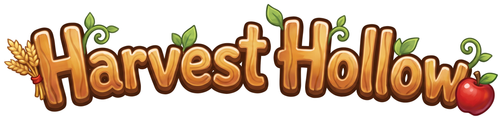
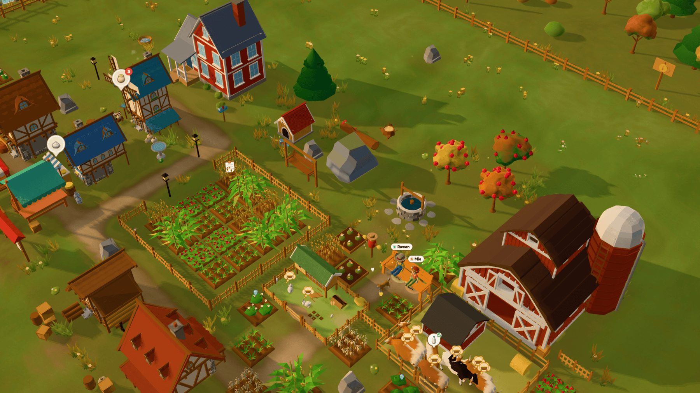
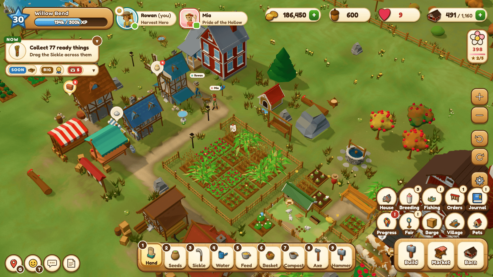
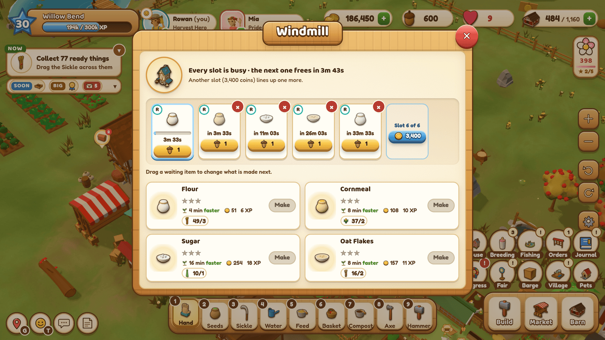
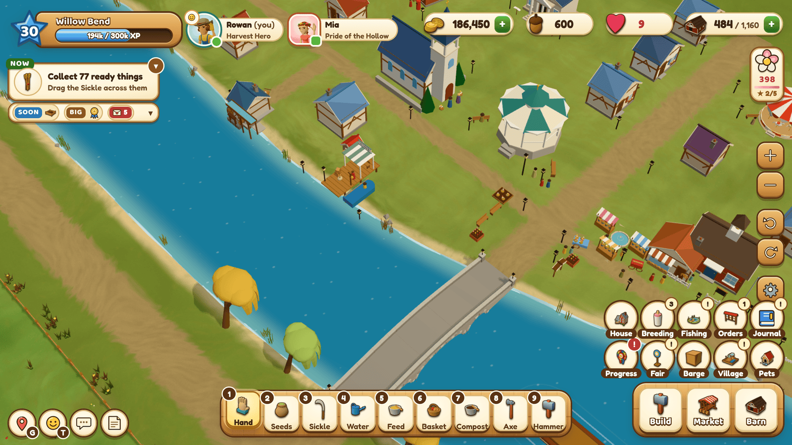
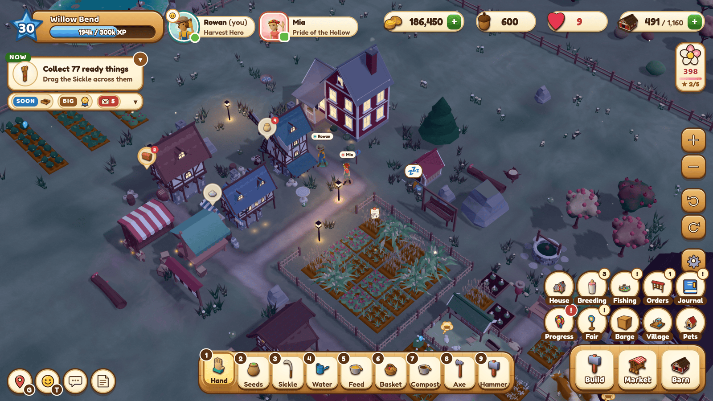
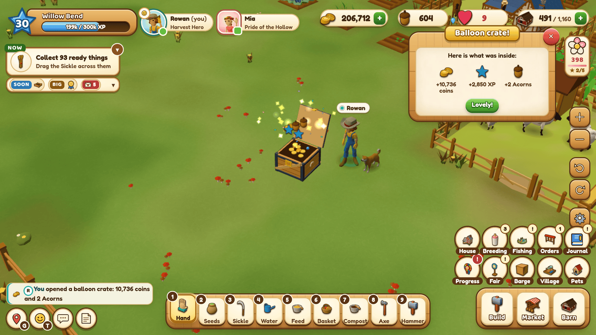
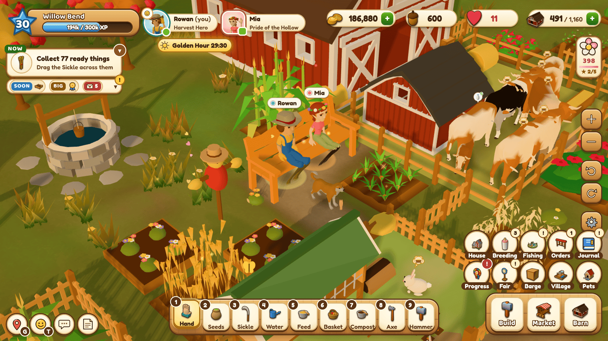
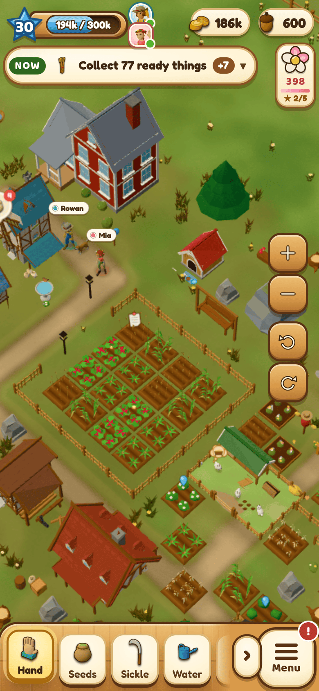
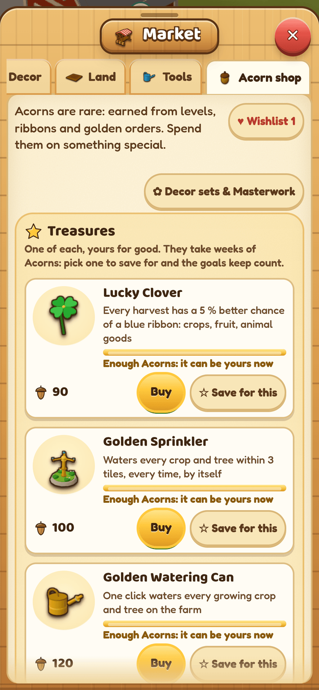

<p align="center">
  
</p>

<p align="center"><b>A cozy 3D farming game for two, in the browser.</b><br>
Plant, harvest, raise animals, craft and grow a whole valley together, on one shared farm, in real time.</p>

<p align="center">
  
</p>

Harvest Hollow is a FarmVille-2-style co-op farm you host yourself. One small Node server runs the farm 24/7, and
everyone plays in a browser — on a PC, a laptop, a tablet or a phone. Two people share **one** farm: one plants, the
other harvests; one runs the bakery while the other feeds the cows; you both see everything the moment it happens.

## Features

- **A whole valley, 40 levels deep** (and Legacy levels after): 21 crops from Wheat to Roses and Coffee Beans;
  15 kinds of trees (fruit, nuts, olives, maple and cocoa, and the Pine for wood) that age a year with every harvest
  and bear more as they grow old; 10 kinds of animals, from chickens and rabbits to bees, horses and alpacas, with
  babies, a Nursery and breeding with coat colours, in homes that grow bigger with the flock.
- **Craft everything**: 17 workshops and 121 recipes (animal feeds included), queues you drag to reorder and finish
  item by item, and Compost and Fertilizer for bigger, faster harvests.
- **Always a next goal**: Mabel's orders board, illustrated story letters from the townsfolk, 64 quests,
  68 ribbons, 12 collection albums, a 30-tier seasonal ribbon track, a weekly County Fair with an NPC league and a
  horse show, the River Barge, 24 Town Projects that grow a village across the river, six restoration projects
  ending with Grandma's farmhouse and its room to furnish (40 pieces), fishing and four perk trees.
- **Surprises and treasures**: the hot-air balloon drops loot crates on a parachute (coins and XP, sometimes Acorns,
  Golden Seeds, Fertilizer, an album find or a decor piece), and eight one-of-a-kind Acorn treasures are worth saving
  up for: the Golden Watering Can that waters everything at once, a Rainbow Tree, a Time Turner, a Farmhand and more.
- **Make it yours**: 115 decor pieces (ten of them Grand showpieces), three upgrade tiers each for the farmhouse, the
  Well, the Market Stand and the benches, turn anything where it stands, sell decor you are done with, pull the wild
  weeds. Every farmer picks a build, hair, hair colour, skin tone, outfit colours and a hat, and wears that look in a
  3D portrait on their name chip. A dog and a cat come in three breeds each and sleep at night in their own beds.
- **Made for two**: shared coins and barn with a big-purchase confirm, "Thank all" in the activity feed,
  pings and emotes, sitting on the bench together for Golden Hour, a Friendly Duel, duet recipes you cook together.
- **Feels good to play**: drag a finger or the mouse across fields to plant and harvest, click anywhere to walk there,
  every action is instant (the shared rules engine predicts it, the server confirms it), "where to get it" hint
  bubbles on every item, finish crops early with Acorns, and a level-up finishes everything that is growing.
- **Looks and sounds cozy**: a low-poly 3D world with day and night, seasons, drizzle and downpours with puddles and
  the odd rainbow, glowing windows and lamps after dark, a camera you can turn and tilt, painted characters and
  storybook letters, and an acoustic folk soundtrack that follows the time of day.
- **Phones and tablets**: touch controls, a phone layout with bottom sheets, a lighter graphics mode, and
  "Add to Home Screen".
- **Self-hosted and private**: your farm lives in one JSON save on your own machine, crash-safe with an action journal
  and rotating backups.

<p align="center">
  
  
</p>
<p align="center">
  
  
</p>
<p align="center">
  
  
</p>
<p align="center">
  
  
</p>

## Play it in 2 minutes

You need [Node.js 24](https://nodejs.org/).

```sh
git clone https://github.com/KrasimirKralev/harvest-hollow.git
cd harvest-hollow
npm install
npm start
```

The server prints its addresses. Open **http://localhost:3300**, pick a farmer, a name and a colour, and play.
Your partner opens the **home-network address** it prints (for example `http://192.168.x.y:3300`) on their own
computer or phone and picks the other farmer. A farm has two farmers; `HH_SLOTS=1 npm start` makes it a solo farm.

Set a farm passphrase before you share the farm beyond your home network; it protects "this is me on a new device":

```sh
HH_PASSPHRASE='something-only-you-know' npm start
```

### Run it 24/7 (a Raspberry Pi, a mini-PC, an old laptop)

```sh
mkdir -p ~/.config/systemd/user
cp deploy/harvest-hollow.service ~/.config/systemd/user/
systemctl --user daemon-reload
systemctl --user enable --now harvest-hollow
loginctl enable-linger "$USER"          # keep it running without a login
```

The unit expects the checkout in `~/harvest-hollow` and Node at `/usr/bin/node`; edit its `WorkingDirectory` and
`ExecStart` lines if yours differ. The save lives in `data/` (or `HH_DATA_DIR`). Put the passphrase in a drop-in
(`systemctl --user edit harvest-hollow` → `[Service]` `Environment=HH_PASSPHRASE=...`), never in a tracked file.

### Play from anywhere

The game is one HTTP + WebSocket port, so any tunnel works. Two free options:

- **Tailscale Funnel**: `sudo tailscale funnel --bg 3300` gives the machine a fixed public `https://` address on
  your tailnet's domain.
- **Cloudflare Tunnel**: `cloudflared tunnel --url http://localhost:3300` (a named tunnel gives a fixed link on your
  own domain).

Set `HH_PASSPHRASE` before you open the farm to the internet.

## How to play

| | Mouse / keyboard | Touch |
|---|---|---|
| Act on something | click it with the Hand (1) | tap |
| Plant / harvest a field | pick Seeds (2) or the Sickle (3), drag across plots | drag a finger |
| Plant on an empty plot | click it with the Hand → seed picker | tap it |
| Walk | click open ground | tap open ground |
| Camera | right-drag pan, wheel zoom, Q / E turn, PageUp / PageDown tilt | two fingers pan, pinch zoom, twist to turn, two fingers up or down to tilt |
| Move or turn a building | the Hammer (9), then click it; R turns it | the Hammer, then tap it; ⟳ turns it |
| Reorder a workshop queue | drag a waiting item | hold, then drag (or tap it for ◀ ▶) |
| Item info | hover any item | hold any item |

Everything you need to know is taught in game by Grandma Hazel's two short guides on the first evening.
Settings › Controls lists every key and gesture.

## How it works

- `shared/` — the whole game in pure, deterministic JavaScript: content tables (every crop, recipe and price,
  generated from one economy model) and the rules engine. The **same code** runs in the browser to predict an action
  instantly and on the server to decide it, so the game feels local and stays cheat-proof.
- `server/` — Express + `ws`: one authoritative farm in memory, an append-only action journal, atomic JSON snapshots
  and rotating backups, presence at 15 Hz, rate limits, a scheduler for daily and weekly events.
- `public/` — the client: Three.js with no bundler (an import map), instanced and batched rendering with quality tiers
  for laptops and phones, and an HTML/CSS interface.
- `tools/` — the economy model and simulators, the asset pipeline, and end-to-end tests that drive two headless
  browsers (`npm run test:e2e`) or a phone and a desktop together (`tools/e2e-mobile.mjs`).
- `docs/GDD.md` — the full game design document: every system, number and the reasoning behind it;
  `docs/research/tech-architecture.md` explains the technical decisions.

```sh
npm test                          # 1,655 unit and integration tests (node:test)
npm run test:e2e -- --port 3310   # two players in two headless browsers, end to end (needs Chrome; CHROME=<path>)
node tools/econ-sim.mjs --checks  # the economy's pacing and balance checks
```

## Credits

- 3D models: [Quaternius](https://quaternius.com), [Kenney](https://kenney.nl) and
  [vertexcat](https://vertexcat.itch.io) (CC0) — the packs are listed in
  [`public/assets/models/CREDITS.md`](public/assets/models/CREDITS.md).
- Music: CC0 tracks from [OpenGameArt](https://opengameart.org) by Komiku, Memoraphile, Écrivain, Indieteur and
  RandomMind — details in [`public/assets/audio/music/CREDITS.md`](public/assets/audio/music/CREDITS.md).
- Fonts: Fredoka, Baloo 2 and Nunito (SIL Open Font License 1.1; the licence texts are in `public/assets/fonts/`).
- Illustrated portraits, letter headers, backdrops and the logo: original art made for this game with an AI image
  model (Higgsfield), checked image by image and post-processed; released under the MIT licence with the code.
- Sound effects: synthesised for this game by `tools/make-sfx.mjs`.
- Built with [three.js](https://threejs.org), [Express](https://expressjs.com) and [ws](https://github.com/websockets/ws).

## License

Code and the game's own art, including the AI-generated illustrations: [MIT](LICENSE). Third-party assets keep their
own licences (CC0 or the SIL OFL, listed above).
