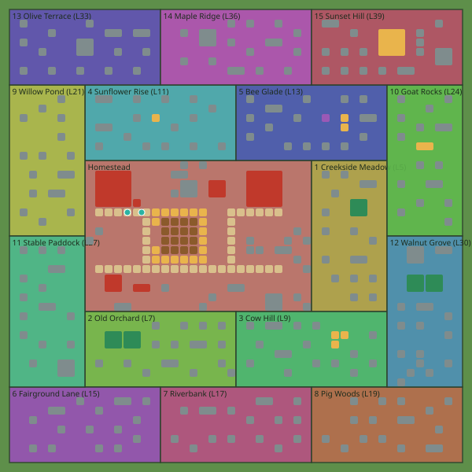

# Harvest Hollow: content report

Generated by `node tools/content-report.mjs` from `shared/content/` (CONTENT_HASH `6cafb425`, build milestone **M2**). Milestones in **bold** are live in this build; the rest exist as data and are unreachable in play (every action argument is validated against live content only).

## Summary

| Family | All | Live in M2 |
|---|---|---|
| crops | 21 | 21 |
| trees | 14 | 14 |
| feeds | 4 | 4 |
| animals | 10 | 10 |
| homes | 10 | 10 |
| buildings | 17 | 17 |
| recipes | 117 | 117 |
| items | 176 | 176 |
| decor | 113 | 113 |
| expansions | 16 | 16 |
| quests | 64 | 64 |
| ribbons | 70 | 68 |
| npcs | 12 | 12 |
| tools | 13 | 13 |
| features | 74 | 74 |
| collections | 12 | 12 |
| restoration | 6 | 6 |
| townProjects | 24 | 24 |
| decorSets | 5 | 5 |
| festivals | 6 | 0 |

validateContent(): **no problems**.

## GDD §4.9 checks (the content test suites)

| Result | Check |
|---|---|
| pass | pacing targets of the owner (GDD §4.6): L5 after ~45 min, L10 after ~3 h, L20 after ~13 h of play |
| pass | every new unlock of L1-12 is affordable on arrival (level-up coins + at most an hour of income) |
| pass | the first evening works from the start values: 16 plots of Wheat cost less than the starting coins |
| pass | expansions are saving goals of a few evenings (0.8-3.6 hours of income at the gate, nice-rounded) |
| pass | the Barn never forces overflow on one full harvest of the field (M1a levels, every expansion on time) |
| pass | orders: the board grows with the farm and every budget fits one evening |
| pass | quest rewards stay below the play they represent (coins = E x minutes / 60 x 0.5) |
| pass | tools/gen-content.mjs --check: every generated table is up to date |
| pass | the economy model passes its own checks (R1-R18 at the source) |
| pass | the content equals the model JSON, number for number |
| pass | the Homestead: 16 tilled plots in the 4x4 block at offset (8, 6), 300 coins, 5 Acorns (GDD §2.3) |
| pass | starter structures sit where GDD §2.3 puts them (offsets from the north-west corner 16, 24) |
| pass | starter debris: 8 weeds, 6 rocks, 4 stumps, 4 logs, 2 boulders = 40 XP, 200 coins, 20 Wood |
| pass | every expansion brings 15 debris pieces = 68 XP, 340 coins, 12 Wood (GDD §2.3, §4.5); M2 land a Big Stump |
| pass | object ids are valid, unique and never collide with action-created ids |
| pass | every starter object is live and on the Homestead; nothing overlaps; the porch is free |
| pass | the dirt paths connect the porch, the plot gate, the market road and the barn door |
| pass | there is room for the free Coop and Feed Mill (3x3 each) on minute one, without clearing anything |
| pass | the parcel map: 15 expansions + the Homestead tile the 48x48 farm in 8x8 parcels |
| pass | Restoration projects 1-3 are GDD §5.9 to the item (any N of M; coin slot E(16) x 0.5 h) |
| pass | Town Projects 1-4 and their rules are GDD §5.9 (E x 2 h of goods, E x (10 + 0.5 (n-1)) h of coins) |
| pass | Farm Beauty, decor sets and Masterwork are GDD §5.9 / §3.8 |
| pass | the validator catches decor sets that cannot be completed |
| pass | collections: the 8 M1b sets of GDD §5.5, 5 items each, sources that exist by M1b |
| pass | County Fair and River Barge numbers are GDD §5.6 / §5.7 |
| pass | townsfolk board and Friendship (GDD §5.3, L21): every townsperson pays a gift every 2 Friendship |
| pass | M1b production: the 4 buildings, both duets, second copies and giant crops (GDD §3.5, §6.2 \#7-\#8) |
| pass | quests to L25: every M1b card is a full illustrated letter with a giver who speaks by then |
| pass | ribbons to L25: the ones whose counters M1b feeds are M1b, every Bronze is reachable with M1b content |
| pass | drip-feed cards and first-use tips for every new M1b system |
| pass | the first evening (RC-01): the Almanac from L3, a quick order on its own 5-minute timer |
| pass | pets are M1b (rules-economy builds them), the Hearts shop waits for M2 |
| pass | flip gate: every M1b system has an entry here, and once M1b is live the rules register its actions |
| pass | the M1a and the M1b slices are exactly GDD §10 (whatever the build plays) |
| pass | later milestones exist as data for every family |
| pass | lookup() refuses every non-live def of every family (so no action can name one) |
| pass | no live def references a def of a later milestone |
| pass | unlock banners only ever list live things |
| pass | shipped content is valid, frozen and hashed |
| pass | every family of the whole game exists as data, every def carries a milestone |
| pass | lookups are own-key only; lookup() answers live content only |
| pass | isLive, live() and liveAt() follow the milestone |
| pass | unlocksAt lists live content and systems, never later milestones |
| pass | recipesOf, classMembers and usesOf |
| pass | validateContent catches broken tables |
| pass | levelFromXp at every boundary, and beyond the table (Legacy) |
| pass | GDD §4.6 table spot checks: L2 at 25 XP, L5 at 680, L10 at 7,960, L12 at 15,160 |
| pass | plot cap and plot prices (GDD §3.10) |
| pass | E-hours, mastery stars, personal levels and titles |
| pass | order slots, barn capacity, tree and home caps |
| pass | expansionObjects: free objects then debris, with stable object ids |
| pass | pluralOf: item names read right in counts (feed lines, task lines) |
| pass | decor cards speak to players: no design notes ("§", "pure juice", "bee forage") (RC-27) |
| pass | pet goods and pet homes wait for the pets (M1b); L10 still unlocks something (RC-30, R8) |
| pass | R1: one formula prices everything (values, seeds, XP, prices recomputed from GDD §4.3) |
| pass | R2: seeds never cost more than the plot returns |
| pass | R3: no value-losing step (every recipe output >= 1.15 x its input value) |
| pass | R4: no dead ends (raw goods have >= 2 uses, the first within 3 levels; Manure -> Compost is the exception) |
| pass | R5: no arbitrage (the store never sells what the Market buys cheaper; consumables never sell) |
| pass | R6: unlock order holds (inputs, buildings and quest references unlocked at or before) |
| pass | R6+: every live recipe and quest item has a full live production chain |
| pass | R7: from L12 every horizon band has a crop (<= 3 min, 10-60 min, 2-6 h, 8-16 h, >= 24 h) |
| pass | R8: every level gives something; no crop/tree/animal/building gap longer than 3 levels |
| pass | R9: monotonic curve (XP to next strictly increases, E never falls) |
| pass | R10: every animal product is worth more than its feed |
| pass | R11: every ribbon Gold tier is reachable from the content |
| pass | R12: no refund loop (decor grants no XP; no refund returns more than was paid) |
| pass | R13: every bonus variant is worth at least its base (giant, blue ribbon, premium, duet) |
| pass | R15: repeatable rewards count value, never player-controlled counts |
| pass | R17: every co-op bonus is an extra on top of a base anyone gets |
| pass | R18: no dominated recipe or crop |
| pass | no coin pump: the recipe graph is acyclic and the store sells nothing a recipe consumes |
| pass | crop gross follows GDD §4.3 (attention-free up to an hour, hours^0.45 beyond) |

## What unlocks at each level

| Lvl | M | XP at | XP to next | E/h | Coins | Acorns | Plot cap | Unlocks (bold = live) |
|---|---|---|---|---|---|---|---|---|
| 1 | M1a | 0 | 25 | 2,200 | 0 | 0 | 16 (+6/exp.) | crop **Wheat**; animal **Chicken**; home **Chicken Coop**; building **Feed Mill**; feed **Chicken Feed**; decor **Flower Bed**; decor **Picket Fence**; decor **Dirt Path**; tool **Hand**; tool **Seed Bag**; tool **Sickle**; tool **Feed Scoop**; tool **Axe**; tool **Hammer**; system **Market Stand**; system **Barn**; system **Clearing debris**; system **Uproot**; system **Quest book**; system **Activity feed**; system **Pings and emotes**; system **High-five**; system **Fields and Barnyard tracks** |
| 2 | M1a | 25 | 55 | 2,400 | 360 | 2 | 17 (+6/exp.) | crop **Carrot**; system **Orders Board**; system **Help flags and pins**; system **Pulling wild weeds** |
| 3 | M1a | 80 | 140 | 3,300 | 500 | 2 | 19 (+6/exp.) | crop **Corn**; building **Windmill**; recipe **Flour**; recipe **Cornmeal**; decor **Scarecrow**; system **Daily Gift**; system **Daily Almanac**; system **Farm Weeks**; system **Your look** |
| 4 | M1a | 220 | 460 | 5,200 | 780 | 2 | 20 (+6/exp.) | crop **Strawberry**; tree **Apple Tree**; building **Bakery**; recipe **Bread**; recipe **Corn Bread**; recipe **Carrot Muffin**; decor **Sunset Bench**; tool **Watering Can**; tool **Basket**; system **Golden Hour**; system **Turning buildings**; system **Homestead upgrades** |
| 5 | M1a | 680 | 780 | 9,300 | 1,400 | 5 | 22 (+6/exp.) | crop **Potato**; decor **Hay Bale Stack**; land **Creekside Meadow**; system **Land expansions**; system **Hurry**; system **Mabel's weekly meter**; system **Camera tilt** |
| 6 | M1a | 1,460 | 1,000 | 12,000 | 1,800 | 2 | 23 (+6/exp.) | crop **Tomato**; tree **Pine (woodlot)**; building **Sawmill**; building **Juice Press**; recipe **Planks**; recipe **Wooden Crate**; recipe **Apple Juice**; recipe **Carrot Juice**; decor **Porch Wind Chime**; system **Barn upgrades**; system **Couple Challenge**; system **Selling decor**; **barn upgrade 1** |
| 7 | M1a | 2,460 | 1,300 | 15,000 | 2,300 | 2 | 25 (+6/exp.) | animal **Cow**; home **Cow Barn**; building **Dairy**; recipe **Cream**; recipe **Butter**; recipe **Baby Bottle**; recipe **Strawberry Yogurt**; feed **Livestock Feed**; decor **Flower Wheelbarrow**; land **Old Orchard**; system **Mastery**; system **Baby animals** |
| 8 | M1a | 3,760 | 1,600 | 16,000 | 2,400 | 2 | 26 (+6/exp.) | crop **Sugarcane**; building **Compost Bin**; recipe **Sugar**; recipe **Pancakes**; decor **Bird Bath**; decor **Sweetheart Arbor**; tool **Compost Scoop**; system **Compost and blue ribbons**; system **Golden Seeds** |
| 9 | M1a | 5,360 | 2,600 | 24,000 | 3,600 | 2 | 28 (+6/exp.) | crop **Pumpkin**; building **Farm Kitchen**; recipe **Bird House**; recipe **Omelette**; recipe **Veggie Soup**; recipe **Pumpkin Soup**; decor **Garden Lantern**; land **Cow Hill**; system **Wishlist**; **barn upgrade 2** |
| 10 | M1a | 7,960 | 2,700 | 25,000 | 3,800 | 5 | 29 (+6/exp.) | recipe **Cookies**; recipe **Cheese**; recipe **Popcorn**; recipe **Dog Biscuit**; recipe **Cat Treat**; recipe **Fertilizer**; recipe **Sweetheart Cake**; decor **Sprinkler**; decor **Dog House**; decor **Cat Basket**; decor **Golden Scarecrow**; tool **Big Watering Can**; system **Duet recipes**; system **Pets**; system **Collections album**; system **Fertilizer**; system **Pet breeds** |
| 11 | M1a | 10,660 | 4,500 | 32,000 | 4,800 | 2 | 31 (+6/exp.) | crop **Sunflower**; tree **Cherry Tree**; building **Preserves Kitchen**; recipe **Roasted Sunflower Seeds**; recipe **Strawberry Jam**; recipe **Ketchup**; recipe **Cherry Jam**; land **Sunflower Rise**; system **Market Demand** |
| 12 | M1a | 15,160 | 6,900 | 40,000 | 6,000 | 2 | 32 (+6/exp.) | crop **Cabbage**; crop **Raspberry**; animal **Sheep**; home **Sheep Pasture**; building **Weaver's Shed**; recipe **Coleslaw**; recipe **Potato Gratin**; recipe **Sauerkraut**; recipe **Yarn**; recipe **Raspberry Jam**; recipe **Toy Horse**; decor **Rose Arch**; decor **Cherry Blossom Tree**; tool **Wide Sickle**; system **Specialisation perks**; system **Rested XP**; **barn upgrade 3** |
| 13 | M1b | 22,060 | 10,000 | 52,000 | 7,800 | 2 | 34 (+6/exp.) | crop **Oats**; crop **Roses**; tree **Orange Tree**; home **Beehive**; recipe **Oat Flakes**; recipe **Orange Marmalade**; recipe **Orange Juice**; recipe **Rose Petal Jelly**; land **Bee Glade**; system **Bee forage and pollination** |
| 14 | M1b | 32,060 | 13,000 | 57,000 | 8,600 | 2 | 35 (+6/exp.) | crop **Blueberry**; tree **Pomegranate Tree**; animal **Rabbit**; home **Rabbit Hutch**; building **Sewing Table**; recipe **Blueberry Muffin**; recipe **Blueberry Jam**; recipe **Wool Scarf**; recipe **Pomegranate Juice**; recipe **Grenadine Syrup**; recipe **Angora Yarn**; recipe **Angora Mittens**; feed **Rabbit Greens**; decor **Wishing Well**; tool **Seed Spreader**; system **County Fair** |
| 15 | M1b | 45,060 | 30,000 | 70,000 | 11,000 | 5 | 37 (+6/exp.) | tree **Lemon Tree**; building **Pie Oven**; recipe **Granola Bar**; recipe **Apple Pie**; recipe **Pumpkin Pie**; recipe **Cherry Pie**; recipe **Lemon Cake**; recipe **Lemonade**; recipe **Raspberry Tart**; recipe **Harvest Feast**; decor **Garden Windmill**; decor **String of Star Lanterns**; land **Fairground Lane**; system **River Barge**; **barn upgrade 4** |
| 16 | M1b | 75,060 | 35,000 | 76,000 | 11,000 | 2 | 38 (+6/exp.) | crop **Cotton**; crop **Coffee Beans**; building **Chandlery**; recipe **Cotton Cloth**; recipe **Cotton Tote**; recipe **Wool Pillow**; recipe **Blueberry Pie**; recipe **Beeswax**; recipe **Honey Candle**; recipe **Rose Candle**; recipe **Farmhouse Coffee**; recipe **Coffee Cake**; recipe **Bunny Slippers**; decor **Straw Skep**; system **Restoration Ledger**; system **Second Windmill** |
| 17 | M1b | 110,060 | 40,000 | 89,000 | 13,000 | 2 | 40 (+6/exp.) | tree **Peach Tree**; animal **Pig**; home **Pig Pen**; recipe **Truffle Pasta**; recipe **Peach Jam**; recipe **Picnic Blanket**; recipe **Peach Cobbler**; feed **Pig Slop**; land **Riverbank**; system **Truffle hunting** |
| 18 | M1b | 150,060 | 46,000 | 96,000 | 14,000 | 2 | 41 (+6/exp.) | crop **Lavender**; recipe **Ice Cream**; recipe **Lavender Dye**; recipe **Sweater**; recipe **Lavender Candle**; decor **Porch Swing**; system **Farm Beauty**; system **Decor sets**; system **Masterwork decor**; system **Second Dairy**; **barn upgrade 5** |
| 19 | M1b | 196,060 | 52,000 | 110,000 | 17,000 | 2 | 43 (+6/exp.) | tree **Pear Tree**; animal **Duck**; home **Duck Pond**; recipe **Custard**; recipe **Pear Tart**; recipe **Lemon Meringue Pie**; recipe **Pear Nectar**; land **Pig Woods**; system **Animal Nursery** |
| 20 | M1b | 248,060 | 62,000 | 120,000 | 18,000 | 5 | 44 (+6/exp.) | building **Packing Table**; recipe **Quilt**; recipe **Breakfast Hamper**; recipe **Pizza**; decor **Stone Fountain**; decor **Grandma's Rocking Chair**; decor **Old Dutch Windmill**; system **Giant crops**; system **Grand decor**; system **Town Projects** |
| 21 | M1b | 310,060 | 70,000 | 130,000 | 20,000 | 2 | 46 (+6/exp.) | land **Willow Pond**; system **Townsfolk Friendship and board**; system **Fishing Dock**; **barn upgrade 6** |
| 22 | M1b | 380,060 | 100,000 | 140,000 | 21,000 | 2 | 47 (+6/exp.) | animal **Goat**; home **Goat Yard**; recipe **Goat Cheese**; recipe **Lavender Soap**; decor **Topiary Bush**; system **Heirloom blue-ribbon fruit** |
| 23 | M1b | 480,060 | 110,000 | 150,000 | 23,000 | 2 | 49 (+6/exp.) | tree **Plum Tree**; recipe **Plum Jam**; recipe **Plum Cake**; recipe **Picnic Basket**; decor **Flower Maze**; system **Help flags on bundle slots** |
| 24 | M1b | 590,060 | 120,000 | 170,000 | 26,000 | 2 | 50 (+6/exp.) | crop **Onion**; recipe **French Onion Soup**; decor **Cold Frame**; land **Goat Rocks**; system **Seasonal Ribbon Track**; **barn upgrade 7** |
| 25 | M1b | 710,060 | 200,000 | 170,000 | 26,000 | 5 | 52 (+6/exp.) | animal **Horse**; home **Stable**; recipe **Compost**; recipe **Wedding Cake**; system **Horse show**; system **Restoration project 4** |
| 26 | M2 | 910,060 | 210,000 | 180,000 | 27,000 | 2 | 53 (+6/exp.) | tree **Walnut Tree**; recipe **Walnut Honey Cake**; recipe **Spa Basket**; recipe **Walnut Cookies**; decor **Garden Gazebo**; decor **Koi Pond**; tool **Grand Sickle** |
| 27 | M2 | 1,120,060 | 230,000 | 200,000 | 30,000 | 2 | 55 (+6/exp.) | crop **Watermelon**; recipe **Watermelon Salad**; recipe **Watermelon Juice**; land **Stable Paddock**; system **Fair NPC league**; **barn upgrade 8** |
| 28 | M2 | 1,350,060 | 250,000 | 200,000 | 30,000 | 2 | 56 (+6/exp.) | recipe **Cozy Winter Gift**; decor **Fishing Dock**; system **Breeding Barn**; system **Restoration project 5** |
| 29 | M2 | 1,600,060 | 270,000 | 210,000 | 32,000 | 2 | 58 (+6/exp.) | decor **Carousel**; system **Friendly Duel**; system **Carousel decor set** |
| 30 | M2 | 1,870,060 | 300,000 | 220,000 | 33,000 | 5 | 59 (+6/exp.) | tree **Olive Tree**; building **Oil Press**; recipe **Olive Bread**; recipe **Sunflower Oil**; recipe **Olive Oil**; recipe **Potato Chips**; decor **Golden Cow Statue**; land **Walnut Grove**; system **Gold mastery**; **barn upgrade 9** |
| 31 | M2 | 2,170,060 | 320,000 | 230,000 | 35,000 | 2 | 61 (+6/exp.) | crop **Bell Pepper**; recipe **Stuffed Peppers**; recipe **Pickled Peppers**; decor **Treehouse**; system **Second Feed Mill** |
| 32 | M2 | 2,490,060 | 330,000 | 230,000 | 35,000 | 2 | 62 (+6/exp.) | recipe **Truffle Oil**; recipe **Harvest Festival Hamper**; decor **Cow Statue**; system **Hampers score double at the Fair** |
| 33 | M2 | 2,820,060 | 360,000 | 250,000 | 38,000 | 2 | 64 (+6/exp.) | animal **Alpaca**; home **Alpaca Paddock**; recipe **Alpaca Yarn**; recipe **Alpaca Plush**; recipe **Alpaca Shawl**; decor **Clock Tower**; land **Olive Terrace**; system **Second Pie Oven**; **barn upgrade 10** |
| 34 | M2 | 3,180,060 | 380,000 | 260,000 | 39,000 | 2 | 65 (+6/exp.) | tree **Maple Tree**; building **Sugar Shack**; recipe **Maple Syrup**; recipe **Maple Pancakes**; recipe **Maple Walnut Fudge**; system **Restoration project 6** |
| 35 | M2 | 3,560,060 | 400,000 | 270,000 | 41,000 | 5 | 67 (+6/exp.) | crop **Rice**; recipe **Truffle Risotto**; recipe **Rice Pudding**; decor **Glass Orangery** |
| 36 | M2 | 3,960,060 | 420,000 | 280,000 | 42,000 | 2 | 68 (+6/exp.) | tree **Cocoa Tree**; building **Chocolatier**; recipe **Chocolate**; recipe **Hot Cocoa**; recipe **Chocolate Cake**; land **Maple Ridge** |
| 37 | M2 | 4,380,060 | 430,000 | 290,000 | 44,000 | 2 | 70 (+6/exp.) | recipe **Chocolate Truffles**; recipe **Gourmet Hamper**; decor **Great Arbor of Lights**; system **Gourmet orders** |
| 38 | M2 | 4,810,060 | 440,000 | 290,000 | 44,000 | 2 | 71 (+6/exp.) | decor **Hot-air Balloon Mooring**; system **Showcase beauty** |
| 39 | M2 | 5,250,060 | 480,000 | 320,000 | 48,000 | 2 | 73 (+6/exp.) | tree **Fig Tree**; recipe **Fig Jam**; recipe **Fig & Goat Cheese Tart**; decor **Hot-Spring Bath House**; land **Sunset Hill**; system **Sunset Hill gazebo** |
| 40 | M2 | 5,730,060 | 480,000 | 320,000 | 48,000 | 5 | 74 (+6/exp.) | decor **Golden Farm Gate**; system **Legacy levels** |

## Crops

| Id | Crop | M | Lvl | Grow | Seed | Yield | Sell | Net/plot | XP | Season | Water | Fresh | Mastery |
|---|---|---|---|---|---|---|---|---|---|---|---|---|---|
| `wheat` | Wheat | **M1a** | 1 | 1 min | 2 | 2 | 2 | 2 | 1 | winter | — | 5 min | 50 / 250 / 750 / 2500 |
| `carrot` | Carrot | **M1a** | 2 | 2 min | 3 | 2 | 4 | 5 | 1 | spring | — | 5 min | 50 / 250 / 750 / 2500 |
| `corn` | Corn | **M1a** | 3 | 10 min | 18 | 3 | 15 | 27 | 6 | summer | — | 5 min | 35 / 190 / 560 / 1900 |
| `strawberry` | Strawberry | **M1a** | 4 | 1 h | 108 | 3 | 90 | 162 | 34 | spring | yes | 15 min | 20 / 100 / 300 / 1000 |
| `potato` | Potato | **M1a** | 5 | 4 h | 205 | 3 | 171 | 308 | 64 | autumn | yes | 1 h | 12 / 60 / 180 / 620 |
| `tomato` | Tomato | **M1a** | 6 | 30 min | 56 | 3 | 47 | 85 | 18 | summer | yes | 7.5 min | 25 / 130 / 380 / 1300 |
| `sugarcane` | Sugarcane | **M1a** | 8 | 45 min | 86 | 2 | 108 | 130 | 27 | winter | yes | 11.25 min | 20 / 110 / 330 / 1100 |
| `pumpkin` | Pumpkin | **M1a** | 9 | 12 h | 356 | 2 | 445 | 534 | 111 | autumn | yes | 2 h | 10 / 50 / 150 / 500 |
| `sunflower` | Sunflower | **M1a** | 11 | 6 h | 268 | 2 | 335 | 402 | 84 | summer | yes | 1 h 30 min | 11 / 55 / 160 / 530 |
| `cabbage` | Cabbage | **M1a** | 12 | 24 h | 506 | 2 | 632 | 758 | 158 | winter | yes | 2 h | 10 / 50 / 150 / 500 |
| `raspberry` | Raspberry | **M1a** | 12 | 2 h 30 min | 182 | 3 | 152 | 274 | 57 | summer | yes | 37.5 min | 15 / 75 / 220 / 730 |
| `oats` | Oats | **M1b** | 13 | 20 min | 41 | 3 | 34 | 61 | 13 | autumn | — | 5 min | 30 / 150 / 440 / 1500 |
| `rose` | Roses | **M1b** | 13 | 1 h 30 min | 147 | 2 | 184 | 221 | 46 | spring | yes | 22.5 min | 17 / 85 / 260 / 870 |
| `blueberry` | Blueberry | **M1b** | 14 | 3 h | 204 | 3 | 170 | 306 | 64 | summer | yes | 45 min | 14 / 70 / 200 / 680 |
| `cotton` | Cotton | **M1b** | 16 | 10 h | 358 | 2 | 448 | 538 | 112 | autumn | yes | 2 h | 10 / 50 / 150 / 500 |
| `coffee` | Coffee Beans | **M1b** | 16 | 5 h | 263 | 3 | 219 | 394 | 82 | winter | yes | 1 h 15 min | 11 / 55 / 170 / 570 |
| `lavender` | Lavender | **M1b** | 18 | 2 h | 178 | 2 | 223 | 268 | 56 | spring | yes | 30 min | 16 / 80 / 240 / 780 |
| `onion` | Onion | **M1b** | 24 | 1 h 30 min | 168 | 3 | 140 | 252 | 53 | spring | yes | 22.5 min | 17 / 85 / 260 / 870 |
| `watermelon` | Watermelon | **M2** | 27 | 16 h | 503 | 2 | 629 | 755 | 157 | summer | yes | 2 h | 10 / 50 / 150 / 500 |
| `pepper` | Bell Pepper | **M2** | 31 | 5 h | 311 | 3 | 259 | 466 | 97 | summer | yes | 1 h 15 min | 11 / 55 / 170 / 570 |
| `rice` | Rice | **M2** | 35 | 8 h | 400 | 3 | 333 | 599 | 125 | autumn | yes | 2 h | 10 / 50 / 150 / 500 |

## Trees

| Id | Tree | M | Lvl | Cost | Cycle | Yield | Product | XP | Tool | Bee forage |
|---|---|---|---|---|---|---|---|---|---|---|
| `apple_tree` | Apple Tree | **M1a** | 4 | 4,900 | 4 h | 5 | `apple` | 101 | basket | yes |
| `pine` | Pine (woodlot) | **M1a** | 6 | 6,800 | 8 h | 8 | `wood` | 142 | axe | — |
| `cherry_tree` | Cherry Tree | **M1a** | 11 | 6,400 | 6 h | 5 | `cherry` | 134 | basket | yes |
| `orange_tree` | Orange Tree | **M1b** | 13 | 7,500 | 8 h | 6 | `orange` | 156 | basket | yes |
| `pomegranate_tree` | Pomegranate Tree | **M1b** | 14 | 8,800 | 11 h | 5 | `pomegranate` | 183 | basket | yes |
| `lemon_tree` | Lemon Tree | **M1b** | 15 | 7,700 | 8 h | 6 | `lemon` | 161 | basket | yes |
| `peach_tree` | Peach Tree | **M1b** | 17 | 5,100 | 3 h | 4 | `peach` | 106 | basket | yes |
| `pear_tree` | Pear Tree | **M1b** | 19 | 8,900 | 10 h | 6 | `pear` | 186 | basket | yes |
| `plum_tree` | Plum Tree | **M1b** | 23 | 8,000 | 7 h | 5 | `plum` | 166 | basket | yes |
| `walnut_tree` | Walnut Tree | **M2** | 26 | 10,000 | 12 h | 6 | `walnut` | 218 | basket | — |
| `olive_tree` | Olive Tree | **M2** | 30 | 11,000 | 12 h | 6 | `olive` | 228 | basket | yes |
| `maple_tree` | Maple Tree | **M2** | 34 | 11,000 | 10 h | 6 | `maple_sap` | 219 | basket | — |
| `cocoa_tree` | Cocoa Tree | **M2** | 36 | 13,000 | 16 h | 6 | `cocoa` | 276 | basket | yes |
| `fig_tree` | Fig Tree | **M2** | 39 | 11,000 | 9 h | 5 | `fig` | 219 | basket | yes |

## Animals and homes

| Id | Animal | M | Lvl | Home | Baby | Adult | Grows | Eats | Cycle | Product | XP | Blue ribbon after |
|---|---|---|---|---|---|---|---|---|---|---|---|---|
| `chicken` | Chicken | **M1a** | 1 | coop | 800 | 1,300 | 30 min | 1 chicken_feed | 20 min | 1 egg | 10 | 60 |
| `cow` | Cow | **M1a** | 7 | cow_barn | 1,400 | 2,200 | 2 h | 1 livestock_feed | 1 h | 1 milk | 18 | 40 |
| `sheep` | Sheep | **M1a** | 12 | pasture | 2,800 | 4,500 | 6 h | 2 livestock_feed | 4 h | 1 wool | 36 | 25 |
| `bee` | Bee Colony | **M1b** | 13 | beehive | with hive | — | — | forage | 6 h | 1 honey | 43 | 25 |
| `rabbit` | Rabbit | **M1b** | 14 | hutch | 2,000 | 3,200 | 1 h 30 min | 1 rabbit_greens | 2 h | 1 angora_wool | 25 | 40 |
| `pig` | Pig | **M1b** | 17 | pig_pen | 2,800 | 4,500 | 4 h | 1 pig_slop | 4 h | 1 truffle | 35 | 25 |
| `duck` | Duck | **M1b** | 19 | duck_pond | 1,700 | 2,700 | 1 h | 1 chicken_feed | 1 h 30 min | 1 duck_egg | 22 | 40 |
| `goat` | Goat | **M1b** | 22 | goat_yard | 2,400 | 3,800 | 4 h | 2 livestock_feed | 3 h | 1 goat_milk | 31 | 25 |
| `horse` | Horse | **M1b** | 25 | stable | 3,400 | 5,400 | 8 h | 2 livestock_feed | 6 h | 2 manure | 44 | 20 |
| `alpaca` | Alpaca | **M2** | 33 | paddock | 3,100 | 5,000 | 6 h | 2 livestock_feed | 5 h | 1 alpaca_fiber | 40 | 25 |

| Id | Home | M | Lvl | Size | Cost | Capacity | Upgrade (+step) |
|---|---|---|---|---|---|---|---|
| `coop` | Chicken Coop | **M1a** | 1 | 3×3 | 0 | 6→12 | 440 (+2) |
| `cow_barn` | Cow Barn | **M1a** | 7 | 4×3 | 5,300 | 4→8 | 3,000 (+2) |
| `pasture` | Sheep Pasture | **M1a** | 12 | 4×4 | 14,000 | 4→8 | 8,000 (+2) |
| `beehive` | Beehive | **M1b** | 13 | 1×1 | 3,400 | 1→1 | — |
| `hutch` | Rabbit Hutch | **M1b** | 14 | 3×2 | 20,000 | 4→8 | 11,000 (+2) |
| `pig_pen` | Pig Pen | **M1b** | 17 | 4×3 | 31,000 | 4→8 | 18,000 (+2) |
| `duck_pond` | Duck Pond | **M1b** | 19 | 4×4 | 39,000 | 4→8 | 22,000 (+2) |
| `goat_yard` | Goat Yard | **M1b** | 22 | 4×4 | 49,000 | 4→8 | 28,000 (+2) |
| `stable` | Stable | **M1b** | 25 | 4×3 | 59,000 | 2→4 | 34,000 (+2) |
| `paddock` | Alpaca Paddock | **M2** | 33 | 4×4 | 88,000 | 4→8 | 50,000 (+2) |

## Buildings and recipes

| Id | Building | M | Lvl | Size | Cost | Slots | Slot costs | Second copy |
|---|---|---|---|---|---|---|---|---|
| `feed_mill` | Feed Mill | **M1a** | 1 | 3×3 | 0 | 3→6 | 550 / 880 / 1,400 | L31, 120,000 |
| `mill` | Windmill | **M1a** | 3 | 3×3 | 0 | 2→6 | 830 / 1,300 / 2,100 / 3,400 | L16, 38,000 |
| `bakery` | Bakery | **M1a** | 4 | 3×3 | 2,600 | 2→6 | 1,300 / 2,100 / 3,300 / 5,300 | — |
| `sawmill` | Sawmill | **M1a** | 6 | 3×3 | 6,000 | 2→5 | 3,000 / 4,800 / 7,700 | — |
| `dairy` | Dairy | **M1a** | 7 | 3×3 | 9,000 | 2→6 | 3,800 / 6,000 / 9,600 / 15,000 | L18, 18,000 |
| `compost_bin` | Compost Bin | **M1a** | 8 | 2×2 | 4,800 | 1→3 | 4,000 / 6,400 | — |
| `kitchen` | Farm Kitchen | **M1a** | 9 | 3×3 | 14,000 | 2→6 | 6,000 / 9,600 / 15,000 / 25,000 | — |
| `preserves` | Preserves Kitchen | **M1a** | 11 | 3×3 | 19,000 | 2→6 | 8,000 / 13,000 / 20,000 / 33,000 | — |
| `weaver` | Weaver's Shed | **M1a** | 12 | 3×3 | 24,000 | 2→5 | 10,000 / 16,000 / 26,000 | — |
| `sewing` | Sewing Table | **M1b** | 14 | 2×2 | 34,000 | 2→5 | 14,000 / 23,000 / 36,000 | — |
| `pie_oven` | Pie Oven | **M1b** | 15 | 3×2 | 49,000 | 2→6 | 18,000 / 28,000 / 45,000 / 72,000 | L33, 98,000 |
| `juice_press` | Juice Press | **M1a** | 6 | 2×2 | 7,200 | 2→6 | 3,000 / 4,800 / 7,700 / 12,000 | — |
| `chandlery` | Chandlery | **M1b** | 16 | 3×3 | 53,000 | 2→5 | 19,000 / 30,000 / 49,000 | — |
| `packing` | Packing Table | **M1b** | 20 | 3×2 | 96,000 | 2→4 | 30,000 / 48,000 | — |
| `oil_press` | Oil Press | **M2** | 30 | 3×3 | 180,000 | 2→5 | 55,000 / 88,000 / 140,000 | — |
| `sugar_shack` | Sugar Shack | **M2** | 34 | 3×3 | 210,000 | 2→4 | 65,000 / 100,000 | — |
| `chocolatier` | Chocolatier | **M2** | 36 | 3×3 | 250,000 | 2→5 | 70,000 / 110,000 / 180,000 | — |

### Feed Mill (`feed_mill`)

| Id | Recipe | M | Lvl | Inputs | Time | Out | Sell/unit | XP | Tier |
|---|---|---|---|---|---|---|---|---|---|
| `chicken_feed` | Chicken Feed | **M1a** | 1 | 3 grain | 5 min | 6 | 2 | 1 | feed |
| `livestock_feed` | Livestock Feed | **M1a** | 7 | 2 grain + 1 root | 10 min | 6 | 3 | 1 | feed |
| `rabbit_greens` | Rabbit Greens | **M1b** | 14 | 2 root + 1 veg | 10 min | 6 | 4 | 2 | feed |
| `pig_slop` | Pig Slop | **M1b** | 17 | 2 produce | 10 min | 6 | 3 | 2 | feed |

### Windmill (`mill`)

| Id | Recipe | M | Lvl | Inputs | Time | Out | Sell/unit | XP | Tier |
|---|---|---|---|---|---|---|---|---|---|
| `flour` | Flour | **M1a** | 3 | 3 wheat | 5 min | 1 | 51 | 6 | T2 |
| `cornmeal` | Cornmeal | **M1a** | 3 | 2 corn | 10 min | 1 | 108 | 10 | T2 |
| `sugar` | Sugar | **M1a** | 8 | 1 sugarcane | 20 min | 1 | 254 | 18 | T2 |
| `oat_flakes` | Oat Flakes | **M1b** | 13 | 2 oats | 10 min | 1 | 157 | 11 | T2 |

### Bakery (`bakery`)

| Id | Recipe | M | Lvl | Inputs | Time | Out | Sell/unit | XP | Tier |
|---|---|---|---|---|---|---|---|---|---|
| `bread` | Bread | **M1a** | 4 | 1 flour | 5 min | 1 | 96 | 6 | T3 |
| `carrot_muffin` | Carrot Muffin | **M1a** | 4 | 1 flour + 2 carrot + 1 egg | 20 min | 1 | 279 | 17 | T3 |
| `corn_bread` | Corn Bread | **M1a** | 4 | 1 cornmeal + 1 egg | 30 min | 1 | 381 | 24 | T3 |
| `pancakes` | Pancakes | **M1a** | 8 | 1 flour + 2 egg + 1 milk | 30 min | 1 | 558 | 25 | T3 |
| `cookies` | Cookies | **M1a** | 10 | 1 flour + 1 egg + 1 sugar | 45 min | 1 | 673 | 36 | T3 |
| `sweetheart_cake` | Sweetheart Cake | **M1a** | 10 | 2 flour + 2 egg + 1 butter + 2 strawberry | 1 h duet / 2 h solo | 1 | 1,291 | 45 (56 together) | duet |
| `blueberry_muffin` | Blueberry Muffin | **M1b** | 14 | 1 flour + 1 egg + 2 blueberry | 40 min | 1 | 747 | 34 | T3 |
| `granola_bar` | Granola Bar | **M1b** | 15 | 1 oat_flakes + 1 honey + 1 strawberry | 40 min | 1 | 867 | 35 | T3 |
| `pizza` | Pizza | **M1b** | 20 | 1 flour + 2 tomato + 1 cheese | 1 h | 1 | 1,339 | 51 | T3 |
| `walnut_cookies` | Walnut Cookies | **M2** | 26 | 1 flour + 1 walnut + 1 butter | 45 min | 1 | 1,174 | 43 | T3 |
| `olive_bread` | Olive Bread | **M2** | 30 | 1 flour + 2 olive | 30 min | 1 | 921 | 33 | T3 |
| `maple_pancakes` | Maple Pancakes | **M2** | 34 | 1 flour + 2 egg + 1 maple_syrup | 30 min | 1 | 1,547 | 34 | T3 |

### Sawmill (`sawmill`)

| Id | Recipe | M | Lvl | Inputs | Time | Out | Sell/unit | XP | Tier |
|---|---|---|---|---|---|---|---|---|---|
| `planks` | Planks | **M1a** | 6 | 1 wood | 10 min | 2 | 112 | 10 | T2 |
| `wooden_crate` | Wooden Crate | **M1a** | 6 | 2 planks | 20 min | 1 | 366 | 18 | T3 |
| `bird_house` | Bird House | **M1a** | 9 | 3 planks | 1 h | 1 | 692 | 45 | T3 |
| `toy_horse` | Toy Horse | **M1a** | 12 | 2 planks + 1 yarn | 2 h | 1 | 1,365 | 81 | T3 |

### Dairy (`dairy`)

| Id | Recipe | M | Lvl | Inputs | Time | Out | Sell/unit | XP | Tier |
|---|---|---|---|---|---|---|---|---|---|
| `baby_bottle` | Baby Bottle | **M1a** | 7 | 1 milk | 10 min | 2 | 112 | 10 | T2 |
| `cream` | Cream | **M1a** | 7 | 1 milk | 20 min | 1 | 286 | 18 | T2 |
| `butter` | Butter | **M1a** | 7 | 1 cream | 30 min | 1 | 485 | 25 | T2 |
| `yogurt` | Strawberry Yogurt | **M1a** | 7 | 1 milk + 1 strawberry | 45 min | 1 | 507 | 34 | T3 |
| `cheese` | Cheese | **M1a** | 10 | 3 milk | 1 h | 1 | 786 | 45 | T3 |
| `ice_cream` | Ice Cream | **M1b** | 18 | 1 cream + 1 sugar + 1 blueberry | 1 h | 1 | 1,108 | 50 | T3 |
| `goat_cheese` | Goat Cheese | **M1b** | 22 | 2 goat_milk | 1 h 30 min | 1 | 1,071 | 72 | T3 |

### Compost Bin (`compost_bin`)

| Id | Recipe | M | Lvl | Inputs | Time | Out | Sell/unit | XP | Tier |
|---|---|---|---|---|---|---|---|---|---|
| `fertilizer` | Fertilizer | **M1a** | 10 | 2 compost + 1 egg | 30 min | 1 | 907 | 26 | T2 |
| `compost` | Compost | **M1b** | 25 | 1 manure | 2 h | 3 | 309 | 94 | T2 |

### Farm Kitchen (`kitchen`)

| Id | Recipe | M | Lvl | Inputs | Time | Out | Sell/unit | XP | Tier |
|---|---|---|---|---|---|---|---|---|---|
| `omelette` | Omelette | **M1a** | 9 | 2 egg + 1 milk | 20 min | 1 | 454 | 19 | T3 |
| `veggie_soup` | Veggie Soup | **M1a** | 9 | 2 carrot + 1 potato + 1 tomato | 40 min | 1 | 483 | 32 | T3 |
| `pumpkin_soup` | Pumpkin Soup | **M1a** | 9 | 2 pumpkin + 1 cream + 1 carrot | 45 min | 1 | 1,462 | 35 | T3 |
| `dog_biscuit` | Dog Biscuit | **M1b** | 10 | 1 flour + 1 egg + 1 milk | 15 min | 1 | 394 | 15 | T3 |
| `cat_treat` | Cat Treat | **M1b** | 10 | 1 cream + 1 egg | 15 min | 1 | 487 | 15 | T3 |
| `popcorn` | Popcorn | **M1a** | 10 | 2 corn + 1 butter | 30 min | 1 | 722 | 26 | T3 |
| `roasted_seeds` | Roasted Sunflower Seeds | **M1a** | 11 | 2 sunflower | 30 min | 1 | 880 | 26 | T3 |
| `coleslaw` | Coleslaw | **M1a** | 12 | 2 cabbage + 2 carrot | 30 min | 1 | 1,484 | 27 | T3 |
| `potato_gratin` | Potato Gratin | **M1a** | 12 | 2 potato + 1 cheese + 1 cream | 1 h | 1 | 1,784 | 46 | T3 |
| `harvest_feast` | Harvest Feast | **M1b** | 15 | 1 veggie_soup + 1 corn_bread + 1 apple_pie | 1 h duet / 2 h solo | 1 | 2,939 | 48 (60 together) | duet |
| `farm_coffee` | Farmhouse Coffee | **M1b** | 16 | 2 coffee + 1 milk | 25 min | 1 | 773 | 24 | T3 |
| `truffle_pasta` | Truffle Pasta | **M1b** | 17 | 1 flour + 1 egg + 1 truffle + 1 butter | 1 h 30 min | 1 | 1,444 | 68 | T4 |
| `custard` | Custard | **M1b** | 19 | 2 duck_egg + 1 milk + 1 sugar | 45 min | 1 | 1,062 | 40 | T3 |
| `french_onion_soup` | French Onion Soup | **M1b** | 24 | 2 onion + 1 cheese + 1 bread | 1 h | 1 | 1,589 | 53 | T3 |
| `wedding_cake` | Wedding Cake | **M1b** | 25 | 3 flour + 4 egg + 2 butter + 2 sugar + 1 cream | 2 h duet / 4 h solo | 1 | 2,997 | 94 (118 together) | duet |
| `watermelon_salad` | Watermelon Salad | **M2** | 27 | 2 watermelon + 1 goat_cheese | 45 min | 1 | 2,680 | 44 | T3 |
| `potato_chips` | Potato Chips | **M2** | 30 | 2 potato + 1 sunflower_oil | 45 min | 1 | 2,165 | 45 | T3 |
| `stuffed_peppers` | Stuffed Peppers | **M2** | 31 | 2 pepper + 1 tomato + 1 cheese | 1 h | 1 | 1,811 | 58 | T3 |
| `maple_fudge` | Maple Walnut Fudge | **M2** | 34 | 1 maple_syrup + 1 walnut + 1 butter | 1 h | 1 | 2,310 | 59 | T3 |
| `rice_pudding` | Rice Pudding | **M2** | 35 | 2 rice + 1 milk + 1 sugar | 45 min | 1 | 1,443 | 48 | T3 |
| `risotto` | Truffle Risotto | **M2** | 35 | 2 rice + 1 truffle + 1 butter | 1 h 30 min | 1 | 2,096 | 83 | T4 |
| `hot_cocoa` | Hot Cocoa | **M2** | 36 | 1 chocolate + 1 milk | 30 min | 1 | 2,036 | 35 | T3 |

### Preserves Kitchen (`preserves`)

| Id | Recipe | M | Lvl | Inputs | Time | Out | Sell/unit | XP | Tier |
|---|---|---|---|---|---|---|---|---|---|
| `ketchup` | Ketchup | **M1a** | 11 | 3 tomato + 1 sugar | 45 min | 1 | 685 | 36 | T3 |
| `strawberry_jam` | Strawberry Jam | **M1a** | 11 | 3 strawberry + 1 sugar | 1 h | 1 | 889 | 46 | T3 |
| `cherry_jam` | Cherry Jam | **M1a** | 11 | 3 cherry + 1 sugar | 1 h | 1 | 1,261 | 46 | T3 |
| `raspberry_jam` | Raspberry Jam | **M1a** | 12 | 3 raspberry + 1 sugar | 1 h 10 min | 1 | 1,128 | 52 | T3 |
| `sauerkraut` | Sauerkraut | **M1a** | 12 | 2 cabbage + 1 carrot | 4 h | 1 | 2,389 | 140 | T3 |
| `orange_marmalade` | Orange Marmalade | **M1b** | 13 | 3 orange + 1 sugar | 1 h 15 min | 1 | 1,326 | 56 | T3 |
| `rose_jelly` | Rose Petal Jelly | **M1b** | 13 | 3 rose + 1 sugar | 1 h 30 min | 1 | 1,324 | 65 | T3 |
| `grenadine` | Grenadine Syrup | **M1b** | 14 | 2 pomegranate + 1 sugar | 50 min | 1 | 1,166 | 41 | T3 |
| `blueberry_jam` | Blueberry Jam | **M1b** | 14 | 3 blueberry + 1 sugar | 1 h | 1 | 1,143 | 47 | T3 |
| `peach_jam` | Peach Jam | **M1b** | 17 | 3 peach + 1 sugar | 1 h | 1 | 1,281 | 49 | T3 |
| `plum_jam` | Plum Jam | **M1b** | 23 | 3 plum + 1 sugar | 1 h | 1 | 1,471 | 53 | T3 |
| `pickled_peppers` | Pickled Peppers | **M2** | 31 | 3 pepper + 1 onion | 2 h | 1 | 1,718 | 100 | T3 |
| `fig_jam` | Fig Jam | **M2** | 39 | 3 fig + 1 sugar | 1 h | 1 | 1,805 | 62 | T3 |

### Weaver's Shed (`weaver`)

| Id | Recipe | M | Lvl | Inputs | Time | Out | Sell/unit | XP | Tier |
|---|---|---|---|---|---|---|---|---|---|
| `yarn` | Yarn | **M1a** | 12 | 1 wool | 30 min | 1 | 497 | 27 | T2 |
| `angora_yarn` | Angora Yarn | **M1b** | 14 | 1 angora_wool | 35 min | 1 | 447 | 31 | T2 |
| `cotton_cloth` | Cotton Cloth | **M1b** | 16 | 2 cotton | 45 min | 1 | 1,205 | 39 | T2 |
| `lavender_dye` | Lavender Dye | **M1b** | 18 | 2 lavender | 30 min | 1 | 675 | 29 | T2 |
| `alpaca_yarn` | Alpaca Yarn | **M2** | 33 | 1 alpaca_fiber | 40 min | 1 | 658 | 43 | T2 |

### Sewing Table (`sewing`)

| Id | Recipe | M | Lvl | Inputs | Time | Out | Sell/unit | XP | Tier |
|---|---|---|---|---|---|---|---|---|---|
| `scarf` | Wool Scarf | **M1b** | 14 | 2 yarn | 1 h | 1 | 1,373 | 47 | T3 |
| `angora_mittens` | Angora Mittens | **M1b** | 14 | 2 angora_yarn | 1 h 15 min | 1 | 1,348 | 57 | T3 |
| `cotton_tote` | Cotton Tote | **M1b** | 16 | 2 cotton_cloth | 1 h | 1 | 2,799 | 49 | T3 |
| `wool_pillow` | Wool Pillow | **M1b** | 16 | 2 wool + 1 cotton_cloth | 1 h 30 min | 1 | 2,313 | 67 | T3 |
| `bunny_slippers` | Bunny Slippers | **M1b** | 16 | 2 angora_wool + 1 cotton_cloth | 1 h 40 min | 1 | 2,192 | 73 | T3 |
| `picnic_blanket` | Picnic Blanket | **M1b** | 17 | 2 cotton_cloth + 1 yarn | 2 h 30 min | 1 | 3,726 | 102 | T3 |
| `sweater` | Sweater | **M1b** | 18 | 2 yarn + 1 lavender_dye | 2 h | 1 | 2,363 | 87 | T3 |
| `quilt` | Quilt | **M1b** | 20 | 3 cotton_cloth + 2 yarn + 1 lavender_dye | 4 h | 1 | 6,521 | 155 | T4 |
| `alpaca_plush` | Alpaca Plush | **M2** | 33 | 2 alpaca_fiber + 1 cotton_cloth | 1 h 30 min | 1 | 2,491 | 81 | T3 |
| `alpaca_shawl` | Alpaca Shawl | **M2** | 33 | 2 alpaca_yarn + 1 lavender_dye | 3 h | 1 | 3,123 | 142 | T4 |

### Pie Oven (`pie_oven`)

| Id | Recipe | M | Lvl | Inputs | Time | Out | Sell/unit | XP | Tier |
|---|---|---|---|---|---|---|---|---|---|
| `raspberry_tart` | Raspberry Tart | **M1b** | 15 | 1 flour + 3 raspberry + 1 butter | 1 h 40 min | 1 | 1,570 | 72 | T3 |
| `apple_pie` | Apple Pie | **M1b** | 15 | 1 flour + 3 apple + 1 butter | 2 h | 1 | 1,691 | 84 | T3 |
| `cherry_pie` | Cherry Pie | **M1b** | 15 | 1 flour + 3 cherry + 1 sugar | 2 h | 1 | 1,616 | 84 | T3 |
| `pumpkin_pie` | Pumpkin Pie | **M1b** | 15 | 1 flour + 2 pumpkin + 1 cream + 1 egg | 2 h 30 min | 1 | 2,109 | 100 | T3 |
| `lemon_cake` | Lemon Cake | **M1b** | 15 | 1 flour + 2 lemon + 1 butter + 1 sugar | 3 h | 1 | 2,143 | 116 | T3 |
| `blueberry_pie` | Blueberry Pie | **M1b** | 16 | 1 flour + 3 blueberry + 1 butter | 2 h | 1 | 1,723 | 85 | T3 |
| `coffee_cake` | Coffee Cake | **M1b** | 16 | 1 flour + 2 coffee + 1 egg + 1 sugar | 2 h 40 min | 1 | 1,677 | 107 | T3 |
| `peach_cobbler` | Peach Cobbler | **M1b** | 17 | 1 flour + 3 peach + 1 butter | 2 h | 1 | 1,854 | 86 | T3 |
| `pear_tart` | Pear Tart | **M1b** | 19 | 1 flour + 2 pear + 1 butter | 2 h | 1 | 1,734 | 88 | T3 |
| `lemon_meringue_pie` | Lemon Meringue Pie | **M1b** | 19 | 1 flour + 2 lemon + 2 duck_egg + 1 sugar | 2 h 30 min | 1 | 1,918 | 105 | T3 |
| `plum_cake` | Plum Cake | **M1b** | 23 | 1 flour + 3 plum + 1 egg + 1 sugar | 2 h 30 min | 1 | 2,061 | 110 | T3 |
| `walnut_honey_cake` | Walnut Honey Cake | **M2** | 26 | 1 flour + 2 walnut + 1 honey + 1 egg | 4 h | 1 | 2,380 | 165 | T3 |
| `chocolate_cake` | Chocolate Cake | **M2** | 36 | 1 flour + 1 chocolate + 2 egg + 1 butter | 3 h | 1 | 3,482 | 146 | T3 |
| `fig_tart` | Fig & Goat Cheese Tart | **M2** | 39 | 1 flour + 3 fig + 1 goat_cheese | 2 h 30 min | 1 | 3,212 | 130 | T3 |

### Juice Press (`juice_press`)

| Id | Recipe | M | Lvl | Inputs | Time | Out | Sell/unit | XP | Tier |
|---|---|---|---|---|---|---|---|---|---|
| `carrot_juice` | Carrot Juice | **M1a** | 6 | 4 carrot | 20 min | 1 | 158 | 18 | T3 |
| `apple_juice` | Apple Juice | **M1a** | 6 | 3 apple | 30 min | 1 | 682 | 25 | T3 |
| `orange_juice` | Orange Juice | **M1b** | 13 | 3 orange | 30 min | 1 | 839 | 27 | T3 |
| `pomegranate_juice` | Pomegranate Juice | **M1b** | 14 | 3 pomegranate | 35 min | 1 | 1,122 | 31 | T3 |
| `lemonade` | Lemonade | **M1b** | 15 | 2 lemon + 1 sugar | 30 min | 1 | 903 | 28 | T3 |
| `pear_nectar` | Pear Nectar | **M1b** | 19 | 3 pear | 30 min | 1 | 976 | 29 | T3 |
| `watermelon_juice` | Watermelon Juice | **M2** | 27 | 2 watermelon | 30 min | 1 | 1,511 | 32 | T3 |

### Chandlery (`chandlery`)

| Id | Recipe | M | Lvl | Inputs | Time | Out | Sell/unit | XP | Tier |
|---|---|---|---|---|---|---|---|---|---|
| `beeswax` | Beeswax | **M1b** | 16 | 1 honey | 30 min | 1 | 565 | 28 | T2 |
| `honey_candle` | Honey Candle | **M1b** | 16 | 2 beeswax | 45 min | 1 | 1,439 | 39 | T3 |
| `rose_candle` | Rose Candle | **M1b** | 16 | 1 beeswax + 2 rose | 50 min | 1 | 1,269 | 42 | T3 |
| `lavender_candle` | Lavender Candle | **M1b** | 18 | 1 beeswax + 1 lavender | 1 h | 1 | 1,186 | 50 | T3 |
| `lavender_soap` | Lavender Soap | **M1b** | 22 | 2 lavender + 1 goat_milk | 1 h | 1 | 1,110 | 52 | T3 |

### Packing Table (`packing`)

| Id | Recipe | M | Lvl | Inputs | Time | Out | Sell/unit | XP | Tier |
|---|---|---|---|---|---|---|---|---|---|
| `breakfast_hamper` | Breakfast Hamper | **M1b** | 20 | 1 wooden_crate + 1 pancakes + 1 strawberry_jam + 1 orange_juice | 1 h 30 min | 1 | 3,216 | 71 | T4 |
| `picnic_basket` | Picnic Basket | **M1b** | 23 | 1 wooden_crate + 1 bread + 1 cheese + 1 lemonade + 1 picnic_blanket | 3 h | 1 | 6,894 | 127 | T4 |
| `spa_basket` | Spa Basket | **M2** | 26 | 1 wooden_crate + 1 lavender_soap + 1 lavender_candle + 1 cotton_tote | 3 h | 1 | 6,512 | 131 | T4 |
| `cozy_winter_gift` | Cozy Winter Gift | **M2** | 28 | 1 wooden_crate + 1 sweater + 1 honey_candle + 2 cookies | 3 h | 1 | 6,588 | 134 | T4 |
| `harvest_hamper` | Harvest Festival Hamper | **M2** | 32 | 1 wooden_crate + 1 pumpkin_pie + 1 truffle_oil + 1 lavender_candle + 1 walnut_honey_cake | 4 h 30 min | 1 | 10,838 | 194 | T4 |
| `gourmet_hamper` | Gourmet Hamper | **M2** | 37 | 1 wooden_crate + 1 chocolate_cake + 1 goat_cheese + 1 maple_fudge + 1 olive_bread | 4 h | 1 | 9,632 | 185 | T4 |

### Oil Press (`oil_press`)

| Id | Recipe | M | Lvl | Inputs | Time | Out | Sell/unit | XP | Tier |
|---|---|---|---|---|---|---|---|---|---|
| `sunflower_oil` | Sunflower Oil | **M2** | 30 | 3 sunflower | 1 h | 1 | 1,461 | 57 | T2 |
| `olive_oil` | Olive Oil | **M2** | 30 | 4 olive | 1 h 30 min | 1 | 1,846 | 79 | T2 |
| `truffle_oil` | Truffle Oil | **M2** | 32 | 1 truffle + 1 olive_oil | 3 h | 1 | 3,248 | 140 | T4 |

### Sugar Shack (`sugar_shack`)

| Id | Recipe | M | Lvl | Inputs | Time | Out | Sell/unit | XP | Tier |
|---|---|---|---|---|---|---|---|---|---|
| `maple_syrup` | Maple Syrup | **M2** | 34 | 2 maple_sap | 1 h | 1 | 1,059 | 59 | T2 |

### Chocolatier (`chocolatier`)

| Id | Recipe | M | Lvl | Inputs | Time | Out | Sell/unit | XP | Tier |
|---|---|---|---|---|---|---|---|---|---|
| `chocolate` | Chocolate | **M2** | 36 | 2 cocoa + 1 sugar + 1 milk | 1 h | 1 | 1,616 | 61 | T2 |
| `chocolate_truffles` | Chocolate Truffles | **M2** | 37 | 1 chocolate + 1 cream | 45 min | 1 | 2,290 | 49 | T3 |

## Items

| Id | Item | M | Kind | Lvl | Sell | Sellable | Orderable | Keep | Store price | Source |
|---|---|---|---|---|---|---|---|---|---|---|
| `wheat` | Wheat | **M1a** | crop | 1 | 2 | yes | yes |  |  | `wheat` |
| `carrot` | Carrot | **M1a** | crop | 2 | 4 | yes | yes |  |  | `carrot` |
| `corn` | Corn | **M1a** | crop | 3 | 15 | yes | yes |  |  | `corn` |
| `strawberry` | Strawberry | **M1a** | crop | 4 | 90 | yes | yes |  |  | `strawberry` |
| `potato` | Potato | **M1a** | crop | 5 | 171 | yes | yes |  |  | `potato` |
| `tomato` | Tomato | **M1a** | crop | 6 | 47 | yes | yes |  |  | `tomato` |
| `sugarcane` | Sugarcane | **M1a** | crop | 8 | 108 | yes | yes |  |  | `sugarcane` |
| `pumpkin` | Pumpkin | **M1a** | crop | 9 | 445 | yes | yes |  |  | `pumpkin` |
| `sunflower` | Sunflower | **M1a** | crop | 11 | 335 | yes | yes |  |  | `sunflower` |
| `cabbage` | Cabbage | **M1a** | crop | 12 | 632 | yes | yes |  |  | `cabbage` |
| `raspberry` | Raspberry | **M1a** | crop | 12 | 152 | yes | yes |  |  | `raspberry` |
| `oats` | Oats | **M1b** | crop | 13 | 34 | yes | yes |  |  | `oats` |
| `rose` | Roses | **M1b** | crop | 13 | 184 | yes | yes |  |  | `rose` |
| `blueberry` | Blueberry | **M1b** | crop | 14 | 170 | yes | yes |  |  | `blueberry` |
| `cotton` | Cotton | **M1b** | crop | 16 | 448 | yes | yes |  |  | `cotton` |
| `coffee` | Coffee Beans | **M1b** | crop | 16 | 219 | yes | yes |  |  | `coffee` |
| `lavender` | Lavender | **M1b** | crop | 18 | 223 | yes | yes |  |  | `lavender` |
| `onion` | Onion | **M1b** | crop | 24 | 140 | yes | yes |  |  | `onion` |
| `watermelon` | Watermelon | **M2** | crop | 27 | 629 | yes | yes |  |  | `watermelon` |
| `pepper` | Bell Pepper | **M2** | crop | 31 | 259 | yes | yes |  |  | `pepper` |
| `rice` | Rice | **M2** | crop | 35 | 333 | yes | yes |  |  | `rice` |
| `apple` | Apple | **M1a** | fruit | 4 | 162 | yes | yes |  |  | `apple_tree` |
| `wood` | Wood | **M1a** | material | 6 | 142 | yes | no | 20 |  | `pine` |
| `cherry` | Cherry | **M1a** | fruit | 11 | 214 | yes | yes |  |  | `cherry_tree` |
| `orange` | Orange | **M1b** | fruit | 13 | 208 | yes | yes |  |  | `orange_tree` |
| `pomegranate` | Pomegranate | **M1b** | fruit | 14 | 292 | yes | yes |  |  | `pomegranate_tree` |
| `lemon` | Lemon | **M1b** | fruit | 15 | 214 | yes | yes |  |  | `lemon_tree` |
| `peach` | Peach | **M1b** | fruit | 17 | 211 | yes | yes |  |  | `peach_tree` |
| `pear` | Pear | **M1b** | fruit | 19 | 248 | yes | yes |  |  | `pear_tree` |
| `plum` | Plum | **M1b** | fruit | 23 | 265 | yes | yes |  |  | `plum_tree` |
| `walnut` | Walnut | **M2** | fruit | 26 | 291 | yes | yes |  |  | `walnut_tree` |
| `olive` | Olive | **M2** | fruit | 30 | 304 | yes | yes |  |  | `olive_tree` |
| `maple_sap` | Maple Sap | **M2** | fruit | 34 | 292 | yes | yes |  |  | `maple_tree` |
| `cocoa` | Cocoa Pod | **M2** | fruit | 36 | 368 | yes | yes |  |  | `cocoa_tree` |
| `fig` | Fig | **M2** | fruit | 39 | 351 | yes | yes |  |  | `fig_tree` |
| `chicken_feed` | Chicken Feed | **M1a** | feed | 1 | 2 | no | no |  | 5 | `chicken_feed` |
| `livestock_feed` | Livestock Feed | **M1a** | feed | 7 | 3 | no | no |  | 8 | `livestock_feed` |
| `rabbit_greens` | Rabbit Greens | **M1b** | feed | 14 | 4 | no | no |  | 10 | `rabbit_greens` |
| `pig_slop` | Pig Slop | **M1b** | feed | 17 | 3 | no | no |  | 8 | `pig_slop` |
| `egg` | Egg | **M1a** | animal | 1 | 82 | yes | yes |  |  | `chicken` |
| `golden_egg` | Golden Egg | **M1a** | premium | 1 | 328 | yes | no |  |  | `chicken` |
| `milk` | Milk | **M1a** | animal | 7 | 142 | yes | yes |  |  | `cow` |
| `cream_top_milk` | Cream-Top Milk | **M1a** | premium | 7 | 568 | yes | no |  |  | `cow` |
| `wool` | Wool | **M1a** | animal | 12 | 285 | yes | yes |  |  | `sheep` |
| `silk_wool` | Silk Wool | **M1a** | premium | 12 | 1,140 | yes | no |  |  | `sheep` |
| `honey` | Honey | **M1b** | animal | 13 | 342 | yes | yes |  |  | `bee` |
| `royal_jelly` | Royal Jelly | **M1b** | premium | 13 | 1,368 | yes | no |  |  | `bee` |
| `angora_wool` | Angora Wool | **M1b** | animal | 14 | 201 | yes | yes |  |  | `rabbit` |
| `cloud_angora` | Cloud Angora | **M1b** | premium | 14 | 804 | yes | no |  |  | `rabbit` |
| `truffle` | Truffle | **M1b** | animal | 17 | 282 | yes | yes |  |  | `pig` |
| `black_truffle` | Black Truffle | **M1b** | premium | 17 | 1,128 | yes | no |  |  | `pig` |
| `duck_egg` | Duck Egg | **M1b** | animal | 19 | 173 | yes | yes |  |  | `duck` |
| `golden_feather` | Golden Feather | **M1b** | premium | 19 | 692 | yes | no |  |  | `duck` |
| `goat_milk` | Goat Milk | **M1b** | animal | 22 | 247 | yes | yes |  |  | `goat` |
| `aged_goat_cheese` | Aged Goat Cheese | **M1b** | premium | 22 | 988 | yes | no |  |  | `goat` |
| `manure` | Manure | **M1b** | animal | 25 | 174 | yes | yes |  |  | `horse` |
| `show_ribbon` | Show Ribbon | **M1b** | premium | 25 | 696 | yes | no |  |  | `horse` |
| `alpaca_fiber` | Alpaca Fibre | **M2** | animal | 33 | 318 | yes | yes |  |  | `alpaca` |
| `royal_fiber` | Royal Fibre | **M2** | premium | 33 | 1,272 | yes | no |  |  | `alpaca` |
| `flour` | Flour | **M1a** | craft T2 | 3 | 51 | yes | yes |  |  | `flour` |
| `cornmeal` | Cornmeal | **M1a** | craft T2 | 3 | 108 | yes | yes |  |  | `cornmeal` |
| `sugar` | Sugar | **M1a** | craft T2 | 8 | 254 | yes | yes |  |  | `sugar` |
| `oat_flakes` | Oat Flakes | **M1b** | craft T2 | 13 | 157 | yes | yes |  |  | `oat_flakes` |
| `bread` | Bread | **M1a** | craft T3 | 4 | 96 | yes | yes |  |  | `bread` |
| `corn_bread` | Corn Bread | **M1a** | craft T3 | 4 | 381 | yes | yes |  |  | `corn_bread` |
| `carrot_muffin` | Carrot Muffin | **M1a** | craft T3 | 4 | 279 | yes | yes |  |  | `carrot_muffin` |
| `pancakes` | Pancakes | **M1a** | craft T3 | 8 | 558 | yes | yes |  |  | `pancakes` |
| `cookies` | Cookies | **M1a** | craft T3 | 10 | 673 | yes | yes |  |  | `cookies` |
| `blueberry_muffin` | Blueberry Muffin | **M1b** | craft T3 | 14 | 747 | yes | yes |  |  | `blueberry_muffin` |
| `granola_bar` | Granola Bar | **M1b** | craft T3 | 15 | 867 | yes | yes |  |  | `granola_bar` |
| `olive_bread` | Olive Bread | **M2** | craft T3 | 30 | 921 | yes | yes |  |  | `olive_bread` |
| `planks` | Planks | **M1a** | craft T2 | 6 | 112 | yes | yes |  |  | `planks` |
| `wooden_crate` | Wooden Crate | **M1a** | craft T3 | 6 | 366 | yes | yes |  |  | `wooden_crate` |
| `bird_house` | Bird House | **M1a** | craft T3 | 9 | 692 | yes | yes |  |  | `bird_house` |
| `cream` | Cream | **M1a** | craft T2 | 7 | 286 | yes | yes |  |  | `cream` |
| `butter` | Butter | **M1a** | craft T2 | 7 | 485 | yes | yes |  |  | `butter` |
| `baby_bottle` | Baby Bottle | **M1a** | consumable T2 | 7 | 112 | no | no |  |  | `baby_bottle` |
| `cheese` | Cheese | **M1a** | craft T3 | 10 | 786 | yes | yes |  |  | `cheese` |
| `yogurt` | Strawberry Yogurt | **M1a** | craft T3 | 7 | 507 | yes | yes |  |  | `yogurt` |
| `ice_cream` | Ice Cream | **M1b** | craft T3 | 18 | 1,108 | yes | yes |  |  | `ice_cream` |
| `goat_cheese` | Goat Cheese | **M1b** | craft T3 | 22 | 1,071 | yes | yes |  |  | `goat_cheese` |
| `compost` | Compost | **M1a** | consumable T2 | 8 | 309 | no | no |  |  | `compost_bin` |
| `omelette` | Omelette | **M1a** | craft T3 | 9 | 454 | yes | yes |  |  | `omelette` |
| `veggie_soup` | Veggie Soup | **M1a** | craft T3 | 9 | 483 | yes | yes |  |  | `veggie_soup` |
| `pumpkin_soup` | Pumpkin Soup | **M1a** | craft T3 | 9 | 1,462 | yes | yes |  |  | `pumpkin_soup` |
| `popcorn` | Popcorn | **M1a** | craft T3 | 10 | 722 | yes | yes |  |  | `popcorn` |
| `dog_biscuit` | Dog Biscuit | **M1b** | craft T3 | 10 | 394 | yes | yes |  |  | `dog_biscuit` |
| `cat_treat` | Cat Treat | **M1b** | craft T3 | 10 | 487 | yes | yes |  |  | `cat_treat` |
| `roasted_seeds` | Roasted Sunflower Seeds | **M1a** | craft T3 | 11 | 880 | yes | yes |  |  | `roasted_seeds` |
| `coleslaw` | Coleslaw | **M1a** | craft T3 | 12 | 1,484 | yes | yes |  |  | `coleslaw` |
| `potato_gratin` | Potato Gratin | **M1a** | craft T3 | 12 | 1,784 | yes | yes |  |  | `potato_gratin` |
| `truffle_pasta` | Truffle Pasta | **M1b** | craft T4 | 17 | 1,444 | yes | yes |  |  | `truffle_pasta` |
| `french_onion_soup` | French Onion Soup | **M1b** | craft T3 | 24 | 1,589 | yes | yes |  |  | `french_onion_soup` |
| `watermelon_salad` | Watermelon Salad | **M2** | craft T3 | 27 | 2,680 | yes | yes |  |  | `watermelon_salad` |
| `stuffed_peppers` | Stuffed Peppers | **M2** | craft T3 | 31 | 1,811 | yes | yes |  |  | `stuffed_peppers` |
| `risotto` | Truffle Risotto | **M2** | craft T4 | 35 | 2,096 | yes | yes |  |  | `risotto` |
| `custard` | Custard | **M1b** | craft T3 | 19 | 1,062 | yes | yes |  |  | `custard` |
| `rice_pudding` | Rice Pudding | **M2** | craft T3 | 35 | 1,443 | yes | yes |  |  | `rice_pudding` |
| `wedding_cake` | Wedding Cake | **M1b** | craft duet | 25 | 2,997 | yes | no |  |  | `wedding_cake` |
| `strawberry_jam` | Strawberry Jam | **M1a** | craft T3 | 11 | 889 | yes | yes |  |  | `strawberry_jam` |
| `ketchup` | Ketchup | **M1a** | craft T3 | 11 | 685 | yes | yes |  |  | `ketchup` |
| `cherry_jam` | Cherry Jam | **M1a** | craft T3 | 11 | 1,261 | yes | yes |  |  | `cherry_jam` |
| `sauerkraut` | Sauerkraut | **M1a** | craft T3 | 12 | 2,389 | yes | yes |  |  | `sauerkraut` |
| `orange_marmalade` | Orange Marmalade | **M1b** | craft T3 | 13 | 1,326 | yes | yes |  |  | `orange_marmalade` |
| `blueberry_jam` | Blueberry Jam | **M1b** | craft T3 | 14 | 1,143 | yes | yes |  |  | `blueberry_jam` |
| `peach_jam` | Peach Jam | **M1b** | craft T3 | 17 | 1,281 | yes | yes |  |  | `peach_jam` |
| `plum_jam` | Plum Jam | **M1b** | craft T3 | 23 | 1,471 | yes | yes |  |  | `plum_jam` |
| `fig_jam` | Fig Jam | **M2** | craft T3 | 39 | 1,805 | yes | yes |  |  | `fig_jam` |
| `pickled_peppers` | Pickled Peppers | **M2** | craft T3 | 31 | 1,718 | yes | yes |  |  | `pickled_peppers` |
| `yarn` | Yarn | **M1a** | craft T2 | 12 | 497 | yes | yes |  |  | `yarn` |
| `cotton_cloth` | Cotton Cloth | **M1b** | craft T2 | 16 | 1,205 | yes | yes |  |  | `cotton_cloth` |
| `lavender_dye` | Lavender Dye | **M1b** | craft T2 | 18 | 675 | yes | yes |  |  | `lavender_dye` |
| `alpaca_yarn` | Alpaca Yarn | **M2** | craft T2 | 33 | 658 | yes | yes |  |  | `alpaca_yarn` |
| `scarf` | Wool Scarf | **M1b** | craft T3 | 14 | 1,373 | yes | yes |  |  | `scarf` |
| `cotton_tote` | Cotton Tote | **M1b** | craft T3 | 16 | 2,799 | yes | yes |  |  | `cotton_tote` |
| `picnic_blanket` | Picnic Blanket | **M1b** | craft T3 | 17 | 3,726 | yes | yes |  |  | `picnic_blanket` |
| `sweater` | Sweater | **M1b** | craft T3 | 18 | 2,363 | yes | yes |  |  | `sweater` |
| `wool_pillow` | Wool Pillow | **M1b** | craft T3 | 16 | 2,313 | yes | yes |  |  | `wool_pillow` |
| `quilt` | Quilt | **M1b** | craft T4 | 20 | 6,521 | yes | yes |  |  | `quilt` |
| `alpaca_plush` | Alpaca Plush | **M2** | craft T3 | 33 | 2,491 | yes | yes |  |  | `alpaca_plush` |
| `alpaca_shawl` | Alpaca Shawl | **M2** | craft T4 | 33 | 3,123 | yes | yes |  |  | `alpaca_shawl` |
| `apple_pie` | Apple Pie | **M1b** | craft T3 | 15 | 1,691 | yes | yes |  |  | `apple_pie` |
| `pumpkin_pie` | Pumpkin Pie | **M1b** | craft T3 | 15 | 2,109 | yes | yes |  |  | `pumpkin_pie` |
| `cherry_pie` | Cherry Pie | **M1b** | craft T3 | 15 | 1,616 | yes | yes |  |  | `cherry_pie` |
| `lemon_cake` | Lemon Cake | **M1b** | craft T3 | 15 | 2,143 | yes | yes |  |  | `lemon_cake` |
| `blueberry_pie` | Blueberry Pie | **M1b** | craft T3 | 16 | 1,723 | yes | yes |  |  | `blueberry_pie` |
| `peach_cobbler` | Peach Cobbler | **M1b** | craft T3 | 17 | 1,854 | yes | yes |  |  | `peach_cobbler` |
| `pear_tart` | Pear Tart | **M1b** | craft T3 | 19 | 1,734 | yes | yes |  |  | `pear_tart` |
| `lemon_meringue_pie` | Lemon Meringue Pie | **M1b** | craft T3 | 19 | 1,918 | yes | yes |  |  | `lemon_meringue_pie` |
| `plum_cake` | Plum Cake | **M1b** | craft T3 | 23 | 2,061 | yes | yes |  |  | `plum_cake` |
| `walnut_honey_cake` | Walnut Honey Cake | **M2** | craft T3 | 26 | 2,380 | yes | yes |  |  | `walnut_honey_cake` |
| `fig_tart` | Fig & Goat Cheese Tart | **M2** | craft T3 | 39 | 3,212 | yes | yes |  |  | `fig_tart` |
| `apple_juice` | Apple Juice | **M1a** | craft T3 | 6 | 682 | yes | yes |  |  | `apple_juice` |
| `orange_juice` | Orange Juice | **M1b** | craft T3 | 13 | 839 | yes | yes |  |  | `orange_juice` |
| `lemonade` | Lemonade | **M1b** | craft T3 | 15 | 903 | yes | yes |  |  | `lemonade` |
| `carrot_juice` | Carrot Juice | **M1a** | craft T3 | 6 | 158 | yes | yes |  |  | `carrot_juice` |
| `pear_nectar` | Pear Nectar | **M1b** | craft T3 | 19 | 976 | yes | yes |  |  | `pear_nectar` |
| `watermelon_juice` | Watermelon Juice | **M2** | craft T3 | 27 | 1,511 | yes | yes |  |  | `watermelon_juice` |
| `beeswax` | Beeswax | **M1b** | craft T2 | 16 | 565 | yes | yes |  |  | `beeswax` |
| `honey_candle` | Honey Candle | **M1b** | craft T3 | 16 | 1,439 | yes | yes |  |  | `honey_candle` |
| `lavender_candle` | Lavender Candle | **M1b** | craft T3 | 18 | 1,186 | yes | yes |  |  | `lavender_candle` |
| `lavender_soap` | Lavender Soap | **M1b** | craft T3 | 22 | 1,110 | yes | yes |  |  | `lavender_soap` |
| `breakfast_hamper` | Breakfast Hamper | **M1b** | craft T4 | 20 | 3,216 | yes | yes |  |  | `breakfast_hamper` |
| `picnic_basket` | Picnic Basket | **M1b** | craft T4 | 23 | 6,894 | yes | yes |  |  | `picnic_basket` |
| `spa_basket` | Spa Basket | **M2** | craft T4 | 26 | 6,512 | yes | yes |  |  | `spa_basket` |
| `cozy_winter_gift` | Cozy Winter Gift | **M2** | craft T4 | 28 | 6,588 | yes | yes |  |  | `cozy_winter_gift` |
| `sunflower_oil` | Sunflower Oil | **M2** | craft T2 | 30 | 1,461 | yes | yes |  |  | `sunflower_oil` |
| `olive_oil` | Olive Oil | **M2** | craft T2 | 30 | 1,846 | yes | yes |  |  | `olive_oil` |
| `truffle_oil` | Truffle Oil | **M2** | craft T4 | 32 | 3,248 | yes | yes |  |  | `truffle_oil` |
| `maple_syrup` | Maple Syrup | **M2** | craft T2 | 34 | 1,059 | yes | yes |  |  | `maple_syrup` |
| `chocolate` | Chocolate | **M2** | craft T2 | 36 | 1,616 | yes | yes |  |  | `chocolate` |
| `chocolate_truffles` | Chocolate Truffles | **M2** | craft T3 | 37 | 2,290 | yes | yes |  |  | `chocolate_truffles` |
| `fertilizer` | Fertilizer | **M1a** | consumable T2 | 10 | 907 | no | no |  |  | `fertilizer` |
| `raspberry_jam` | Raspberry Jam | **M1a** | craft T3 | 12 | 1,128 | yes | yes |  |  | `raspberry_jam` |
| `raspberry_tart` | Raspberry Tart | **M1b** | craft T3 | 15 | 1,570 | yes | yes |  |  | `raspberry_tart` |
| `rose_jelly` | Rose Petal Jelly | **M1b** | craft T3 | 13 | 1,324 | yes | yes |  |  | `rose_jelly` |
| `rose_candle` | Rose Candle | **M1b** | craft T3 | 16 | 1,269 | yes | yes |  |  | `rose_candle` |
| `pomegranate_juice` | Pomegranate Juice | **M1b** | craft T3 | 14 | 1,122 | yes | yes |  |  | `pomegranate_juice` |
| `grenadine` | Grenadine Syrup | **M1b** | craft T3 | 14 | 1,166 | yes | yes |  |  | `grenadine` |
| `farm_coffee` | Farmhouse Coffee | **M1b** | craft T3 | 16 | 773 | yes | yes |  |  | `farm_coffee` |
| `coffee_cake` | Coffee Cake | **M1b** | craft T3 | 16 | 1,677 | yes | yes |  |  | `coffee_cake` |
| `angora_yarn` | Angora Yarn | **M1b** | craft T2 | 14 | 447 | yes | yes |  |  | `angora_yarn` |
| `angora_mittens` | Angora Mittens | **M1b** | craft T3 | 14 | 1,348 | yes | yes |  |  | `angora_mittens` |
| `bunny_slippers` | Bunny Slippers | **M1b** | craft T3 | 16 | 2,192 | yes | yes |  |  | `bunny_slippers` |
| `pizza` | Pizza | **M1b** | craft T3 | 20 | 1,339 | yes | yes |  |  | `pizza` |
| `walnut_cookies` | Walnut Cookies | **M2** | craft T3 | 26 | 1,174 | yes | yes |  |  | `walnut_cookies` |
| `maple_pancakes` | Maple Pancakes | **M2** | craft T3 | 34 | 1,547 | yes | yes |  |  | `maple_pancakes` |
| `sweetheart_cake` | Sweetheart Cake | **M1a** | craft duet | 10 | 1,291 | yes | no |  |  | `sweetheart_cake` |
| `toy_horse` | Toy Horse | **M1a** | craft T3 | 12 | 1,365 | yes | yes |  |  | `toy_horse` |
| `harvest_feast` | Harvest Feast | **M1b** | craft duet | 15 | 2,939 | yes | no |  |  | `harvest_feast` |
| `potato_chips` | Potato Chips | **M2** | craft T3 | 30 | 2,165 | yes | yes |  |  | `potato_chips` |
| `maple_fudge` | Maple Walnut Fudge | **M2** | craft T3 | 34 | 2,310 | yes | yes |  |  | `maple_fudge` |
| `hot_cocoa` | Hot Cocoa | **M2** | craft T3 | 36 | 2,036 | yes | yes |  |  | `hot_cocoa` |
| `chocolate_cake` | Chocolate Cake | **M2** | craft T3 | 36 | 3,482 | yes | yes |  |  | `chocolate_cake` |
| `harvest_hamper` | Harvest Festival Hamper | **M2** | craft T4 | 32 | 10,838 | yes | yes |  |  | `harvest_hamper` |
| `gourmet_hamper` | Gourmet Hamper | **M2** | craft T4 | 37 | 9,632 | yes | yes |  |  | `gourmet_hamper` |

## Decor

| Id | Decor | M | Tier | Lvl | Price | Beauty | Size | Effect |
|---|---|---|---|---|---|---|---|---|
| `flower_bed` | Flower Bed | **M1a** | coin | 1 | 160 | 4 | 1×1 | A splash of colour by the path |
| `picket_fence` | Picket Fence | **M1a** | coin | 1 | 40 | 1 | 1×1 | Auto-joins; pens and gardens |
| `dirt_path` | Dirt Path | **M1a** | coin | 1 | 20 | 0.5 | 1×1 | Beauty path bonus: +10 % beauty to decor touching a path |
| `sunset_bench` | Sunset Bench | **M1a** | coin | 4 | 270 | 6 | 2×1 | A seat for Golden Hour, for the two of you |
| `scarecrow` | Scarecrow | **M1a** | coin | 3 | 350 | 8 | 1×1 | Crops within 3 tiles: +5 % chance of +1 unit (does not stack) |
| `hay_bales` | Hay Bale Stack | **M1a** | coin | 5 | 230 | 5 | 1×1 | — |
| `wind_chime` | Porch Wind Chime | **M1a** | coin | 6 | 290 | 6 | 1×1 | Chimes when you point at it |
| `wheelbarrow` | Flower Wheelbarrow | **M1a** | coin | 7 | 500 | 10 | 1×1 | Grandma's old barrow, full of flowers |
| `bird_bath` | Bird Bath | **M1a** | coin | 8 | 610 | 12 | 1×1 | Trees within 3 tiles: +5 % chance of +1 fruit (does not stack) |
| `lantern` | Garden Lantern | **M1a** | coin | 9 | 530 | 10 | 1×1 | Glows at night |
| `sprinkler` | Sprinkler | **M1a** | coin | 10 | 220 | 4 | 1×1 | Waters every crop within 2 tiles at the moment it is planted |
| `dog_house` | Dog House | **M1b** | coin | 10 | 650 | 12 | 2×2 | A home for the farm dog |
| `cat_basket` | Cat Basket | **M1b** | coin | 10 | 540 | 10 | 1×1 | Home of the farm cat |
| `rose_arch` | Rose Arch | **M1a** | coin | 12 | 1,000 | 18 | 2×1 | A rose arch to walk under |
| `stone_well` | Wishing Well | **M1b** | coin | 14 | 1,200 | 20 | 2×2 | cosmetic:coins |
| `windmill_toy` | Garden Windmill | **M1b** | coin | 15 | 1,000 | 16 | 1×1 | Spins with the wind |
| `beehive_skep` | Straw Skep | **M1b** | coin | 16 | 900 | 14 | 1×1 | An old straw hive, for the look of it |
| `bench_swing` | Porch Swing | **M1b** | coin | 18 | 1,600 | 24 | 2×1 | Two-seat: also a Sunset Bench |
| `fountain` | Stone Fountain | **M1b** | coin | 20 | 2,800 | 40 | 2×2 | cosmetic:water |
| `topiary` | Topiary Bush | **M1b** | coin | 22 | 1,600 | 22 | 1×1 | — |
| `greenhouse_frame` | Cold Frame | **M1b** | coin | 24 | 1,500 | 20 | 2×1 | Crops within 2 tiles count as in season |
| `gazebo` | Garden Gazebo | **M2** | coin | 26 | 4,800 | 60 | 3×3 | Two-seat: also a Sunset Bench |
| `pond_dock` | Fishing Dock | **M2** | coin | 28 | 2,500 | 30 | 2×2 | Collection spot: Pond Treasures |
| `statue_cow` | Cow Statue | **M2** | coin | 32 | 4,500 | 50 | 2×2 | — |
| `hot_air_balloon` | Hot-air Balloon Mooring | **M2** | coin | 38 | 8,900 | 90 | 3×3 | Photo-mode backdrop |
| `golden_scarecrow` | Golden Scarecrow | **M1a** | acorn | 10 | 25 Acorns | 30 | 1×1 | As Scarecrow, radius 4 |
| `heart_arbor` | Sweetheart Arbor | **M1a** | acorn | 8 | 30 Acorns | 35 | 2×1 | Two-seat Sunset Bench; +1 Heart each per Golden Hour |
| `cherry_blossom` | Cherry Blossom Tree | **M1a** | acorn | 12 | 30 Acorns | 40 | 2×2 | Petals drift in the breeze |
| `star_lanterns` | String of Star Lanterns | **M1b** | acorn | 15 | 15 Acorns | 25 | 3×1 | Night glow over a 3-tile line |
| `grandma_rocker` | Grandma's Rocking Chair | **M1b** | acorn | 20 | 20 Acorns | 30 | 1×1 | Story decor; plays a memory line |
| `golden_cow_statue` | Golden Cow Statue | **M2** | acorn | 30 | 60 Acorns | 80 | 2×2 | Showcase piece |
| `grand_windmill` | Old Dutch Windmill | **M2** | grand | 20 | 60,000 | 80 | 3×3 | Sails turn with the wind |
| `flower_maze` | Flower Maze | **M2** | grand | 23 | 120,000 | 100 | 4×4 | A flower maze the two of you can walk |
| `koi_pond` | Koi Pond | **M2** | grand | 26 | 180,000 | 120 | 3×3 | Two-seat bench at the edge (Golden Hour seat) |
| `carousel` | Carousel | **M2** | grand | 29 | 290,000 | 150 | 4×4 | Turns at night with lights; Memory Book backdrop |
| `treehouse` | Treehouse | **M2** | grand | 31 | 410,000 | 170 | 3×3 | Two-seat lookout (Golden Hour seat) |
| `clock_tower` | Clock Tower | **M2** | grand | 33 | 550,000 | 190 | 2×2 | Chimes the hour |
| `orangery` | Glass Orangery | **M2** | grand | 35 | 700,000 | 210 | 4×3 | Lit from inside at night |
| `arbor_of_lights` | Great Arbor of Lights | **M2** | grand | 37 | 870,000 | 230 | 3×2 | Two-seat; fireflies all night |
| `bath_house` | Hot-Spring Bath House | **M2** | grand | 39 | 1,100,000 | 250 | 4×4 | Steam and lanterns; two seats |
| `golden_gate` | Golden Farm Gate | **M2** | grand | 40 | 1,300,000 | 300 | 3×1 | Shows the farm name in gold leaf |
| `jam_shelf` | Jam-Jar Shelf | **M1a** | reward | 1 | free | 8 | 1×1 | Mabel's thank-you for the first jam. |
| `mabel_stall` | Mabel's Stall Sign | **M1b** | reward | 1 | free | 14 | 2×1 | — |
| `melon_awning` | Melon-Stand Awning | **M2** | reward | 1 | free | 20 | 2×1 | — |
| `gold_scale` | Mabel's Gold Scale | **M2** | reward | 1 | free | 30 | 1×1 | — |
| `pig_mud_bath` | Pig Mud Bath | **M1b** | reward | 1 | free | 16 | 2×2 | — |
| `saddle_rack` | Saddle Rack | **M1b** | reward | 1 | free | 18 | 1×1 | — |
| `olive_jar` | Olive Jar | **M2** | reward | 1 | free | 22 | 1×1 | — |
| `fig_crate` | Fig Crate | **M2** | reward | 1 | free | 26 | 1×1 | — |
| `rope_coil` | Rope Coil | **M1b** | reward | 1 | free | 14 | 1×1 | — |
| `silver_rosette` | Silver Rosette Stand | **M1b** | reward | 1 | free | 24 | 1×1 | — |
| `hamper_rosette` | Hamper Rosette | **M2** | reward | 1 | free | 28 | 1×1 | — |
| `giant_trophy` | Giant-Pumpkin Trophy | **M1b** | reward | 1 | free | 30 | 2×2 | — |
| `ribbon_rosette` | Ribbon Rosette | **M1a** | reward | 1 | free | 10 | 1×1 | A silver rosette for a farm ribbon. |
| `ribbon_trophy` | Ribbon Trophy | **M1a** | reward | 1 | free | 20 | 1×1 | A gold trophy for a farm ribbon. |
| `mastery_sign` | Mastery Sign | **M1a** | reward | 1 | free | 6 | 1×1 | Shows the crop, tree or animal you mastered. |
| `mastery_sign_gold` | Gold Mastery Sign | **M2** | reward | 1 | free | 12 | 1×1 | — |
| `bunting` | Bunting Line | **M1a** | reward | 1 | free | 8 | 2×1 | Little flags for a big week. |
| `bird_feeder` | Bird Feeder | **M1a** | reward | 1 | free | 8 | 1×1 | cosmetic:birds |
| `garden_gnome` | Garden Gnome | **M1a** | reward | 1 | free | 8 | 1×1 | — |
| `milk_churn` | Milk Churn | **M1a** | reward | 1 | free | 8 | 1×1 | — |
| `flower_cart` | Flower Cart | **M1a** | reward | 1 | free | 10 | 2×1 | forage:1 |
| `lucky_horseshoe` | Lucky Horseshoe Post | **M1a** | reward | 1 | free | 8 | 1×1 | — |
| `fair_trophy` | County Fair Trophy | **M1b** | reward | 1 | free | 24 | 1×1 | A Gold medal week at the County Fair. |
| `champion_banner` | Champion Banner | **M2** | reward | 1 | free | 30 | 1×2 | Platinum at the County Fair: the best farm in the county. |
| `captains_lantern` | Captain's Lantern | **M1b** | reward | 1 | free | 14 | 1×1 | From Captain Reed's chest. It still smells of the river. |
| `ship_bell` | Ship's Bell | **M1b** | reward | 1 | free | 16 | 1×1 | From Captain Reed's chest. Ring it twice for friends. |
| `duel_pennant` | Friendly Duel Pennant | **M2** | reward | 1 | free | 10 | 1×1 | From your first Friendly Duel. Nobody remembers who won. |
| `season_pennant` | Season Pennant | **M2** | reward | 1 | free | 12 | 1×1 | Flies the colours of the season it was won in. |
| `season_trophy` | Season Ticket Trophy | **M2** | reward | 1 | free | 25 | 1×1 | A whole Seasonal Ribbon Track, every tier. |
| `legacy_statue` | Legacy Statue | **M2** | reward | 1 | free | 30 | 1×1 | A little bronze farmer on a plinth; the plaque shows the Legacy level. |
| `pavilion_souvenir` | Festival Pavilion Souvenir | **M2** | reward | 1 | free | 20 | 1×1 | — |
| `picnic_table` | Picnic Table | **M1a** | reward | 1 | free | 10 | 2×1 | Lunch in the field, for two. |
| `tulip_planter` | Tulip Planter | **M1a** | reward | 1 | free | 12 | 1×1 | forage:1 |
| `sunflower_planter` | Sunflower Planter | **M1a** | reward | 1 | free | 12 | 1×1 | forage:1 |
| `pumpkin_lanterns` | Pumpkin Lanterns | **M1a** | reward | 1 | free | 12 | 1×1 | cosmetic:glow |
| `snow_lantern` | Snow Lantern | **M1a** | reward | 1 | free | 12 | 1×1 | cosmetic:glow |
| `recipe_cards_display` | Recipe Card Frame | **M1b** | reward | 1 | free | 15 | 1×1 | — |
| `butterflies_display` | Butterfly Case | **M1b** | reward | 1 | free | 15 | 1×1 | — |
| `lost_tools_display` | Old Tool Rack | **M1b** | reward | 1 | free | 15 | 1×1 | — |
| `feathers_display` | Feather Vase | **M1b** | reward | 1 | free | 15 | 1×1 | — |
| `heirloom_seeds_display` | Seed Tin Shelf | **M1b** | reward | 1 | free | 15 | 1×1 | — |
| `pond_treasures_display` | Pond Treasure Box | **M2** | reward | 1 | free | 15 | 1×1 | — |
| `fossils_display` | Fossil Cabinet | **M1b** | reward | 1 | free | 15 | 1×1 | — |
| `honey_jars_display` | Honey Jar Shelf | **M1b** | reward | 1 | free | 15 | 1×1 | — |
| `buttons_display` | Button Jar | **M1b** | reward | 1 | free | 15 | 1×1 | — |
| `fair_rosettes_display` | Rosette Board | **M2** | reward | 1 | free | 15 | 1×1 | — |
| `old_coins_display` | Coin Display | **M2** | reward | 1 | free | 15 | 1×1 | — |
| `love_notes_display` | Love Note Box | **M2** | reward | 1 | free | 15 | 1×1 | — |
| `ferry_landing_souvenir` | Ferry Landing Souvenir | **M1b** | reward | 1 | free | 20 | 1×1 | — |
| `chapel_souvenir` | Little Chapel Souvenir | **M1b** | reward | 1 | free | 20 | 1×1 | — |
| `bandstand_souvenir` | Bandstand Souvenir | **M1b** | reward | 1 | free | 20 | 1×1 | — |
| `schoolhouse_souvenir` | Schoolhouse Souvenir | **M1b** | reward | 1 | free | 20 | 1×1 | — |
| `lighthouse_souvenir` | Lighthouse Souvenir | **M2** | reward | 1 | free | 20 | 1×1 | — |
| `village_carousel_souvenir` | Village Carousel Souvenir | **M2** | reward | 1 | free | 20 | 1×1 | — |
| `village_bakery_souvenir` | Village Bakery Souvenir | **M2** | reward | 1 | free | 20 | 1×1 | — |
| `millpond_bridge_souvenir` | Mill Pond Bridge Souvenir | **M2** | reward | 1 | free | 20 | 1×1 | — |
| `library_souvenir` | Library Souvenir | **M2** | reward | 1 | free | 20 | 1×1 | — |
| `flower_market_souvenir` | Flower Market Souvenir | **M2** | reward | 1 | free | 20 | 1×1 | — |
| `post_office_souvenir` | Post Office Souvenir | **M2** | reward | 1 | free | 20 | 1×1 | — |
| `tea_room_souvenir` | Tea Room Souvenir | **M2** | reward | 1 | free | 20 | 1×1 | — |
| `clock_square_souvenir` | Clock Square Souvenir | **M2** | reward | 1 | free | 20 | 1×1 | — |
| `watermill_souvenir` | Watermill Souvenir | **M2** | reward | 1 | free | 20 | 1×1 | — |
| `boathouse_souvenir` | Boathouse Souvenir | **M2** | reward | 1 | free | 20 | 1×1 | — |
| `village_green_souvenir` | Village Green Souvenir | **M2** | reward | 1 | free | 20 | 1×1 | — |
| `music_hall_souvenir` | Music Hall Souvenir | **M2** | reward | 1 | free | 20 | 1×1 | — |
| `harbour_inn_souvenir` | Harbour Inn Souvenir | **M2** | reward | 1 | free | 20 | 1×1 | — |
| `observatory_souvenir` | Observatory Souvenir | **M2** | reward | 1 | free | 20 | 1×1 | — |
| `craft_hall_souvenir` | Craft Hall Souvenir | **M2** | reward | 1 | free | 20 | 1×1 | — |
| `glasshouse_garden_souvenir` | Glasshouse Garden Souvenir | **M2** | reward | 1 | free | 20 | 1×1 | — |
| `skating_pond_souvenir` | Skating Pond Souvenir | **M2** | reward | 1 | free | 20 | 1×1 | — |
| `orchard_walk_souvenir` | Orchard Walk Souvenir | **M2** | reward | 1 | free | 20 | 1×1 | — |
| `festival_arch_souvenir` | Festival Arch Souvenir | **M2** | reward | 1 | free | 20 | 1×1 | — |

## Land, Barn and plots

| # | Id | Expansion | M | Lvl | Coins | Planks | Crates | Rects | Proof | Arrives with |
|---|---|---|---|---|---|---|---|---|---|---|
| 0 | `home` | Homestead | **M1a** | 1 | 0 | 0 | 0 | [16,24,24,16] |  |  |
| 1 | `creekside` | Creekside Meadow | **M1a** | 5 | 7,400 | 0 | 0 | [40,24,8,16] | harvest 30 wheat; collect 10 egg | pine |
| 2 | `old_orchard` | Old Orchard | **M1a** | 7 | 15,000 | 2 | 0 | [16,40,16,8] | own 2 apple_tree; make 3 apple_juice | apple_tree, apple_tree |
| 3 | `cow_hill` | Cow Hill | **M1a** | 9 | 29,000 | 3 | 1 | [32,40,16,8] | collect 10 milk; make 3 butter | flower_bed, flower_bed, flower_bed |
| 4 | `sunflower_rise` | Sunflower Rise | **M1a** | 11 | 45,000 | 4 | 1 | [16,16,16,8] | make 3 strawberry_jam | scarecrow |
| 5 | `bee_glade` | Bee Glade | **M1b** | 13 | 83,000 | 5 | 1 | [32,16,16,8] | make 4 yarn; own 1 pasture | beehive, flower_bed, flower_bed |
| 6 | `fair_lane` | Fairground Lane | **M1b** | 15 | 130,000 | 6 | 1 | [8,48,16,8] | make 2 apple_pie; fill 10 order | 15 debris |
| 7 | `riverbank` | Riverbank | **M1b** | 17 | 180,000 | 7 | 1 | [24,48,16,8] | make 3 cotton_tote/wool_pillow | 15 debris |
| 8 | `pig_woods` | Pig Woods | **M1b** | 19 | 240,000 | 8 | 1 | [40,48,16,8] | collect 5 truffle | 15 debris |
| 9 | `willow_pond` | Willow Pond | **M1b** | 21 | 310,000 | 9 | 2 | [8,16,8,16] | collect 8 duck_egg | 15 debris |
| 10 | `goat_rocks` | Goat Rocks | **M1b** | 24 | 440,000 | 10 | 2 | [48,16,8,16] | make 3 goat_cheese | sunset_bench |
| 11 | `stable_paddock` | Stable Paddock | **M2** | 27 | 560,000 | 11 | 2 | [8,32,8,16] | make 2 picnic_basket | 15 debris |
| 12 | `walnut_grove` | Walnut Grove | **M2** | 30 | 660,000 | 12 | 2 | [48,32,8,16] | harvest 30 walnut | walnut_tree, walnut_tree |
| 13 | `olive_terrace` | Olive Terrace | **M2** | 33 | 800,000 | 13 | 2 | [8,8,16,8] | make 4 olive_oil | 15 debris |
| 14 | `maple_ridge` | Maple Ridge | **M2** | 36 | 950,000 | 14 | 2 | [24,8,16,8] | make 3 maple_syrup | 15 debris |
| 15 | `sunset_hill` | Sunset Hill | **M2** | 39 | 1,200,000 | 15 | 3 | [40,8,16,8] | make 2 gourmet_hamper | gazebo |

| Upgrade | M | From lvl | Capacity | Coins | Planks | Crates |
|---|---|---|---|---|---|---|
| Start | **M1a** | 1 | 200 | 0 | 0 | 0 |
| 1 | **M1a** | 6 | 320 | 3,600 | 2 | 0 |
| 2 | **M1a** | 9 | 440 | 8,300 | 3 | 0 |
| 3 | **M1a** | 12 | 560 | 16,000 | 4 | 1 |
| 4 | **M1b** | 15 | 680 | 32,000 | 5 | 1 |
| 5 | **M1b** | 18 | 800 | 50,000 | 6 | 1 |
| 6 | **M1b** | 21 | 920 | 78,000 | 7 | 1 |
| 7 | **M1b** | 24 | 1,040 | 120,000 | 8 | 2 |
| 8 | **M2** | 27 | 1,160 | 160,000 | 9 | 2 |
| 9 | **M2** | 30 | 1,280 | 200,000 | 10 | 2 |
| 10 | **M2** | 33 | 1,400 | 260,000 | 11 | 2 |

Plots: the first 16 are free; plot cap = 16 at L1 + 1.5 per level + 6 per expansion (L12 with 4 expansions: 56). Prices: #17+ 25, #19+ 30, #23+ 35, #27+ 40, #30+ 45, #33+ 50, #35+ 55, #38+ 60 … #169+ 10,000.

## Quests (letters in `shared/content/story.js`)

| # | Giver | M | Lvl | Quest | Tasks | Coins | XP | Extra |
|---|---|---|---|---|---|---|---|---|
| A1 | hazel | **M1a** | 1 | Welcome Home | plant 6 wheat; harvest 6 wheat | 55 | 7 |  |
| A2 | hazel | **M1a** | 1 | Market Morning | sell 10 wheat | 55 | 7 |  |
| A3 | hazel | **M1a** | 1 | Feathered Friends | place 1 coop; make 1 chicken_feed; tend 2 chicken | 110 | 14 | animalsAtStart: chicken:2 |
| A4 | hazel | **M1a** | 2 | First Customer | fill 1 order | 80 | 10 |  |
| A5 | hazel | **M1a** | 3 | The Old Windmill | place 1 mill; make 3 flour | 220 | 30 |  |
| A6 | hazel | **M1a** | 4 | Grandma's Apple Tree | plant 1 apple_tree; plant 6 strawberry; collect 2 egg | 430 | 55 | giftAtStart: apple_tree,sunset_bench |
| A7 | hazel | **M1a** | 5 | Bread Like Grandma's | build 1 bakery; make 3 bread | 1,200 | 150 | collection: recipe_bread |
| A8 | hazel | **M1a** | 6 | Wood for Winter | clear 4 debris; make 4 planks | 2,000 | 250 | gift: pine |
| A9 | hazel | **M1a** | 7 | A Cow Named Clover | buy 1 cow; collect 3 milk; make 1 butter | 3,100 | 390 | name: cow; memory: true |
| A10 | hazel | **M1a** | 9 | Supper at the Farmhouse | build 1 kitchen; make 2 veggie_soup; make 1 omelette | 6,000 | 750 |  |
| A11 | hazel | **M1a** | 10 | Grandma's Long Letter | make 1 sweetheart_cake | 9,400 | 1,200 | acorns: 5; beat: two_pairs; memory: true |
| B1 | mabel | **M1a** | 3 | Open for Business | fill 3 order | 280 | 35 |  |
| B2 | mabel | **M1a** | 6 | Juice Stand | build 1 juice_press; make 2 apple_juice; deliver 1 apple_juice | 3,000 | 380 |  |
| B3 | mabel | **M1a** | 11 | Jam Session | build 1 preserves; make 3 strawberry_jam; sell 1 demand | 12,000 | 1,500 | decor: jam_shelf |
| B4 | mabel | **M1b** | 14 | Busy Week | fill 15 order | 57,000 | 7,100 | acorns: 3 |
| B5 | mabel | **M1b** | 20 | Breakfast in a Basket | build 1 packing; make 1 breakfast_hamper; deliver 1 breakfast_hamper | 120,000 | 15,000 | decor: mabel_stall; beat: basket_for_hazel |
| B6 | mabel | **M2** | 27 | Watermelon Summer | make 2 watermelon_juice; make 1 watermelon_salad | 300,000 | 38,000 | decor: melon_awning |
| B7 | mabel | **M2** | 31 | Peppers and Pickles | make 2 pickled_peppers; make 1 stuffed_peppers | 350,000 | 44,000 |  |
| B8 | mabel | **M2** | 35 | Sunday Rice | make 2 rice_pudding; make 1 risotto | 540,000 | 68,000 |  |
| B9 | mabel | **M2** | 37 | The Gourmet Basket | make 1 gourmet_hamper; deliver 1 gourmet_hamper | 730,000 | 91,000 | decor: gold_scale; acorns: 3 |
| C0 | fern | **M1a** | 5 | Hen House Calls | collect 4 egg; make 2 chicken_feed | 700 | 90 |  |
| C1 | fern | **M1a** | 7 | Baby Steps | make 2 baby_bottle; raise 1 cow | 3,800 | 480 |  |
| C2 | fern | **M1a** | 8 | Good Soil | empty 2 compost_bin; fertilize 6 plot | 5,300 | 660 | items: compost:6 |
| C3 | fern | **M1a** | 12 | Shearing Day | build 1 pasture; buy 2 sheep; collect 4 wool | 20,000 | 2,500 |  |
| C4 | fern | **M1b** | 17 | Truffle Trouble | build 1 pig_pen; make 6 pig_slop; collect 3 truffle | 67,000 | 8,400 | decor: pig_mud_bath |
| C5 | fern | **M1b** | 19 | Duck Pond Days | build 1 duck_pond; collect 5 duck_egg; make 1 custard | 83,000 | 10,000 |  |
| C6 | fern | **M1b** | 22 | Mountain Goats | build 1 goat_yard; collect 4 goat_milk; make 1 goat_cheese | 110,000 | 14,000 |  |
| C7 | fern | **M1b** | 25 | Horse Sense | build 1 stable; buy 1 horse; make 2 compost | 170,000 | 21,000 | decor: saddle_rack; name: horse; beat: horse_sense; memory: true |
| C8 | fern | **M2** | 28 | New Coats | breed 1 cow | 300,000 | 38,000 | name: cow; memory: true |
| C9 | fern | **M2** | 33 | Alpaca Hill | build 1 paddock; buy 2 alpaca; make 1 alpaca_yarn | 500,000 | 63,000 |  |
| D1 | juniper | **M1a** | 11 | Cherry on Top | plant 2 cherry_tree; make 1 cherry_jam | 16,000 | 2,000 |  |
| D2 | juniper | **M1b** | 13 | The Buzz | place 1 beehive; place 3 forage; collect 2 honey | 39,000 | 4,900 | decor: wheelbarrow |
| D3 | juniper | **M1b** | 15 | Pie Day | build 1 pie_oven; make 1 apple_pie; make 1 cherry_pie | 70,000 | 8,800 |  |
| D4 | juniper | **M1b** | 17 | Peach Season | plant 2 peach_tree; make 1 peach_cobbler | 89,000 | 11,000 |  |
| D5 | juniper | **M1b** | 23 | Plum Perfect | plant 2 plum_tree; make 2 plum_jam | 190,000 | 24,000 |  |
| D6 | juniper | **M2** | 30 | Liquid Gold | build 1 oil_press; make 2 olive_oil | 330,000 | 41,000 | decor: olive_jar; beat: liquid_gold |
| D7 | juniper | **M2** | 34 | Sweet Sap | plant 1 maple_tree; build 1 sugar_shack; make 2 maple_syrup | 520,000 | 65,000 |  |
| D8 | juniper | **M2** | 36 | Cocoa Dreams | plant 1 cocoa_tree; build 1 chocolatier; make 1 chocolate_cake | 700,000 | 88,000 |  |
| D9 | juniper | **M2** | 39 | Figs at Sunset | plant 1 fig_tree; make 1 fig_tart | 800,000 | 100,000 | decor: fig_crate |
| E1 | ollie | **M1a** | 5 | Beyond the Fence | expand 1 creekside | 2,300 | 290 |  |
| E2 | ollie | **M1a** | 6 | More Room | upgrade 1 barn | 3,000 | 380 |  |
| E3 | ollie | **M1a** | 9 | Slots and Sawdust | upgrade 1 slot; make 2 wooden_crate | 9,000 | 1,100 |  |
| E4 | ollie | **M1b** | 16 | The Old Greenhouse | complete 2 bundle | 76,000 | 9,500 |  |
| E5 | ollie | **M1b** | 18 | Pretty as a Picture | reach 2 beauty_star | 72,000 | 9,000 | decor: rose_arch |
| E6 | ollie | **M1b** | 22 | Bridge to the Meadow | complete 2 bundle; complete 1 project | 280,000 | 35,000 |  |
| E7 | ollie | **M1b** | 23 | The Ferry Landing | complete 1 town_project | 300,000 | 38,000 | beat: lights_across |
| E8 | ollie | **M2** | 28 | A Village Wakes | complete 3 town_project | 500,000 | 63,000 | acorns: 3 |
| E9 | ollie | **M2** | 34 | Grandma's Farmhouse | complete 2 bundle | 650,000 | 81,000 |  |
| E10 | ollie | **M2** | 38 | Grandma Comes Home | complete 1 project | 870,000 | 110,000 | acorns: 5; beat: grandma_visits; memory: true |
| F1 | reed | **M1b** | 15 | The Barge Arrives | load 3 crate | 35,000 | 4,400 |  |
| F2 | reed | **M1b** | 17 | Full Row | load 1 row | 89,000 | 11,000 | decor: rope_coil |
| F3 | reed | **M1b** | 23 | Ship Shape | load 2 row | 380,000 | 48,000 | acorns: 3; beat: ship_shape |
| G1 | pemberton | **M1b** | 14 | Entry Form | enter 3 fair | 21,000 | 2,600 |  |
| G2 | pemberton | **M1b** | 16 | Blue Ribbon Crops | harvest 3 prized | 57,000 | 7,100 |  |
| G3 | pemberton | **M1b** | 20 | Silver Lining | reach 1 fair_silver | 300,000 | 38,000 | decor: silver_rosette; beat: silver_lining |
| G4 | pemberton | **M2** | 27 | League Night | reach 2 league | 300,000 | 38,000 |  |
| G5 | pemberton | **M2** | 32 | Hamper Show | enter 2 hamper | 350,000 | 44,000 | decor: hamper_rosette |
| H1 | journal | **M1b** | 4 | Golden Hour | together 1 bench | 430 | 55 | hearts: 1; memory: true |
| H2 | journal | **M1b** | 10 | Recipe for Two | together 1 duet | 13,000 | 1,600 | hearts: 2 |
| H3 | journal | **M1b** | 12 | Helping Hands | together 3 help_flag | 20,000 | 2,500 | hearts: 2 |
| H4 | journal | **M1b** | 20 | Giants of the Field | together 1 giant | 90,000 | 11,000 | decor: giant_trophy; beat: giants |
| H5 | journal | **M1b** | 25 | A Cake for Two | together 1 duet | 170,000 | 21,000 | hearts: 2; memory: true |
| H6 | journal | **M2** | 30 | Gone Fishing | together 1 dock | 220,000 | 28,000 | hearts: 2 |
| H7 | journal | **M2** | 39 | Golden Hour on the Hill | together 1 bench | 320,000 | 40,000 | hearts: 3; memory: true; furniture: memory_frame |

## Ribbons

| # | Ribbon | M | Scope | Counter | Bronze / Silver / Gold | Gold title |
|---|---|---|---|---|---|---|
| 1 | Cream of the Crop | **M1a** | F | `cropsHarvested` (sum) | 500 / 5,000 / 25,000 | Harvest Royalty |
| 2 | Green Thumb | **M1a** | P | `plantingsHarvested` (sum) | 300 / 3,000 / 12,000 | Green Thumb |
| 3 | Rainbow Harvest | **M1a** | F | `harvest.*` (distinct) | 6 / 12 / 21 | Keepers of the Rainbow |
| 4 | Night Shift | **M1a** | F | `harvestLong` (sum) | 25 / 250 / 1,500 | Night Shift Legends |
| 5 | Fresh Picker | **M1a** | F | `freshHarvests` (sum) | 200 / 2,000 / 10,000 | Always Fresh |
| 6 | Prize Patch | **M1a** | F | `prizedHarvests` (sum) | 10 / 150 / 1,000 | Prize Growers |
| 7 | Giant Among Us | **M1b** | F | `giantsFelled` (sum) | 1 / 10 / 50 | Giant Slayers |
| 8 | In Season | **M1a** | F | `seasonsHundred` (sum) | 1 / 4 / 8 | Farmers for All Seasons |
| 9 | Knock on Wood | **M1a** | F | `treesHarvested` (sum) | 50 / 500 / 2,500 | Orchard Hands |
| 10 | Orchardist | **M1a** | F | `treeSpecies` (state) | 3 / 7 / 14 | Master Orchardists |
| 11 | Grove Keeper | **M1a** | F | `grovesFormed` (state) | 1 / 4 / 10 | Grove Keepers |
| 12 | Heirloom Keeper | **M1b** | F | `heirloomTrees` (state) | 1 / 5 / 15 | Heirloom Keepers |
| 13 | Busy Bees | **M1b** | F | `collect.honey` (sum) | 20 / 200 / 1,000 | Queen Bees |
| 14 | Zoologist | **M1a** | F | `animalsCollected` (sum) | 100 / 1,000 / 5,000 | Zoologists |
| 15 | Nursery | **M1a** | F | `babiesRaised` (sum) | 3 / 15 / 50 | Nursery Nannies |
| 16 | Blue Ribbon | **M1a** | F | `prizedAnimals` (state) | 1 / 5 / 15 | Blue-Ribbon Breeders |
| 17 | Full Barnyard | **M1a** | F | `animalSpecies` (state) | 3 / 6 / 10 | Noah's Farm |
| 18 | Name Game | **M1a** | P | `animalsNamed` (sum) | 3 / 15 / 40 | Namer of Names |
| 19 | Gentle Hands | **M1a** | P | `animalsPetted` (sum) | 100 / 1,000 / 5,000 | Gentle Hands |
| 20 | Best Friends | **M1b** | P | `petFedDays` (sum) | 7 / 30 / 100 | Best Friend |
| 21 | Home Cooking | **M1a** | F | `goodsCrafted` (sum) | 50 / 500 / 2,500 | Home Cooks |
| 22 | Recipe Box | **M1a** | F | `craft.*` (distinct) | 10 / 50 / 117 | Keepers of the Recipe Box |
| 23 | Master Chef | **M1a** | F | `recipesStar3` (state) | 1 / 5 / 15 | Master Chefs |
| 24 | Mill Runner | **M1a** | F | `feedMade` (sum) | 100 / 1,000 / 5,000 | Millers |
| 25 | Hamper Maker | **M1b** | F | `premiumGoodsMade` (sum) | 5 / 50 / 250 | Hamper Masters |
| 26 | High Roller | **M1a** | F | `coins.earned` (sum) | 100,000 / 5,000,000 / 50,000,000 | High Rollers |
| 27 | Good Business | **M1a** | F | `ordersQ` (sum,
    ×4) | 25 / 250 / 1,000 | Pillars of the Market |
| 28 | Captain's Friend | **M1b** | F | `bargeRows` (sum) | 3 / 25 / 100 | Friends of the River |
| 29 | Full Steam | **M1b** | F | `bargeStreak` (state) | 2 / 6 / 12 | Full Steam Ahead |
| 30 | Market Savvy | **M1a** | F | `demandSold` (sum) | 20 / 200 / 1,000 | Market Savvy |
| 31 | Wishful Thinking | **M1a** | F | `wish.*` (distinct) | 3 / 8 / 15 | Dreamers |
| 32 | Clearing the Way | **M1a** | F | `debrisCleared` (sum) | 25 / 150 / 400 | Trailblazers |
| 33 | Room to Grow | **M1a** | F | `expansionsBought` (sum) | 1 / 6 / 15 | Landholders |
| 34 | Builder | **M1a** | F | `buildsAndSlots` (sum) | 5 / 20 / 50 | Master Builders |
| 35 | Picture Perfect | **M1b** | F | `beautyStars` (state) | 2 / 4 / 5 | Picture Perfect |
| 36 | Showcase | **M2** | F | `showcasePoints` (state) | 500 / 2,000 / 6,000 | Showstoppers |
| 37 | Collector | **M1b** | F | `setsCompleted` (sum) | 1 / 6 / 12 | Collectors |
| 38 | Album Pages | **M1b** | F | `albumItems` (sum) | 10 / 30 / 60 | Archivists |
| 39 | Restorer | **M1b** | F | `bundlesDone` (sum) | 4 / 12 / 24 | Restorers |
| 40 | Hollow Reborn | **M1b** | F | `projectsDone` (sum) | 1 / 3 / 6 | Heart of the Hollow |
| 41 | Crop Master | **M1a** | F | `cropsStar3` (state) | 1 / 6 / 21 | Crop Masters |
| 42 | Golden Touch | **M2** | F | `goldStars` (state) | 1 / 5 / 15 | Golden Touch |
| 43 | Fair Contender | **M1b** | F | `bestMedal` (state) | 1 / 7 / 10 | County Champions |
| 44 | Fair Regular | **M1b** | F | `medalWeeks` (sum) | 4 / 15 / 40 | Fair Regulars |
| 45 | League Climber | **M2** | F | `bestLeague` (state) | 2 / 4 / 5 | League Champions |
| 46 | Season Ticket | **M2** | F | `seasonTiers` (sum) | 30 / 90 / 240 | Season Ticket Holders |
| 47 | Festive | M3 | F | `festivalsDone` (sum) | 1 / 4 / 10 | Life of the Party |
| 48 | Almanac Reader | **M1a** | P | `almanacDone` (sum) | 50 / 500 / 2,500 | Almanac Scholar |
| 49 | Farm Weeks | **M1a** | F | `farmWeeksBest` (state) | 4 / 12 / 52 | Steady Hands |
| 50 | Farmer's Calendar | **M1a** | P | `daysPlayed` (sum) | 7 / 60 / 200 | Every Day a Farmer |
| 51 | Level Up | **M1a** | F | `level` (state) | 10 / 25 / 40 | Legendary Farm |
| 52 | Seasoned Farmer | **M1a** | P | `personalLevel` (state) | 10 / 25 / 40 | Seasoned Farmer |
| 53 | Helping Hands | **M1a** | T | `partnerFlagsFilled` (sum) | 10 / 100 / 500 | Helping Hands |
| 54 | Love Letters | **M1a** | P | `keepsakesGiven` (sum) | 10 / 75 / 300 | Sweetheart |
| 55 | Duet | **M1a** | T | `duets` (sum) | 3 / 30 / 150 | Perfect Duet |
| 56 | Teamwork | **M1b** | T | `teamworkFelled` (sum) | 3 / 25 / 100 | Dream Team |
| 57 | Golden Hour | **M1a** | T | `goldenHours` (sum) | 3 / 30 / 100 | Sunset Lovers |
| 58 | High Five | **M1a** | T | `highFives` (sum) | 10 / 100 / 500 | High-Five Heroes |
| 59 | Side by Side | **M1a** | T | `hoursTogether` (sum) | 5 / 50 / 250 | Side by Side |
| 60 | Our Story | **M1b** | T | `memoryPages` (sum) | 10 / 40 / 100 | Storytellers |
| 61 | Equal Partners | **M2** | T | `equalWeeks` (sum) | 2 / 10 / 30 | Equal Partners |
| 62 | Combo Kings | **M1a** | T | `comboActions` (sum) | 500 / 5,000 / 25,000 | Combo Royalty |
| 63 | Village Builders | **M1b** | F | `townProjects` (sum) | 1 / 8 / 24 | Village Founders |
| 64 | Scarecrow's Day Off | **M1a** | F | `placed.scarecrow` (sum) | 10 | hidden |
| 65 | Pumpkin Royalty | M3 | F | `festivalPrizedPumpkin` (sum) | 1 | hidden |
| 66 | Early Bird | **M1a** | F | `earlyHarvests` (sum) | 1 | hidden |
| 67 | Night Owls | **M1a** | T | `nightOwls` (sum) | 1 | hidden |
| 68 | Chicken Whisperer | **M1a** | P | `named.chicken` (sum) | 12 | hidden |
| 69 | Thank You! | **M1a** | P | `thanksSent` (sum) | 50 | hidden |
| 70 | Clean Sweep | **M1a** | P | `bestHarvestStroke` (state) | 50 | hidden |

## Tools, systems, co-op numbers

| Id | Tool | M | Lvl | Cost | Brush |
|---|---|---|---|---|---|
| `hand` | Hand | **M1a** | 1 | 0 | 1×1 |
| `seed_bag` | Seed Bag | **M1a** | 1 | 0 | 1×1 |
| `sickle` | Sickle | **M1a** | 1 | 0 | 1×1 |
| `watering_can` | Watering Can | **M1a** | 4 | 0 | 1×1 |
| `feed_scoop` | Feed Scoop | **M1a** | 1 | 0 | 1×1 |
| `basket` | Basket | **M1a** | 4 | 0 | 1×1 |
| `compost_scoop` | Compost Scoop | **M1a** | 8 | 0 | 1×1 |
| `axe` | Axe | **M1a** | 1 | 0 | 1×1 |
| `hammer` | Hammer | **M1a** | 1 | 0 | 1×1 |
| `big_watering_can` | Big Watering Can | **M1a** | 10 | 4,000 | 3×3 |
| `wide_sickle` | Wide Sickle | **M1a** | 12 | 6,000 | 2×2 |
| `seed_spreader` | Seed Spreader | **M1b** | 14 | 9,000 | 2×2 |
| `grand_sickle` | Grand Sickle | **M2** | 26 | 20,000 | 3×3 |

| Id | System | M | Lvl | Drip-feed card |
|---|---|---|---|---|
| `market` | Market Stand | **M1a** | 1 | — |
| `barn` | Barn | **M1a** | 1 | — |
| `debris` | Clearing debris | **M1a** | 1 | — |
| `uproot` | Uproot | **M1a** | 1 | **Changed your mind?**: Shift-click a growing crop to pull it up. Inside 10 minutes the seed is refunded in full. |
| `quest_book` | Quest book | **M1a** | 1 | — |
| `activity_feed` | Activity feed | **M1a** | 1 | — |
| `pings` | Pings and emotes | **M1a** | 1 | **Say hello**: Press G to ping a spot for your partner, T for the emote wheel. Notes pinned to a tile wait for them. |
| `high_five` | High-five | **M1a** | 1 | **High five!**: Stand next to each other and both press high-five: a Spark gives you both +10 % XP for 10 minutes. |
| `tutorial` | Fields and Barnyard tracks | **M1a** | 1 | — |
| `orders` | Orders Board | **M1a** | 2 | **Mabel's Order Board**: Orders pay more than the market and never expire. A filled slot refills in 15 minutes. |
| `help_flags` | Help flags and pins | **M1a** | 2 | **I'm on it**: Pin an order you are working on, or flag it "Need help": when your partner fills it you both get a Heart. |
| `daily_gift` | Daily Gift | **M1a** | 3 | **A gift a day**: Claim one gift each day you play. Miss a day and the calendar simply waits. |
| `almanac` | Daily Almanac | **M1a** | 3 | **The Almanac**: Four small tasks each, every day, plus one to do together. The first four pay coins and XP. |
| `farm_weeks` | Farm Weeks | **M1a** | 3 | **Farm Weeks**: Play on two days of a week and the streak grows. Skip weeks are saved up for busy times. |
| `golden_hour` | Golden Hour | **M1a** | 4 | **Golden Hour**: Sit on the Sunset Bench together for 10 seconds: for 30 minutes everything you start grows 10 % faster. |
| `expansions` | Land expansions | **M1a** | 5 | **More land**: Each expansion adds six plots to your cap and a new corner to explore. Look for the "For sale" signs. |
| `hurry` | Hurry | **M1a** | 5 | **In a hurry?**: Acorns finish any timer: 1 Acorn per started hour left. |
| `mabel_meter` | Mabel's weekly meter | **M1a** | 5 | **Mabel's week**: Every order you fill fills Mabel's weekly meter. Three chests wait on it until Sunday. |
| `barn_upgrades` | Barn upgrades | **M1a** | 6 | **A bigger Barn**: Ollie can enlarge the Barn for coins, Planks and Crates. A full barn never loses anything. |
| `couple_challenge` | Couple Challenge | **M1a** | 6 | **This week's challenge**: One goal for the two of you each week. Finish it for Acorns, Hearts and a decor piece. |
| `mastery` | Mastery | **M1a** | 7 | **Mastery stars**: Grow, raise and craft the same thing often and it earns stars: better prices, faster timers, bonus units. |
| `babies` | Baby animals | **M1a** | 7 | **Babies**: Babies grow up on their own. A Baby Bottle from the Dairy speeds them along. |
| `compost` | Compost and blue ribbons | **M1a** | 8 | **Compost**: The Compost Bin fills as you tend animals. Composted plots give an extra unit and sometimes a blue ribbon. |
| `golden_seeds` | Golden Seeds | **M1a** | 8 | **Golden Seeds**: A crop grown from a golden seed is always a blue-ribbon harvest. |
| `wishlist` | Wishlist | **M1a** | 9 | **Saving up**: Put something on the Wishlist and set coins aside for it. It buys itself the moment it is funded. |
| `duets` | Duet recipes | **M1a** | 10 | **Cook together**: Press "Cook together" at the same time and duet recipes bake in half the time with more XP. |
| `pets` | Pets | **M1b** | 10 | **A pet each**: Adopt a dog or a cat. Feed it a treat each day and it brings you a find the next morning. |
| `collections` | Collections album | **M1b** | 10 | **Collections**: Little treasures turn up while you farm. Complete a set for Acorns and a display piece. |
| `market_demand` | Market Demand | **M1a** | 11 | **Market Demand**: Mabel's chalkboard names two goods each day that sell for half again, for the first 50 units. |
| `perks` | Specialisation perks | **M2** | 12 | **Perks of your own**: Every two personal levels earn a perk point for four trees: Grower, Rancher, Orchardist, Artisan. Perks help only your own work. |
| `rested_xp` | Rested XP | **M2** | 12 | **Welcome back**: While you are away, rested XP builds up: your personal XP counts double until it is used. Farm XP never changes. |
| `bees` | Bee forage and pollination | **M1b** | 13 | **Busy bees**: A Beehive makes Honey every 6 hours with 3 flowers within 4 tiles, every 12 without. Nearby crops and trees get pollinated. |
| `county_fair` | County Fair | **M1b** | 14 | **The County Fair**: Enter your crafted goods at the Fair tent all week; blue-ribbon harvests score too. Medals on Sunday at 20:00. |
| `barge` | River Barge | **M1b** | 15 | **The River Barge**: Captain Reed docks every Monday with crates to fill. Load a whole row for an Acorn and a share of his chest. |
| `restoration` | Restoration Ledger | **M1b** | 16 | **Restoration**: Grandma's old greenhouse can be mended. Donate goods to its bundles a little at a time: each bundle needs only some of its slots. |
| `second_windmill` | Second Windmill | **M1b** | 16 | **A second Windmill**: Ollie can raise a second Windmill now: two queues of Flour, Sugar and Oat Flakes. |
| `truffles` | Truffle hunting | **M1b** | 17 | **Truffle hunting**: Pigs eat Pig Slop from the Feed Mill and dig up Truffles. Now and then a pig finds a black one. |
| `farm_beauty` | Farm Beauty | **M1b** | 18 | **Farm Beauty**: Decor, buildings and trees make the farm beautiful. Each beauty star pays 3 Acorns and 1 % more on every order. |
| `decor_sets` | Decor sets | **M1b** | 18 | **Decor sets**: Place every piece of a themed set within 6 tiles of each other: the set shines with 25 % more beauty. |
| `masterwork` | Masterwork decor | **M1b** | 18 | **Masterwork**: Any coin decor can be upgraded twice, to stone and then gilded trim, for 1.5 and 2 times its beauty. |
| `second_dairy` | Second Dairy | **M1b** | 18 | **A second Dairy**: A second Dairy is allowed now: Cream and Butter in two queues at once. |
| `nursery` | Animal Nursery | **M2** | 19 | **The Nursery**: Feed, play with and groom a baby in the Nursery, a Baby Bottle each. Then pick its personality and a small specialty. |
| `giant_crops` | Giant crops | **M1b** | 20 | **Giant crops**: Compost a 3 × 3 block, plant one crop on it within a minute, and it may grow into a Giant. Fell it together: it is quicker. |
| `grand_decor` | Grand decor | **M2** | 20 | **Grand decor**: Ollie's showpieces are in the Market: big decor with the most beauty on the farm, priced in hours of income. |
| `town_projects` | Town Projects | **M1b** | 20 | **The Hollow Village**: Across the river the village is waking. Bring Ollie goods and coins for one project at a time; it is built the next day. |
| `townsfolk` | Townsfolk Friendship and board | **M1b** | 21 | **The townsfolk board**: Every Monday three neighbours pin a request by the Market. Fill them for coins and their friendship. |
| `fishing` | Fishing Dock | **M2** | 21 | **Gone fishing**: Sit on the dock and cast, once an hour each. Fish are for records and photos; Pond Treasures turn up too. |
| `heirloom_fruit` | Heirloom blue-ribbon fruit | **M1b** | 22 | **Heirloom trees**: A tree picked 60 times becomes an heirloom. Now you can see its blue-ribbon fruit on the branches. |
| `bundle_flags` | Help flags on bundle slots | **M1b** | 23 | **Help with the bundles**: Flag a Restoration slot "Need help": when your partner fills it, you both get a Heart. |
| `seasonal_track` | Seasonal Ribbon Track | **M2** | 24 | **The season's track**: Every XP you earn this season fills a 30-tier track of rewards. A fresh track starts with each season. |
| `horse_show` | Horse show | **M2** | 25 | **The horse show**: A blue-ribbon horse brings Show Ribbons. Entered at the Fair tent, a Show Ribbon now scores double. |
| `restoration_4` | Restoration project 4 | **M2** | 25 | **The Orchard Pond**: A new page in the Ledger: dig the orchard pond. Once it is full, every tree ripens 10 % faster. |
| `fair_league` | Fair NPC league | **M2** | 27 | **The county league**: Five farms of the county meet you at the Fair each week. Finish in the top two to climb a league; each league pays Acorns. |
| `breeding` | Breeding Barn | **M2** | 28 | **The Breeding Barn**: Pair two grown animals of a kind and a baby with a coat of its own arrives: white, brown, spotted, or golden if you are lucky. |
| `restoration_5` | Restoration project 5 | **M2** | 28 | **The Fair Grounds**: Restore the Town Fair Grounds: the Platinum medal, the top league and one more entry per good each week. |
| `friendly_duel` | Friendly Duel | **M2** | 29 | **A friendly duel**: Challenge your partner to a week of pumpkins, pies or orders. The winner wears a crown for a week. Just for fun. |
| `carousel_set` | Carousel decor set | **M2** | 29 | **The Carousel set**: Carousel, Gazebo, Cow Statue and Golden Cow Statue within 6 tiles of each other: music, and 25 % more beauty. |
| `gold_mastery` | Gold mastery | **M2** | 30 | **Gold stars**: Keep going past three stars: a Gold star brings a better blue-ribbon chance, a gold sign and 3 Acorns. |
| `second_feed_mill` | Second Feed Mill | **M2** | 31 | **A second Feed Mill**: A big barnyard can have a second Feed Mill now: two queues of feed at once. |
| `hamper_double` | Hampers score double at the Fair | **M2** | 32 | **Hampers at the Fair**: Hampers entered at the Fair tent now score double. |
| `second_pie_oven` | Second Pie Oven | **M2** | 33 | **A second Pie Oven**: A second Pie Oven is allowed now: two pies in the oven at once. |
| `restoration_6` | Restoration project 6 | **M2** | 34 | **Grandma's Farmhouse**: The last Restoration project is Grandma's farmhouse. Finish it to furnish the rooms inside, and someone special will visit. |
| `gourmet_orders` | Gourmet orders | **M2** | 37 | **Gourmet orders**: Mabel now posts gourmet orders: one hamper or fine dish that pays 1.7 times its value. |
| `showcase` | Showcase beauty | **M2** | 38 | **Showcase**: Five beauty stars and still decorating? Every beauty point past 1,800 counts as Showcase points. |
| `sunset_gazebo` | Sunset Hill gazebo | **M2** | 39 | **Sunset Hill**: Golden Hour at the Sunset Hill gazebo lasts 10 minutes longer. Bring a blanket. |
| `legacy` | Legacy levels | **M2** | 40 | **Legacy levels**: Level 40, and the farm keeps growing. Every Legacy level pays Acorns, seeds, Hearts or a Legacy Statue. |
| `wild_weeds` | Pulling wild weeds | **M1a** | 2 | **Pull the weeds**: The yellow-flowered weeds on your land come out with the Hand, for good. The first 20 a day pay 2 coins. |
| `look_editor` | Your look | **M1a** | 3 | **Your own look**: Click your name chip to change hair, outfit colours, hat and skin tone. Your partner sees it at once. |
| `rotate_buildings` | Turning buildings | **M1a** | 4 | **Turn it around**: Pick a building up with the Hammer and press Rotate (or R) before you set it down. The Farmhouse turns too. |
| `homestead_upgrades` | Homestead upgrades | **M1a** | 4 | **Make it yours**: The Farmhouse, Well, Market Stand and Sunset Bench have three upgrades each. Click one and choose Upgrade. |
| `camera_tilt` | Camera tilt | **M1a** | 5 | **A new angle**: Settings > Right-drag: Rotate camera. Then drag sideways to turn the farm and up or down to tilt it. |
| `sell_decor` | Selling decor | **M1a** | 6 | **Changed your mind?**: Pick a decoration up with the Hammer and choose Sell: half of what you paid back, all of it within 10 minutes. |
| `fertilizer` | Fertilizer | **M1a** | 10 | **Fertilizer**: The Compost Bin turns 2 Compost and an Egg into Fertilizer. On a growing crop: ripe a quarter sooner, 2 more. |
| `pet_breeds` | Pet breeds | **M1b** | 10 | **Pick a breed**: Husky, German Shepherd or Shiba Inu; an orange, black or white cat. Change it in the pet panel any time. |

Orders: slots 3 at L2, 4 at L5, 5 at L9, 6 at L14, 7 at L20, 8 at L28, 9 at L35; refill 15 min (the quick slot 5 min, goods ready within 15 min); pay 1.5 × V; golden every 6 h (+1 Acorn); first order {"wheat":8}; L5 budget 558–1,395 coins.
Co-op: partner tend −5 % on top of watering −15 % (trees −20 %); combo +10 % XP within 3 s and 8 tiles; duet +25 % XP, solo ×2 time; Golden Hour −10 % for 30 min.

## Weekly systems: County Fair, River Barge, townsfolk (GDD §5.6, §5.7, §5.3)

County Fair (**M1b**, L14): week Monday 00:00 to Sunday 20:00; target W = nice(E x 0.16 h / 100) points at Monday's level; a medal pays 1.5 x its threshold value; at most 10 entries of one item a week; duet goods x2; NPC league M2 (L27).

| Medal | M | Share of W | Acorns | Extra |
|---|---|---|---|---|
| Bronze I | M1b | 20 % | 0 |  |
| Bronze II | M1b | 35 % | 0 |  |
| Bronze III | M1b | 50 % | 0 |  |
| Silver I | M1b | 60 % | 2 |  |
| Silver II | M1b | 70 % | 2 |  |
| Silver III | M1b | 80 % | 2 |  |
| Gold I | M1b | 90 % | 4 | trophy |
| Gold II | M1b | 100 % | 4 | trophy |
| Gold III | M1b | 115 % | 4 | trophy |
| Platinum | M2 | 140 % | 6 | banner, 24 h Golden Hour, needs fair_grounds |

River Barge (**M1b**, L15): docks day 0 6:00, casts off day 6 20:00; 1-3 rows of 3 crates (one row per 3 h played last week); a crate = E x 0.08 h, capped at 30 min of one producer, from goods made in the last 14 days (and at most one crate a week of a good never made yet, weight x1); pays 1.6 x V (+5 % a horse, max +20 %); a row pays E x 0.25 h (+25 % after Riverbank) + 1 Acorn + 1/3 of the Captain's chest (tier 1-5: 1 + t Acorns, 3t Compost, a decor roll from tier 3).

Townsfolk board (**M1b**, L21): 3 requests a week of 2-3 goods worth E x 0.25 h, paid 1.5 x V (70 % coins; a fresh board once a week when all are handed in). Friendship up to 10: golden order +1, request +1, chain quest +2, one liked gift a day +1; a gift every 2:

| Townsperson | From | Likes | At 2 | At 4 | At 6 | At 8 | At 10 |
|---|---|---|---|---|---|---|---|
| Mabel | L2 | strawberry_jam, cookies, apple_juice | decor flower_cart | Strawberry Jam card | decor bunting | Cookies card | decor picnic_table |
| Ollie | L5 | planks, wooden_crate, corn_bread | decor picnic_table | Planks card | decor bird_feeder | Wooden Crate card | decor lucky_horseshoe |
| Dr. Fern | L5 | milk, cheese, omelette | decor milk_churn | Milk card | decor bird_feeder | Cheese card | decor lucky_horseshoe |
| Juniper | L4 | apple, cherry, cherry_jam | decor tulip_planter | Apple card | decor sunflower_planter | Cherry card | decor flower_cart |
| Captain Reed | L15 | wool, potato, cheese | decor bunting | Wool card | decor lucky_horseshoe | Potato card | decor snow_lantern |
| Judge Pemberton | L14 | pumpkin, golden_egg, strawberry_jam | decor bunting | Pumpkin card | decor garden_gnome | Golden Egg card | decor sunflower_planter |
| Pip Hartley | L21 | carrot_juice, popcorn, apple | decor bird_feeder | Carrot Juice card | decor garden_gnome | Popcorn card | decor flower_cart |
| Rosie Bell | L21 | flour, butter, egg | decor milk_churn | Flour card | decor picnic_table | Butter card | decor tulip_planter |
| Old Tom | L21 | veggie_soup, bread, honey | decor snow_lantern | Veggie Soup card | decor pumpkin_lanterns | Bread card | decor garden_gnome |
| Lucia Moreno | L21 | sunflower, cookies, yarn | decor tulip_planter | Sunflower card | decor bird_feeder | Cookies card | decor sunflower_planter |

## Long-term systems: Restoration, Town Projects, Farm Beauty, decor sets, collections (GDD §5.5, §5.9)

| # | Project | M | Lvl | Bundles (any N of M) | Reward |
|---|---|---|---|---|---|
| 1 | Old Greenhouse | **M1b** | 16 | Seedlings 5 of 7 (20 wheat, 20 carrot, 10 corn, 6 strawberry, 9 tomato, 6 potato, 2 pumpkin) · Glass & Frames 3 of 3 (12 planks, 2 wooden_crate, E x 0.5 h) · Orchard Gift 3 of 6 (10 apple, 8 cherry, 8 orange, 8 lemon, 4 apple_juice, 2 cherry_jam) · Kitchen Garden 3 of 5 (3 veggie_soup, 2 pumpkin_soup, 2 coleslaw, 3 ketchup, 2 sauerkraut) | A glasshouse with 12 plots beyond the plot cap, always in season. |
| 2 | Mill Wheel | **M1b** | 19 | Grain 4 of 5 (30 wheat, 20 corn, 15 oats, 6 sunflower, 10 sugarcane) · Bakehouse 3 of 5 (6 bread, 3 corn_bread, 3 cookies, 2 blueberry_muffin, 2 granola_bar) · Millwright 2 of 2 (16 planks, 4 wooden_crate) · Dairy 3 of 4 (8 milk, 4 butter, 3 cheese, 3 yogurt) | Feed Mill and Windmill recipes take 20 % less time. |
| 3 | Stone Bridge | **M1b** | 22 | Timber 2 of 2 (24 planks, 6 wooden_crate) · Woolly 3 of 4 (6 wool, 6 yarn, 2 scarf, 1 sweater) · Sweet 3 of 5 (3 strawberry_jam, 3 cherry_jam, 3 orange_marmalade, 3 honey, 2 ice_cream) · Fair Prizes 2 of 3 (3 prized_crop, 1 prized_animal_good, 1 prized_fruit) | Hollow Meadow: two extra parcels of wildflowers beyond the north-west edge, +6 plot cap. |
| 4 | Orchard Pond | **M2** | 25 | Fruit 4 of 6 (10 apple, 10 cherry, 10 peach, 10 pear, 10 plum, 10 lemon) · Pond 3 of 4 (10 duck_egg, 2 custard, 2 lemon_meringue_pie, 1 golden_feather) · Press 3 of 4 (4 apple_juice, 4 orange_juice, 4 lemonade, 3 pear_nectar) · Candles 2 of 3 (3 honey_candle, 3 lavender_candle, 2 lavender_soap) | Irrigation: every tree ripens 10 % faster. |
| 5 | Town Fair Grounds | **M2** | 28 | Pies 4 of 6 (2 apple_pie, 2 cherry_pie, 2 pumpkin_pie, 2 blueberry_pie, 2 peach_cobbler, 2 plum_cake) · Textiles 3 of 4 (2 sweater, 2 picnic_blanket, 1 quilt, 2 wool_pillow) · Hampers 2 of 3 (1 breakfast_hamper, 1 picnic_basket, 1 spa_basket) · Livestock 3 of 4 (1 golden_egg, 1 cream_top_milk, 1 silk_wool, 1 black_truffle) | The Fair Platinum tier, the top NPC league and one more Fair entry per item a week. |
| 6 | Grandma's Farmhouse | **M2** | 34 | Comfort 3 of 4 (2 quilt, 2 alpaca_shawl, 3 honey_candle, 2 wool_pillow) · Larder 4 of 6 (2 truffle_oil, 2 maple_syrup, 2 olive_oil, 3 plum_jam, 2 pickled_peppers, 2 goat_cheese) · Sweets 3 of 4 (2 maple_fudge, 2 wedding_cake, 3 cookies, 2 walnut_honey_cake) · Woodwork 3 of 3 (30 planks, 8 wooden_crate, 2 toy_horse) | Farmhouse interior decorating, the Memory Book wall, Grandma's duet table (+1 Kitchen slot) and her visit. |

Town Projects (L20): one at a time; goods E x 2 h (3 goods made in the last 14 days and makeable now, each at most 2 h of the producers owned), coins E x (10 + 0.5 (n - 1)) h; built 24 h later; 5 Acorns, a souvenir and a Memory Book page.

| # | Project | M | What it brings | Souvenir |
|---|---|---|---|---|
| 1 | Ferry Landing | **M1b** | The ferry crosses again: the village can reach the farm, and the farm the village. | `ferry_landing_souvenir` |
| 2 | Little Chapel | **M1b** | The bell rings on Sundays again, and once more for the two of you. | `chapel_souvenir` |
| 3 | Bandstand | **M1b** | A brass band on summer evenings; you can hear it from the porch. | `bandstand_souvenir` |
| 4 | Schoolhouse | **M1b** | Children in the lanes again, and a class trip to see the animals. | `schoolhouse_souvenir` |
| 5 | Lighthouse | **M2** | A light at the river mouth, so the barge comes home in the dark. | `lighthouse_souvenir` |
| 6 | Village Carousel | **M2** | Painted horses go round on the green every weekend. | `village_carousel_souvenir` |
| 7 | Village Bakery | **M2** | Bread in the village window, baked with your Flour. | `village_bakery_souvenir` |
| 8 | Mill Pond Bridge | **M2** | A footbridge over the mill pond for evening walks. | `millpond_bridge_souvenir` |
| 9 | Library | **M2** | Grandma's old almanacs find a shelf, and so do a few love stories. | `library_souvenir` |
| 10 | Flower Market | **M2** | Buckets of flowers every Saturday, some of them yours. | `flower_market_souvenir` |
| 11 | Post Office | **M2** | Letters arrive the same day now, even from the seaside. | `post_office_souvenir` |
| 12 | Tea Room | **M2** | Scones, your jam and a window table for two. | `tea_room_souvenir` |
| 13 | Clock Square | **M2** | The square clock keeps the village to time, mostly. | `clock_square_souvenir` |
| 14 | Watermill | **M2** | The old wheel turns again on the river. | `watermill_souvenir` |
| 15 | Boathouse | **M2** | Rowing boats for hire, two seats each. | `boathouse_souvenir` |
| 16 | Village Green | **M2** | Picnics, cricket and a maypole in spring. | `village_green_souvenir` |
| 17 | Music Hall | **M2** | Dances on Friday nights. Someone will insist you go. | `music_hall_souvenir` |
| 18 | Harbour Inn | **M2** | Captain Reed finally has somewhere to tell his stories. | `harbour_inn_souvenir` |
| 19 | Observatory | **M2** | A telescope on the hill for clear winter nights. | `observatory_souvenir` |
| 20 | Craft Hall | **M2** | Weavers, potters and carpenters share one long workshop. | `craft_hall_souvenir` |
| 21 | Glasshouse Garden | **M2** | Oranges and palms under glass, warm all winter. | `glasshouse_garden_souvenir` |
| 22 | Skating Pond | **M2** | In winter the pond freezes and the whole village skates. | `skating_pond_souvenir` |
| 23 | Orchard Walk | **M2** | A blossom walk from the village to Juniper's orchard. | `orchard_walk_souvenir` |
| 24 | Festival Arch | **M2** | Lanterns over the road for every festival of the year. | `festival_arch_souvenir` |

Farm Beauty (L18): stars at 50 / 150 / 400 / 900 / 1800; copies 100 % / 50 % / 25 %; +10 % touching a path; sets +25 %; 3 per building, 2 per tree; a star pays 3 Acorns and +1 % order coins. Masterwork: 4 x / 16 x the price for 1.5 x / 2 x beauty.

| Set | M | Lvl | Pieces (within 6 tiles) | Cosmetic |
|---|---|---|---|---|
| Cottage Garden | **M1b** | 18 | Flower Bed, Picket Fence, Rose Arch, Bird Bath, Flower Wheelbarrow | butterflies |
| Harvest Fair | **M1b** | 18 | Scarecrow, Hay Bale Stack, Porch Wind Chime, Garden Windmill, Straw Skep | bunting |
| Seaside | **M2** | 18 | Fishing Dock, Rope Coil, Wishing Well, Stone Fountain | gulls |
| Winter Lights | **M1b** | 18 | Garden Lantern, String of Star Lanterns, Topiary Bush, Porch Swing | lanterns |
| Carousel | **M2** | 29 | Carousel, Garden Gazebo, Cow Statue, Golden Cow Statue | music |

Collections (L10): 2 % per eligible action (x2 for Gold-mastered sources), pity after 40, duplicates 3 -> 1, a set pays 5 Acorns + its display piece + a perk.

| Set | M | Found by | Items | Perk |
|---|---|---|---|---|
| Grandma's Recipe Cards | **M1b** | craft | Bread card, Jam card, Pie card, Soup card, Cake card | +2 % craft XP |
| Garden Butterflies | **M1b** | harvest:flower, harvest:flowering_tree | Cabbage White, Peacock, Swallowtail, Blue Morpho, Monarch | Butterflies around the farm, +20 beauty |
| Lost Tools | **M1b** | clear, chop | Rusty Trowel, Old Pitchfork, Brass Oil Can, Horseshoe Nail Tin, Grandpa's Pocket Knife | Chopping needs 1 fewer chop (min 3) |
| Feathers | **M1b** | collect:chicken, collect:duck | Speckled Feather, Barred Feather, Copper Feather, Golden Feather, Peacock Feather | +2 % bonus-egg chance |
| Heirloom Seeds | **M1b** | harvest:long | Purple Carrot, Moon Melon, Blue Corn, Black Tomato, Striped Beet | Seeds -3 % |
| Pond Treasures | **M2** | collect:duck, fish | Sea-glass, Snail Shell, Old Bottle, Frog Figurine, Silver Spoon | +20 beauty, dock fish animation |
| Fossils & Arrowheads | **M1b** | clear:rock, clear:boulder, collect:pig | Ammonite, Trilobite, Arrowhead, Shark Tooth, Fern Fossil | +5 % bonus-truffle chance |
| Honey Jars | **M1b** | collect:bee | Clover Honey, Apple-blossom Honey, Lavender Honey, Sunflower Honey, Heather Honey | Hive forage radius +1 |
| Buttons & Thimbles | **M1b** | craft:weaver, craft:sewing | Wooden Button, Brass Button, Thimble, Pincushion, Silver Needle | Sewing -3 % time |
| Fair Rosettes | **M2** | enter:fair | Yellow Rosette, Red Rosette, Blue Rosette, Purple Rosette, Rainbow Rosette | Fair points +3 % |
| Old Coins | **M2** | sell | Copper Penny, Silver Sixpence, Old Florin, Gold Sovereign, Lucky Coin | Market Demand cap 50 -> 60 units |
| Love Notes | **M2** | coop | First Note, Pressed Flower, Ticket Stub, Polaroid, Ribbon-tied Letter | Golden Hour +5 min |

First evening (RC-01): the Almanac from L3 (4 tasks each, the first 4 a day pay E x 0.02 h); the quick order refills every 5 min.

## M2 systems: league, track, Legacy, fishing, duel, rested XP, the farmhouse (GDD §4.7, §5.6, §5.9, §6.2)

NPC league (L27, M2): Hedgerow League · Meadow League · Orchard League · Valley League · County League; NPC week = W x (60 % + 70 % x hash01); top 2 up, last 1 down; league x 1 Acorn a week; the top league needs `fair_grounds`.

| NPC farm | Farmer | Motto |
|---|---|---|
| Brambleton | the Bramble sisters | Jam first, questions later. |
| Oakhurst | old Mr Oakes | Slow and steady wins the rosette. |
| Mill Creek | the Millers | Up with the lark, done by dark. |
| Cobble Hill | Farmer Cobb and his geese | The geese are in charge. |
| Fennimore | young Fenn | New to this, and loving it. |

Seasonal Ribbon Track (L24): 30 tiers of about 1 h of play; coins over the whole track E x 1.4 h; season coats blossom (spring), sunkissed (summer), russet (autumn), frost (winter).

| Tier | Reward |
|---|---|
| 1 | 3 hearts |
| 2 | 3 compost |
| 3 | 1 seedPacket |
| 4 | E x 0.1 h |
| 5 | the season's planter |
| 6 | 3 hearts |
| 7 | 3 compost |
| 8 | 1 goldenSeeds |
| 9 | E x 0.15 h |
| 10 | 5 acorns |
| 11 | 3 hearts |
| 12 | 1 seedPacket |
| 13 | 5 compost |
| 14 | E x 0.2 h |
| 15 | Season Pennant |
| 16 | 5 hearts |
| 17 | 1 goldenSeeds |
| 18 | 5 compost |
| 19 | E x 0.25 h |
| 20 | 5 acorns |
| 21 | 5 hearts |
| 22 | 1 seedPacket |
| 23 | E x 0.3 h |
| 24 | 1 goldenSeeds |
| 25 | the season's coat |
| 26 | 5 hearts |
| 27 | 6 compost |
| 28 | E x 0.4 h |
| 29 | 1 goldenSeeds |
| 30 | 5 acorns + Season Ticket Trophy |

Legacy levels (from L41, in turn): 10 acorns · 1 goldenSeeds · 10 hearts · 10 acorns · Legacy Statue.

Festival Pavilion (after Town Project 24): 1. The Pavilion Frame · 2. Bunting and Pennants · 3. The Lantern Roof · 4. The Dance Floor · 5. The Bandstand Wing · 6. Flower Garlands · 7. The Festival Bell · 8. The Golden Weathervane (the last repeats).

Fishing Dock (L21 at Willow Pond, or the Fishing Dock decor from L28): one 20 s cast per player per 1 h; never an economy item; each cast rolls the pond_treasures set.

| Fish | Size (cm) | Chance |
|---|---|---|
| Roach | 12–30 | 28 % |
| Perch | 15–40 | 24 % |
| Bream | 25–55 | 18 % |
| Tench | 30–60 | 12 % |
| Common Carp | 35–80 | 9 % |
| Pike | 50–110 | 5 % |
| Runaway Koi | 30–70 | 2.5 % |
| Golden Carp | 40–90 | 1 % |
| Grandpa's Old Boot | 28–28 | 0.5 % |

Friendly Duel (L29, opt-in): Pumpkin Patch Duel (Most Pumpkins from the plots you planted) · Pie Bake-off (Most pies from the Pie Oven queues you started) · Order Rush (Most orders filled (a quick simple order counts a quarter)); the winner is "Duel Champion" for 168 h, both get 2 Hearts.

Rested XP (L12): 5 % of a personal level's requirement per 8 h away, at most 150 %; doubles personal XP until used; farm XP never.

The farmhouse interior (after `farmhouse`): a 10 x 8 room, wall slots 10 + 8; 32 catalog pieces, 1.42 E(34)-hours for everything; Grandma stays 72 h and leaves her portrait.

| Category | Pieces | Coins (all copies) | E(34)-hours |
|---|---|---|---|
| seating | Grandma's Armchair, Chesterfield Sofa, Window Seat, Footstool, Rocking Horse | 49,600 | 0.19 |
| tables | Farmhouse Table, Side Table, Writing Desk, Tea Trolley | 50,300 | 0.19 |
| comfort | Quilted Daybed, Hope Chest, Bookcase, Painted Dresser | 65,000 | 0.25 |
| kitchen | Cast-iron Range, Kitchen Hutch, Butter Churn | 52,900 | 0.20 |
| music | Upright Piano, Gramophone | 55,000 | 0.21 |
| lights | Floor Lamp, Candle Stand | 16,600 | 0.06 |
| plants | Potted Fern, Potted Lemon Tree, Pet Bed by the Fire | 17,200 | 0.07 |
| rugs | Rag Rug, Round Braided Rug, Hall Runner | 17,000 | 0.07 |
| walls | Painting of the Hollow, Cuckoo Clock, Quilt Hanging, Oval Mirror, Plate Rack, Photo of the Two of You | 45,100 | 0.17 |

Late-game coin sinks in hours of income at their level (the treasury check of Appendix E):

| Sink | Lvl | Coins | E-hours |
|---|---|---|---|
| Stable Paddock | 27 | 560,000 | 2.80 |
| Walnut Grove | 30 | 660,000 | 3.00 |
| Olive Terrace | 33 | 800,000 | 3.20 |
| Maple Ridge | 36 | 950,000 | 3.39 |
| Sunset Hill | 39 | 1,200,000 | 3.75 |
| Oil Press | 30 | 180,000 | 0.82 |
| Sugar Shack | 34 | 210,000 | 0.81 |
| Chocolatier | 36 | 250,000 | 0.89 |
| Old Dutch Windmill | 20 | 60,000 | 0.50 |
| Flower Maze | 23 | 120,000 | 0.80 |
| Koi Pond | 26 | 180,000 | 1.00 |
| Carousel | 29 | 290,000 | 1.38 |
| Treehouse | 31 | 410,000 | 1.78 |
| Clock Tower | 33 | 550,000 | 2.20 |
| Glass Orangery | 35 | 700,000 | 2.59 |
| Great Arbor of Lights | 37 | 870,000 | 3.00 |
| Hot-Spring Bath House | 39 | 1,100,000 | 3.44 |
| Golden Farm Gate | 40 | 1,300,000 | 4.06 |
| Town Project #13 at L30 (coins) | 30 | 3,520,000 | 16.00 |
| Town Project #18 at L35 (coins) | 35 | 4,995,000 | 18.50 |
| Town Project #23 at L40 (coins) | 40 | 6,720,000 | 21.00 |

## The starter farm (Homestead, tiles x 16–39, z 24–39)

```
     x 16      24      32    39
z 24           s w           
z 25  HHHH    ll      BBBB   
z 26  HHHH     @@ WW  BBBB   
z 27  HHHH    r@@ WW  BBBB   
z 28  HHHHm           BBBB   
z 29  ......ffffff  ......   
z 30       .f####f  .        
z 31  w    . ####f  .      r 
z 32 r     . ####f  . w   w w
z 33       .f####f  . rs ll  
z 34       .ffffff  .      r 
z 35  ....................  s
z 36   MM                    
z 37   MM OO w      ll       
z 38              r     @@ w 
z 39    ll       s      @@  w
```
H farmhouse · B barn · W well · m mailbox · M Market Stand · O Order Board · # plot · f fence · . path · w weed · r rock · s stump · l log · @ boulder. Avatars spawn on the porch (20.5, 29.5) and (22, 29.5). 

## Simulator acceptance (`node tools/econ-sim.mjs --checks --md`)

Exit code **0** (every acceptance check passed).

### Static analysis (formula-level, no play)

**Crops — net coins per plot-hour if replanted the moment they ripen, and the value of one Compost (+1 unit)**

| Crop | Lvl | Grow | Net/plot-h | Net/planting | +1 unit (Compost) as % of net |
|---|---|---|---|---|---|
| wheat | 1 | 1 min | 120 | 2 | 100 % |
| carrot | 2 | 2 min | 150 | 5 | 80 % |
| corn | 3 | 10 min | 162 | 27 | 56 % |
| strawberry | 4 | 1.0 h | 162 | 162 | 56 % |
| potato | 5 | 4.0 h | 77 | 308 | 56 % |
| tomato | 6 | 30 min | 170 | 85 | 55 % |
| sugarcane | 8 | 45 min | 173 | 130 | 83 % |
| pumpkin | 9 | 12.0 h | 45 | 534 | 83 % |
| sunflower | 11 | 6.0 h | 67 | 402 | 83 % |
| cabbage | 12 | 24.0 h | 32 | 758 | 83 % |
| raspberry | 12 | 2.5 h | 110 | 274 | 55 % |
| oats | 13 | 20 min | 183 | 61 | 56 % |
| rose | 13 | 1.5 h | 147 | 221 | 83 % |
| blueberry | 14 | 3.0 h | 102 | 306 | 56 % |
| cotton | 16 | 10.0 h | 54 | 538 | 83 % |
| coffee | 16 | 5.0 h | 79 | 394 | 56 % |
| lavender | 18 | 2.0 h | 134 | 268 | 83 % |
| onion | 24 | 1.5 h | 168 | 252 | 56 % |
| watermelon | 27 | 16.0 h | 47 | 755 | 83 % |
| pepper | 31 | 5.0 h | 93 | 466 | 56 % |
| rice | 35 | 8.0 h | 75 | 599 | 56 % |

Best session crop (≤ 60 min) per plot-hour at every level: wheat, carrot, corn, tomato, sugarcane, oats; best/worst session crop per plot-hour = 1.52× (oats vs wheat).

**Recipes — value added per building-hour (a building crafts one item at a time)**

| Building | Best per hour | coins/h | Worst per hour | coins/h | Recipes |
|---|---|---|---|---|---|
| mill | flour | 540 | sugar | 438 | 4 |
| bakery | maple_pancakes | 546 | sweetheart_cake | 360 | 12 |
| sawmill | planks | 492 | toy_horse | 322 | 4 |
| dairy | baby_bottle | 492 | cheese | 360 | 7 |
| compost_bin | fertilizer | 414 | compost | 377 | 2 |
| kitchen | hot_cocoa | 556 | truffle_pasta | 363 | 22 |
| preserves | fig_jam | 498 | sauerkraut | 280 | 13 |
| weaver | alpaca_yarn | 510 | cotton_cloth | 412 | 5 |
| sewing | alpaca_plush | 433 | quilt | 309 | 10 |
| pie_oven | fig_tart | 415 | lemon_cake | 308 | 14 |
| juice_press | watermelon_juice | 506 | apple_juice | 392 | 7 |
| chandlery | beeswax | 446 | lavender_candle | 398 | 5 |
| packing | breakfast_hamper | 376 | picnic_basket | 339 | 6 |
| oil_press | sunflower_oil | 456 | truffle_oil | 373 | 3 |
| sugar_shack | maple_syrup | 475 | maple_syrup | 475 | 1 |
| chocolatier | chocolate_truffles | 517 | chocolate | 484 | 2 |

Dominated recipes (another recipe of the same building, unlocked no later, beats them per hour AND per craft): 0 of 117

Dominated crops (another crop unlocked no later beats them per plot-hour AND per planting): 0 of 21

Wheat → Flour → Bread: 3 Wheat worth 6 coins (seed 3) become one Bread worth 96 (16.0×), in 10 machine-minutes.

Compost V = 309; one Compost on cabbage adds 632 (2.0×), watermelon adds 629 (2.0×), cotton adds 448 (1.4×), pumpkin adds 445 (1.4×). A horse cycle (2 Manure → 6 Compost) is worth up to 3,792 coins of extra crop, vs. its listed net 342.

Mastery reward pool (★1 + ★2 coins, ★1–★3 XP, all items): 3,510,120 coins and 592,953 XP. Largest: fig_tart 96,000 coins (★1 at 15, ★2 at 75); gourmet_hamper 87,000 coins (★1 at 12, ★2 at 60); chocolate_cake 84,000 coins (★1 at 14, ★2 at 70); alpaca_shawl 75,000 coins (★1 at 14, ★2 at 70); alpaca_plush 74,730 coins (★1 at 17, ★2 at 85); maple_fudge 69,300 coins (★1 at 20, ★2 at 100)

Feed Mill at full housing during active play: 41 Chicken Feed, 22 Livestock Feed, 6 Pig Slop per hour = **81 mill-minutes per hour** (one mill = 60).

County Fair: a point is 100 coins of entered goods (V / 100, one decimal); the weekly target W = E × 0.3 / 100 points; a medal pays 1.5 × the value of its threshold, so blue-ribbon crops (free points) and entries both pay like an order. 

### Acceptance checks (5 seeds × 4 policies)

| Check | Result | Detail |
|---|---|---|
| Model contract R1–R18 (economy-model.mjs) | PASS | all checks passed |
| R1 port: simulator = model | PASS | every price, level, expansion, barn and quest matches |
| No dominated recipe (per building) | PASS | 0 of 117 |
| No dominated crop | PASS | 0 of 21 |
| No single best session crop | PASS | best per plot-hour changes 5 times: wheat → carrot → corn → tomato → sugarcane → oats |
| Pacing L5 (reference couple) | PASS | 0.7 h of play (target 0.4–1), day 0.9 (target 0–1) |
| Pacing L10 (reference couple) | PASS | 2.5 h of play (target 2.4–3.6), day 5.9 (target 4–9) |
| Pacing L20 (reference couple) | PASS | 12.1 h of play (target 10.5–16), day 28.8 (target 24–38) |
| Pacing L30 (reference couple) | PASS | 47.6 h of play (target 45–70), day 111.2 (target 100–170) |
| Pacing L40 (reference couple) | PASS | 119.0 h of play (target 110–180), day 278.6 (target 240–420) |
| No dead item (casual, 5 seeds) | PASS | every unlocked item was produced |
| No dead item (target, 5 seeds) | PASS | every unlocked item was produced |
| No dead item (heavy, 5 seeds) | PASS | every unlocked item was produced |
| No dead item (solo, 5 seeds) | PASS | every unlocked item was produced |
| Story quests all completable | PASS | every story quest completed by L40 in every run |
| Weekly quests (This week tab) completable | PASS | open at L40 in some run: g1 |
| Storage: overflow < 10 % of play; intake paused at 2× capacity < 0.1 % of units | PASS | worst 6.8 % of play in overflow; worst 0 units waited in place (0.000 %) |
| R14 materials never wall: coins ready but Planks/Crates missing < 2 % of play | PASS | worst 1.6 % of play |
| Animals fed: < 2 % hungry adult-minutes | PASS | worst 0.4 % |
| Orders valid (G-VALID) and mostly varied | PASS | 0 invalid; simple fallback orders at most 30 % |
| Coins keep mattering: treasury > 15 E-hours < 10 % of play from L20 | PASS | worst 2 % |
| River Barge fillable: >= 50 % of crates loaded | PASS | lowest 65 % of offered crates loaded |
| County Fair reachable: reference couple Silver+ in >= 30 % of weeks | PASS | 86 % of weeks |

### Pacing robustness (5 seeds; play hours mean (min–max), mean calendar day)

| Policy | L5 | L10 | L20 | L30 | L40 |
|---|---|---|---|---|---|
| casual | 0.7 h (0.7–0.7), day 1 | 2.5 h (2.0–2.6), day 6 | 12.1 h (11.0–13.0), day 29 | 47.6 h (46.0–49.0), day 111 | 119.0 h (117.0–122.0), day 279 |
| target | 1.0 h (1.0–1.0), day 1 | 3.0 h (2.7–3.2), day 2 | 13.3 h (12.1–15.0), day 8 | 40.4 h (40.0–41.7), day 25 | 97.2 h (95.5–98.4), day 59 |
| heavy | 0.5 h (0.3–0.6), day 1 | 2.9 h (2.5–3.1), day 1 | 16.0 h (13.7–16.7), day 5 | 51.1 h (50.0–52.8), day 16 | 122.7 h (120.1–124.0), day 37 |
| solo | 0.9 h (0.8–0.9), day 1 | 3.0 h (3.0–3.0), day 4 | 14.6 h (14.0–15.0), day 15 | 49.8 h (49.0–50.4), day 50 | 124.8 h (124.0–125.0), day 126 |

