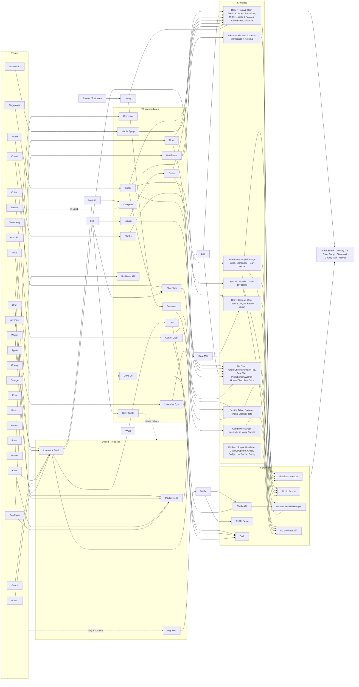

# Harvest Hollow — Animals, Trees, Crafting and Orders (FarmVille 2 and peers)

Research task `fv2-animals-trees-crafting`, written 2026-10-02.

**Scope.** This file covers animals, trees and orchards, crafting and production buildings, and
orders/deliveries. It also gives a recommended production-chain graph for Harvest Hollow.
Neighbouring files:

- `progression-goals-coop.md` (same folder) covers progression, goals, achievements and co-op.
  Where both files touch the same system (Order Board, River Barge, County Fair, Mastery, Prized
  goods), this file keeps the same names and points to it.
- `assets-catalog.md` covers CC0 assets.
- `tech-architecture.md` covers the tech stack.

**How the sources were read.**

- The fandom wikis block scripted page fetches (HTTP 402). Their pages were read as raw wikitext
  through each wiki's MediaWiki API (`api.php?action=parse&prop=wikitext`). The page URLs are
  cited below.
- The GDC 2013 *FarmVille 2 Postmortem* audio from the Internet Archive was transcribed locally. A
  full transcript is saved at `docs/research/sources/farmville2-gdc2013-postmortem-transcript.txt`.
- The Supercell GDC 2018 talk (Hay Day economy section) was read from its YouTube captions.
- Numbers come from those primary pages unless marked *(search snippet)*.

---

## 0. The twelve findings that matter most

1. **FarmVille 2 is one interlocking ecosystem, and its designers said so.** The loop is: water
   grows crops and trees → crops become feed → animals eat feed and give products plus manure →
   manure becomes fertilizer for more crops → products are crafted → crafts are sold at the
   roadside stand. In the designer's words: *"when you feed your animals, they're going to poop,
   and they give you fertilizer back … you can take that and put it all together and craft with
   it and sell your crafts for money"* (GDC 2013 postmortem, transcript ~41–43 min).
   Harvest Hollow should keep exactly this closed loop. It is intuitive because everyone knows how
   a farm works.
2. **Make animals feed on processed feed, not raw crops.** Hay Day and FarmVille 2 both put a
   Feed Mill between crops and animals. That one building turns every surplus crop into something
   useful and creates the first production puzzle. FarmVille 2: Country Escape skipped it (cows eat
   3 wheat directly, every minute) and lost the puzzle. See §2.
3. **Animals never die and never punish neglect.** FarmVille 2's own design summary is *"your
   animals never die"* (GDC 2013). Stardew animals only stop producing when unfed. A product waits
   on the animal until someone collects it. Care (petting, brushing) should give bonuses, never
   penalties.
4. **FarmVille 2's "everything levels up" pillar failed.** Players *"never wanted to stop feeding
   that chicken and watering that tree"*, which killed variety. They also found that *"if
   everything you click on is a decision, then … it goes against that concept of relaxation"*. A
   further cost was an "art explosion" of growth states (GDC 2013, ~22–24 min). Levelling should
   be per *species/recipe* (mastery stars) plus one capstone state (Prized/Heirloom). Do not give
   every individual animal and tree a long upgrade path.
5. **Trees are long-cycle "capital" producers.** FarmVille 2 trees cost 260–5,600 coins, never
   wither, and produce 4–6 fruit every 2–24 h. Groves of 4 trees of the same kind give +1 fruit
   each and save space ([FV2 wiki — Trees](https://farmville2.fandom.com/wiki/Category:Trees),
   [Grove](https://farmville2.fandom.com/wiki/Grove)). Hay Day trees give 2+3+4 fruit and then
   wilt. A *different player* must revive a wilted tree for the last 4 fruit, after which it dies
   ([Hay Day wiki](https://hayday.fandom.com/wiki/Trees_and_Bushes)). For a couple, keep FV2's
   permanence and borrow Hay Day's "partner helps the tree" moment as a *bonus*, not a gate.
6. **Crafting must clearly add value, but by a predictable amount.** In FV2, Apple Pie sells for
   1,300 coins from about 426 coins of raw goods, roughly 3×
   ([Apple Pie](https://farmville2.fandom.com/wiki/Apple_Pie)). In Hay Day, Cheese sells for 122
   from 3 Milk worth 96, about 1.27×
   ([Cheese](https://hayday.fandom.com/wiki/Cheese)). Hay Day prices every good as *ingredient
   value + a concave function of production time*. Supercell said 40 min ≈ 5 diamonds and
   100 min ≈ 7, which fits √t well. Coins and XP are fixed multipliers of that value (Supercell,
   GDC 2018). Harvest Hollow should use the same method (§6.1).
7. **Use timed production queues, not an energy bar.** FV2 crafting was instant but gated by
   "Power": 30 max, 1 power every 4 minutes, 1–7 power per recipe
   ([Power](https://farmville2.fandom.com/wiki/Power)). That is an energy paywall in all but name.
   Hay Day's model is better for a private co-op game:
   - Each machine makes one item at a time with 2–3 queue slots, upgradable to 9.
   - Finished goods wait in front of the machine.
   - Long recipes run while you sleep.
   ([Production Buildings](https://hayday.fandom.com/wiki/Production_Buildings))
8. **Orders are the best goal generator.** They turn an open sandbox into a puzzle with a clear
   next step. Township's production puzzle *"starts from an order"*
   ([Deconstructor of Fun](https://www.deconstructoroffun.com/blog/2020/10/13/how-playrix-township-became-a-billion-dollar-game)).
   Hay Day generates each order from a *target value* filled with 1–6 goods, and varies the XP/coin
   split for choice (Supercell GDC 2018). FV2 paid a *second currency* (Favors) only through
   orders and spent it on expansions and upgrades
   ([Favor](https://farmville2.fandom.com/wiki/Favor)). Orders therefore drive both short and long
   goals. See §5.
9. **Every raw good needs at least two outlets, plus feed or the market.** FV2's universal Feed
   Mill gave any crop or fruit a use: 2–5 feed per fruit, 8–33 feed per crop
   ([Feed](https://farmville2.fandom.com/wiki/Feed)). Harvest Hollow gets the same effect from a
   **Pig Slop** recipe that accepts *any* produce. The recommended graph (§6) gives every raw good
   ≥2 recipes and ≥2 final goods.
10. **Collector buildings make by-products exciting.** FV2's Fertilizer Bin, Spinning Wheel, Mud
    Wallow and Hen House all work the same way ([FV2 help — Hen House](https://zyngasupport.helpshift.com/hc/en/10-farmville-2/faq/475-how-do-i-use-the-hen-house/),
    [Mud Wallow](https://zyngasupport.helpshift.com/hc/en/10-farmville-2/faq/479-how-do-i-use-the-mud-wallow/)):
    - Every feeding adds points to the building (Fertilizer Bin: 40 points → 12 fertilizer).
    - Emptying it gives a rare collectible set (2 uncommon + 2 rare + 1 ultra-rare).
    - A full set unlocks a special breed.

    This is cheap to build and very motivating. Recommended for Harvest Hollow (§2.7).
11. **Prized animals should not retire.** In FV2, after 35–65 feedings an animal became "Prized".
    It then ate only every 18 h and made one premium item, so players stored it in a barn
    ([White Sheep](https://farmville2.fandom.com/wiki/White_Sheep)). In Harvest Hollow, Prized
    should be a *prestige state that keeps producing normally* and adds a chance of a premium good
    for the County Fair. Dead-end collectibles feel bad.
12. **Feel matters as much as numbers.** FV2's rules were:
    - The board moves at about 60 BPM.
    - Hover is "like the wind": crops sway under the cursor.
    - A click is "electric": things spring to life, with sound.
    - The game is one-handed: no complex camera controls.
    - Faster rendering correlated with players who stayed longer and paid more: *"80% of our
      revenue comes from players with 15 frames per second or better"* (GDC 2013, ~34–58 min).

    Supercell kept state *in the world*: a hungry chicken looks hungry. They avoided floating
    icons (GDC 2018). Both points shape how animals and trees must render (§2.8, §3.6).

---

## 1. How FarmVille 2's farm ecosystem works

FarmVille 2 (Zynga, Facebook, 2012; 3D-rendered isometric with GPU acceleration via Flash 11
Stage3D) was built around five creative pillars:

1. *your farm is alive*
2. *your farm is an ecosystem*
3. *everything levels up* (later dropped)
4. *you're part of a living community*
5. *your farm is unique* (scaled back)

(GDC 2013 postmortem by Wright Bagwell and Mike McCarthy:
[GDC Vault](https://www.gdcvault.com/play/1018015/Farm),
[Internet Archive audio](https://archive.org/details/GDC2013Bagwell).)

Vice President Tim LeTourneau: *"Our goal was to create an ecosystem where all these things were
interconnected."* Bagwell: *"You have to water seeds once you plant them … Things don't just fall
from the sky in this game"*
([GamesBeat](https://gamesbeat.com/farmville-2-zynga/)).

### 1.1 The loop, with FV2's actual resources

```
            ┌──────────── Fertilizer (+1 yield) ◄────────────┐
            ▼                                                 │ manure on every feeding
 Water ──► Crops / Trees ──► Feed Mill ──► Feed ──► Animals ──┤
   ▲            │                                        │    └─► Fertilizer Bin (40 pts → 12)
 Wells          └──────────► Kitchen / Workshop / Kiln ◄─┘ products (egg, milk, wool, horseshoe…)
 (10 / 4 h)                       │ (costs Power)
                                  ▼
                   Market Stand (coins) · Orders (coins + Favors) · County Fair (prized goods)
                                  │
                   Favors + coins ──► land expansions, Grove/building upgrades
```

| Resource | How it is produced | What it is used for | Key numbers |
|---|---|---|---|
| Water | +1 every 3 min; Wells | Growing every seed and every tree cycle | Well: 10 water, refills 4 h; well #2–#5 cost 14k/50k/150k/300k coins ([Water](https://farmville2.fandom.com/wiki/Water), [Well](https://farmville2.fandom.com/wiki/Well)) |
| Feed | Feed Mill grinds crops, flowers, fruit | Feeding animals | Cap 25, +25 per Silo, +35 for a Goat Shelter or Sheep Shack, +50 for a Prized Chicken Coop. An average coin crop gives 24 feed; Strawberry gives 10 feed for 18 coins; Zucchini gives 33 ([Feed](https://farmville2.fandom.com/wiki/Feed)) |
| Fertilizer | Animal feedings; Fertilizer Bin | +1 product on a crop or tree; +1 XP | Bin fills 1 point per feeding; 40 points → 12 fertilizer plus a 25% chance of Speed-Grow ([Fertilizer Bin](https://farmville2.fandom.com/wiki/Fertilizer_Bin)) |
| Power | Regenerates; Furnace | Every craft in Kitchen, Workshop, Kiln | Max 30; 1 per 4 min; Furnace gives 10 every 23 h; recipes cost 1–7 ([Power](https://farmville2.fandom.com/wiki/Power)) |
| Baby Bottles | Requests to friends; Farm Bucks | Growing baby animals | 2–17 per animal; 15 s between bottles ([Baby Bottle](https://farmville2.fandom.com/wiki/Baby_Bottle)) |
| Favors | Market Stand orders, quests, Co-op Order Board | Expansions, farm upgrades | 100 Favors for 15 orders a week; 200 if the Co-op finishes the board ([Favor](https://farmville2.fandom.com/wiki/Favor)) |

### 1.2 What players and designers learned

- **Water as a hard limiter annoyed players.** The resource that made the ecosystem readable also
  rationed play. A player on a fan forum titled their thread *"Love the game so far, but a little
  peeved with the undying need for water!"* (thread title via search). For a private game with no
  monetisation, **do not ration actions with water or power**. Keep watering as an optional
  *speed-up* (§3.6).
- **Depth through stats, not rules.** *"Crops and trees have stats … how much they cost to grow,
  how long they take to produce, how many they produce, how many XP … Your animals have stats,
  how much they cost, how often they get hungry, how much they eat, how much they poop"* (GDC 2013,
  ~43 min). The surface is intuitive, and min-maxers find depth in the numbers. The "Space Dino
  farming" joke in the talk makes the point: the same mechanics with a fantasy skin become
  unreadable.
- **Players asked to stay away from fantasy.** Halloween-costumed animals sold poorly. The game
  became *"the good life on the farm … your animals never die … everything's sort of handcrafted"*
  (GDC 2013, ~28 min). Harvest Hollow should keep goods realistic and recognisable.

---

## 2. Animals

### 2.1 FarmVille 2 — roster and numbers

Coin-bought animals from the [FV2 Animals table](https://farmville2.fandom.com/wiki/Animals) and
the individual pages. "Bottles" is how many Baby Bottles grow the baby into an adult. "Prized
after" is the number of adult feedings before the animal turns Prized.

| Lvl | Animal | Baby cost | Bottles | Feed / feeding | Cooldown | Output per feeding | XP | Prized after | Prized state |
|---|---|---|---|---|---|---|---|---|---|
| 3 | [White Chicken](https://farmville2.fandom.com/wiki/White_Chicken) | 1,500 | 2 | 3 | 5 min | 1 Egg (79%) or 2 (21%); egg sells 60 | 2 | 35 | 18 h, Brown Egg |
| 5 | [Saanen Goat](https://farmville2.fandom.com/wiki/Saanen_Goat) | 9,500 | 5 | 4 | 15 min | Milk, sometimes Cheese | 3 | 50 | 18 h, Goat Cheese |
| 6 | [Rhode Island Red Chicken](https://farmville2.fandom.com/wiki/Rhode_Island_Red_Chicken) | 6,000 | 3 | 6 | 5 min | 2–3 Eggs | 4 | 50 | 18 h, Brown Egg |
| 6 | [White Sheep](https://farmville2.fandom.com/wiki/White_Sheep) | 9,000 | 3 | 4 | 8 h | 1 Wool, 1 Milk, 2 Fertilizer | 3 | 50 | 18 h, Fine Sheep Fleece |
| 8 | [Cottontail Rabbit](https://farmville2.fandom.com/wiki/Cottontail_Rabbit) | 4,000 | 2 | 4 | 1 h | Wool | 3 | 50 | 18 h, Fine Rabbit Wool |
| 10 | [Mustang Horse](https://farmville2.fandom.com/wiki/Mustang_Horse) | 14,000 | 9 | 6 | 6 h | 1–2 Horseshoes (+3 Fertilizer 50%) | 5 | 50 | 18 h, Fine Saddle |
| 11 | [Longhorn Cow](https://farmville2.fandom.com/wiki/Longhorn_Cow) | 20,000 | 5 | 4 | 3 h | Milk ×1–3, often Cheese ×2, sometimes 3 Fertilizer | 4 | 50 | 18 h, Swiss Cheese |
| 12 | [Black Arabian Horse](https://farmville2.fandom.com/wiki/Black_Arabian_Horse) | 22,000 | 6 | 12 | 6 h | 2 Horseshoes, 4 Fertilizer | 8 | 55 | 18 h, 2 Fine Saddles |
| 15 | [Jersey Cow](https://farmville2.fandom.com/wiki/Jersey_Cow) | 35,000 | 9 | 8 | 3 h | Milk, sometimes Cheese | 7 | 65 | 18 h, Swiss Cheese |
| 39 | Lincoln Sheep | 50,000 | 13 | 12 | — | 4 Wool, 2 Milk | 13 | 80 | — |

**Observations that matter for our design:**

- **Output is a loot table, not a fixed amount.** Longhorn Cow per feeding:
  - 40%: Milk + 3 Fertilizer.
  - 10%: Milk + 2 Cheese + 3 Fertilizer.
  - 29%: Milk + 2 Cheese.
  - 21%: 3 Milk + 2 Cheese.

  Over 50 feedings that averages about 70 Milk, 40 Cheese and 75 Fertilizer, worth about 13,600
  coins ([Longhorn Cow](https://farmville2.fandom.com/wiki/Longhorn_Cow)). Small variance keeps
  collecting fun.
- **Animals were roughly break-even on raw sales.** The wiki works it out for each animal:
  - Longhorn: about 13,600 coins of product plus 4,000 for the prized sale, against a 20,000 cost.
  - Mustang: *"still needs an income of 2,515 coins to amortize"*.
  - White Sheep: nets only 525 coins if sold at prize.

  The profit came from **crafting** (≈3× multipliers) and **fertilizer**. The design deliberately
  made raw animal goods an *input*, not an income source.
- **Cooldowns are bimodal.** Chickens and goats repeat every 5–15 min (active play); cows, horses
  and sheep every 3–8 h (check-in play).
- **Mastery ribbons per species** (yellow/red/blue at e.g. 32/530/890 feedings for White Sheep)
  pay **Speed-Feed**. Speed-Feed instantly re-feeds an animal and gives 3 feedings' worth of
  products. The Feed Mill can make it later: 80 Feed → 1 Speed-Feed, 8 h cooldown
  ([Speed-Feed](https://farmville2.fandom.com/wiki/Speed-Feed)).

### 2.2 FarmVille 2 — lifecycle, housing, breeding, collectors, pets, horses

- **Baby → adult.** Bought babies cost coins. Adults cost Farm Bucks. A baby needs 2–17 Baby
  Bottles, which came from friends; this was the core social request. Bottles have a 15 s timer
  between uses ([Baby Bottle](https://farmville2.fandom.com/wiki/Baby_Bottle)).
- **Adult → Prized.** After N feedings the cooldown becomes 18 h and the output becomes one
  premium good plus big XP. The prized animal sells for 2× an adult. Most players parked prized
  animals in storage.
- **Storage.**
  - Roaming plus barn capacity is 130.
  - The Animal Barn holds 15→75 animals over 7 levels.
  - The Prized Animal Barn holds 160→430 over 5 levels.
  - Species shelters (Sheep Shack, Goat Shelter, Horse Stable, Prized Chicken Coop, etc.) hold
    prized animals of one kind. The Sheep Shack holds up to 12 prized sheep, *halves* their feed,
    adds feed capacity (+25 on its own page, +35 on the Feed page) and adds Golden Fleece drops
    ([storage FAQ](https://zyngasupport.helpshift.com/hc/en/10-farmville-2/faq/203-what-are-the-different-animal-storage-buildings/),
    [Sheep Shack](https://farmville2.fandom.com/wiki/Sheep_Shack)).
- **Nurseries** (goat, sheep, rabbit). A baby goes through 3 quest stages of 3 tasks each.
  Players "Feed / Play / Groom" using crafted items, pick a **Personality** (Grumpy / Sleepy /
  Playful, which changes idle animation) and a **Specialty** (+1 Milk or +1 Fertilizer on every
  feeding). There is a cooldown between babies and a limit of 3 nurseries
  ([Goat Nursery FAQ](https://zyngasupport.helpshift.com/hc/en/10-farmville-2/faq/648-how-do-i-use-the-goat-nursery/)).
  *This is the best "raise a baby" design in the genre*: a short care arc with a cosmetic choice
  and a small permanent bonus.
- **Breeding Barn** (horses L15, cows L30):
  - Pick two adults; each horse breeds once.
  - A gestation timer can be shortened by feeding the parents. Feeding also raises a "pedigree
    predictor".
  - Pedigree runs 0–5; levels 4–5 can only be bred. One barn per farm, one pair breeding at a
    time.
  - Pedigree points count for one animal a week at the Fair
    ([horses](https://zyngasupport.helpshift.com/hc/en/10-farmville-2/faq/1611-how-do-i-breed-horses/),
    [cows](https://zyngasupport.helpshift.com/hc/en/10-farmville-2/faq/1610-how-do-i-breed-cows/)).
- **Collector buildings.** All four work the same way: they fill from normal feedings and pay
  rare drops.
  - **Fertilizer Bin:** 40 points → 12 fertilizer.
  - **Spinning Wheel** (needs 4 adult sheep or rabbits). Wool drops fill it, and sheep count 2×.
    A full basket gives Spun Yarn plus Fine / Super-Fine / Premium Yarn drops. A set of 6/4/2
    unlocks the Manx Loaghtan sheep
    ([FAQ](https://zyngasupport.helpshift.com/hc/en/10-farmville-2/faq/527-how-do-i-use-the-spinning-wheel/)).
  - **Mud Wallow** (4 pigs). Mud gives Clay for the Kiln plus Copper/Silver/Gold Antique Coins.
    A set of 6+4+2 unlocks the Spotted Hog.
  - **Hen House** (3 chickens). A daily harvest of eggs plus uncommon/rare/ultra-rare exotic eggs.
    A set of 2+2+1 unlocks the Polish chicken.
- **Rooster.** Feeds all adult chickens once every 24 h
  ([FAQ](https://zyngasupport.helpshift.com/hc/en/10-farmville-2/faq/10222-how-does-the-rooster-feed-my-adult-chickens/)).
  This is a convenience item that removes busywork.
- **Bee Box.** Pollen comes from harvesting *crops* (Hibiscus and Honeysuckle about 2× as often).
  It yields Honey plus Amber/Orange/Golden honeycombs. A set of 2+2+1 builds a Beehive that
  fertilizes 4 nearby crops
  ([FAQ](https://zyngasupport.helpshift.com/hc/en/10-farmville-2/faq/1615-how-do-i-use-the-bee-box/)).
- **Dog (Labrador).** Unlocked at L17 through a "Puppy Adoption Race" against NPCs. It needs Baby
  Bottles to grow up. As an adult it may dig up bonus **Prize Crops** after you fertilize and
  harvest. One per farm
  ([FAQ](https://zyngasupport.helpshift.com/hc/en/10-farmville-2/faq/701-how-do-i-get-the-labradors/)).
- **Horses.**
  - Products: Horseshoes (crafted into Metal Sheet → fences), Fertilizer, and Fine Saddle when
    prized ([Horse](https://farmville2.fandom.com/wiki/Horse)).
  - Late FV2 added Horse Racing and a FarmVille Derby
    ([help index](https://zyngasupport.helpshift.com/hc/en/10-farmville-2/section/106-game-guides/)).
  - A horse "producing horseshoes" is illogical (horses *wear* them). Harvest Hollow should not
    copy it (§2.7).

### 2.3 Hay Day — the cleanest animal loop

| Animal | Unlock Lvl (1st/2nd/3rd pen) | Price per animal | Pen and capacity | Cycle | Product (max sell) | Feed |
|---|---|---|---|---|---|---|
| [Chicken](https://hayday.fandom.com/wiki/Chicken) | 1 / 12 / 23 | 20 / 140 / 270 | Coop (5 coins), 6 hens | 20 min | Egg (18) | Chicken Feed = 2 Wheat + 1 Corn → 3 units in 5 min |
| [Cow](https://hayday.fandom.com/wiki/Cow) | 6 / 15 / 27 | 50 / 600 / 1,150 | Pasture (20), 5 cows | 1 h | Milk (32) | Cow Feed = 1 Corn + 2 Soybean → 3 in 10 min |
| [Pig](https://hayday.fandom.com/wiki/Pig) | 10 / 18 / 32 | 500 / 1,400 / 2,300 | Pen (150), 5 pigs | 4 h | Bacon (50) | Pig Feed → 3 in 20 min |
| [Sheep](https://hayday.fandom.com/wiki/Sheep) | 16 / 26 / 42 | 800 / 2,300 / 3,800 | Pasture (300), 5 sheep | 6 h | Wool (54) | Sheep Feed → 3 in 30 min |
| [Goat](https://hayday.fandom.com/wiki/Goat) | 32 / 37 / 50 | 2,150 / 5,400 / 8,650 | Yard (1,000), 4 goats | 8 h | Goat Milk (64) | Goat Feed → 3 in 40 min |

Sources: the per-animal pages above, [Feed Mill](https://hayday.fandom.com/wiki/Feed_Mill),
[Egg](https://hayday.fandom.com/wiki/Egg), [Milk](https://hayday.fandom.com/wiki/Milk).

**Mechanics worth copying:**

- **One feed per production.** Feed is made in batches of 3 at the Feed Mill. The Feed Mill
  starts with 3 queue slots. A second Feed Mill unlocks at level 12.
- **The product sits on the animal until collected.** The animal won't eat again until then. The
  wiki recommends *"let the chickens sit on the eggs until they're needed"* to save storage.
  Storage is never wasted and nothing is lost.
- **Animal state is drawn on the model.** Hungry, fed and full poses exist for every animal; the
  Supercell talk shows a chicken and a pig going *hungry → fed → ready to collect*. No floating
  icons: *"we wanted to represent things inside the game … floating icons … break the
  immersion"* (Supercell GDC 2018, ~6 min).
- **Price tiers per pen.** The 2nd and 3rd coop of chickens cost 7× and 13.5× more per hen. This
  keeps expansion a decision and stops runaway scaling.
- **Pets.** Dogs (fed Bacon) and cats (fed Milk) live in Dog/Cat Houses, up to 3 pets per house
  and 2 houses of each. They give XP every 6 h and sometimes upgrade supplies. A whistle wakes all
  of them for one collection *(search snippet:
  [SuperCheats — List of Pets](https://www.supercheats.com/hay-day/walkthrough/list-of-pets))*.
  Pets are a **sink** for animal products and a cute daily ritual.

### 2.4 FarmVille 2: Country Escape (mobile spin-off) — what not to do

Animals eat **raw crops directly**, on minute-scale cycles
([Animal](https://farmvillecountryescape.fandom.com/wiki/Animal)):

| Animal | Food | Cycle | Output |
|---|---|---|---|
| Cow | 3 Wheat | 1 min | 1 Milk |
| Chicken | 2 Corn | 4 min | 3 Eggs |
| Goat | 2 Carrots | 3 min | 2 Goat Milk |
| Sheep | 4 Tomatoes | 30 min | 3 Wool |
| Pig | 2 Carrots | 3 min | 2 Clay (!) |

There is a maximum of 4 of each type. The first costs coins; the rest cost premium Keys. Prized
animals (one per farm) level through **Animal Mastery** (0–3 stars). Farm Hands tend them for 10
mastery XP each, and they eat special crafted "Prized Feed"
([Prized Animal](https://farmvillecountryescape.fandom.com/wiki/Prized_Animal),
[Without the Sarcasm guide](https://www.withoutthesarcasm.com/posts/eddie-stamps-prized-animals-guide-farmville-2-country-escape/)
*(search snippet)*).

**Lesson:** feeding raw crops on 1–4 minute cycles turns animals into vending machines. Pigs
producing *clay* is the kind of illogic the owner wants to avoid.

### 2.5 FarmVille 3 (2021) — breeds, houses, life stages

- **Roster.** 9 animal families (egg birds, cows, pigs, woodland, sheep, feather birds, goats,
  horses, bison) with 93 breeds ([farmville3.info](https://farmville3.info/animals/)).
- **Housing.** A house holds **2 animals**. *"Every animal needs a cosy room before it can produce
  items or breed"* ([Pocket Tactics](https://www.pockettactics.com/farmville-3/animals)).
- **Life stages: Baby → Adult → Elder.** Only adults produce or breed. Babies take 2–20+ h to grow.
- **Breeding.** When a baby grows up, its parents become **Elders** and are sold for Elder Points
  ([Zynga FV3 FAQ](https://zyngasupport.helpshift.com/hc/en/91-farmville-3/faq/14481-how-do-i-breed-animals/)).
- **12 breed tiers:** Common 1–3, Uncommon 4–6, Rare 7–9, Epic 10–12. Breeding two adults of a
  breed unlocks the next tier, so this is a **collection ladder**.
- **Feed by animal size** at the Feed Maker
  ([fv3 wiki](https://fv3.fandom.com/wiki/Production_Building_Crafting_Guide)):

  | Feed | Recipe | Time |
  |---|---|---|
  | Small Feed ×3 | 2 Sunflower + 1 Wheat | 5 min |
  | Big Feed ×3 | 2 Soybean + 1 Wheat | 10 min |
  | Medium Feed ×3 | 2 Carrot + 2 Sunflower | 20 min |

  Grouping feeds by size keeps the feed list short. Copy that.
- **Lesson:** the breed ladder adds collection depth. But the forced elder-sale removes the
  attachment players have to "our cow", and for a couple attachment matters more than collection
  speed. Keep breeds cosmetic; never take the parents away.

### 2.6 Stardew Valley — the care model

([Animals](https://stardewvalleywiki.com/Animals))

- **Housing tiers unlock species.**
  - Coop: Chicken.
  - Big Coop: Duck.
  - Deluxe Coop: Rabbit.
  - Barn: Cow.
  - Big Barn: Goat, plus pregnancy.
  - Deluxe Barn: Sheep, Pig, plus auto-feeders.
- **Friendship.**
  - Range 0–1000 (5 hearts).
  - Petting +15; milking or shearing +5; eating grass outside +8.
  - Not petted −5 to −10; unfed −20.
  - *"Animals do not die if unfed but become upset and cease production."*
- **Mood** runs 0–255. **Quality** of produce (silver/gold/iridium) and the chance of a *large*
  product (Large Egg 95g vs Egg 50g; Large Milk 190g vs 125g) come from friendship and mood.
- **Pigs find Truffles** only when let outside (625g). Truffle Oil sells for 1,065g, the most
  famous "raw → artisan" upgrade in the genre.
- **Cadence.** Sheep give wool every 3 days, or every 2 at high friendship. Ducks and rabbits give
  rarer drops (feather 250g, rabbit's foot 565g) when happier.
- **Lesson:** *care is the input that turns quantity into quality*. That is a gentle, non-punitive
  depth layer. The negative modifiers (−20 unfed) are the part to drop.

### 2.7 Recommendation — Harvest Hollow animals

**Principles.**

- **A1.** Animals never die, never lose friendship, and never get sick from neglect. An unfed
  animal simply waits.
- **A2.** A product waits on the animal until collected, and the animal won't eat again until
  then. Nothing is wasted and nothing overflows (Hay Day).
- **A3.** One feed unit per production; feed is made in batches of 3 at the Feed Mill.
- **A4.** Every animal's state is visible on the model, with no icons (Supercell):
  - Hungry: looks around, sniffs the trough.
  - Eating.
  - Ready: an egg under the hen, a full udder, a fluffy sheep, a truffle on the ground.
- **A5.** Care is a bonus layer. Petting or brushing once per cycle by *either* player adds
  **Affection** (0–5, shown as paw prints; "Hearts" is already the partner currency in
  `progression-goals-coop.md`). Affection raises the chance of a *bonus or large* product
  (Stardew).
- **A6.** Levelling happens per **species** (mastery ★1–★3 plus Gold, as in
  `progression-goals-coop.md §4.2`) and in one capstone state, **Prized**. There are no long
  per-animal upgrade trees (GDC 2013 lesson).
- **A7.** **Prized keeps producing at the normal cycle.** It adds a 10–15% chance of a *premium
  good* for the County Fair (Golden Egg, Silk Wool, Black Truffle, Cream-Top Milk). Prized never
  slows the animal down.

**Recommended roster.** Unlock bands follow `progression-goals-coop.md §3.5`. Cycle times are
starting points; the value model in §6 balances them.

| Animal | Band | Housing (start → max) | Eats | Cycle | Product | Premium (Prized) | Extra role |
|---|---|---|---|---|---|---|---|
| Chicken | 1–5 | Coop 6 → 12 | 1 Poultry Feed | 20 min | Egg | Golden Egg | Rooster upgrade feeds all hens once a day (FV2 convenience) |
| Cow | 6–10 | Barn 4 → 8 | 1 Livestock Feed | 60 min | Milk | Cream-Top Milk | Milk → Baby Bottles for every mammal baby |
| Sheep | 11–15 | Pasture 5 → 10 | 2 Livestock Feed | 4 h | Wool | Silk Wool | Shearing animation; Spinning Wheel collector set unlocks a rare breed |
| Bees | 11–15 | Hives 3 → 9 | none (flowers or fruit trees within radius) | 6 h | Honey (+ Beeswax at the hive) | Royal Jelly | Pollination: crops and trees in radius +10% bonus-yield chance |
| Pig | 16–20 | Pen 4 → 8 | 1 Pig Slop (any 2 produce) | 4 h | Truffle (dug up in the pasture) | Black Truffle | **Universal sink**: turns any surplus crop or fruit into value |
| Duck (optional) | 16–20 | Pond 4 → 8 | 1 Poultry Feed | 90 min | Duck Egg / Feather | Golden Feather | Pond life, decor |
| Goat | 21–30 | Yard 4 → 8 | 2 Livestock Feed | 3 h | Goat Milk | Aged Goat Cheese drop | Goats climb rocks: delightful idle |
| Horse | 21–30 | Stable 2 → 4 | 2 Livestock Feed (+ apple or carrot treats) | 6 h | Manure ×2 → Compost | Show Ribbon (Fair) | **Mount** (faster travel) and **pulls the delivery cart**; no horseshoes |
| Alpaca (optional) | 31–40 | Paddock 4 → 8 | 2 Livestock Feed | 5 h | Alpaca Fiber | Royal Fiber | Luxury textiles |

**Life cycle.**

| Stage | Rule |
|---|---|
| Baby (calf, lamb, kid, foal, piglet, chick) | Buy as a baby (cheap) or adult (≈2× price, the only "skip"). A baby grows on its own in 30 min (chick) to 4 h (foal). Each Baby Bottle (Dairy: 1 Milk → 2 bottles; Poultry Feed for chicks) cuts 25% of the remaining time. Bottle-feeding is a cute two-player moment, and either player can do it. There is no dead end: babies always grow without bottles. |
| Adult | Produces. Gains Affection from care. |
| Prized | After N collections (chicken 60, cow 40, sheep 25, pig 25, goat 25; roughly 2–5 days of normal play). A ribbon appears on the model and the animal gives premium-good chances. Its species ★ counts. |
| Breeding (late, Breeding Barn) | Two adults of a species → one baby in 2–8 h, with a random **coat variant** from a pool (white/brown/spotted/rare golden). The Collection Album has a page per species. No stat pedigree (no power creep). Parents are untouched. The couple names the baby. |

**Nursery** (FV2's best idea, simplified). A baby placed in the Nursery gets a 3-step care card:
Feed, Play, Groom. Each step uses one crafted treat. At the end the players pick a
**personality** (Sleepy / Playful / Grumpy; changes idle animation) and a **specialty** (+1
product 10% of the time, or +1 manure). This is optional and gives an attachment payoff.

**Collector buildings** (FV2 pattern):

| Building | Fills from | Payout per fill | Collectible set unlocks |
|---|---|---|---|
| Compost Bin | 1 point per animal collection | 40 points → 6 Compost | — |
| Spinning Wheel | Wool collections | 20 → Yarn ×3 + Fine/Super-Fine/Premium Yarn drops | 6/4/2 set → Black Sheep breed |
| Hen House | Daily | Eggs + exotic egg drops | 2+2+1 → Silkie breed |
| Mud Wallow | Pig collections | Clay (pottery decor) + Copper/Silver/Gold coin drops | 6/4/2 → Spotted Pig |

**Pets** (no products, pure joy and a sink):

- **Dog and Cat**, one each per player, adopted through a short story quest. They follow their
  owner, sit by them when idle, and react to the partner.
- **Daily treat** (crafted in the Kitchen):
  - Dog Biscuit = Flour + Egg + Milk.
  - Cat Treat = Cream + Egg.
- **Payout:** a daily **Gift** (a random supply, collection item or seed pack) and +1 Affection.
- **Dog:** chance to dig up a Prize Crop when the partner harvests nearby. This is FV2's Labrador,
  made co-op.
- Pets never punish neglect.

**Horses** are the prestige animal. Their value is **utility and fun**, not sales:

- Riding multiplies walking speed by 1.8.
- Hitching the horse to the cart unlocks bigger Delivery Cart and River Barge shipments.
- Prized horses enter the County Fair **horse show**.
- Manure → Compost closes FV2's fertilizer loop.

**Rendering note for the AMD Vega iGPU:**

- Animals are instanced GLBs.
- Hungry, eating and ready are a pose plus a prop (egg mesh, udder morph, fluffy wool scale).
- Wander AI is simple waypoint lerping inside the pen at about 60 BPM motion.
- Skinned animation is used only within about 25 m of a camera; further away it falls back to a
  static mesh plus a bob.
- `tech-architecture.md` owns the details.

### 2.8 Animal feel checklist (from the talks)

- Hovering over a pen makes animals look at the cursor ("hover is like the wind").
- Clicking or dragging feed triggers a happy bounce plus a sound ("touch is electric").
- Collecting gives a little squash-and-stretch plus a particle burst. Idle motion stays at a
  relaxed 60 BPM. 120 BPM is for attention (a ready product); 240 BPM is reserved for level-ups
  and order completion (GDC 2013, ~52–58 min).
- Every action works with one hand. No camera gymnastics are needed to feed a pen (GDC 2013
  "one-handed principle").

---

## 3. Trees and orchards

### 3.1 FarmVille 2 — numbers

From each tree's wiki page (`TreePage` template; cost and fruit price in coins; "feed" is the
Feed Mill yield per fruit):

| Lvl | Tree | Cost | Water / cycle | Cycle | Fruit per harvest | Fruit sells | Feed per fruit | XP |
|---|---|---|---|---|---|---|---|---|
| 2 | [Lemon](https://farmville2.fandom.com/wiki/Lemon_Tree) | 260 | 3 | 12 h | 6 | 14 | 3 | 4 |
| 3 | [Apple](https://farmville2.fandom.com/wiki/Apple_Tree) | 320 | 2 | 4 h | 4 | 18 | 2 | 2 |
| 5 | [Olive](https://farmville2.fandom.com/wiki/Olive_Tree) | 480 | 3 | 12 h | 6 | 29 | 5 | 5 |
| 6 | [Pine](https://farmville2.fandom.com/wiki/Pine_Tree) | 5,600 | 6 | 24 h | 6 Wood | 98 | 0 | 34 |
| 7 | [Orange](https://farmville2.fandom.com/wiki/Orange_Tree) | 300 | 3 | 8 h | 5 | 18 | 3 | 3 |
| 11 | [Peach](https://farmville2.fandom.com/wiki/Peach_Tree) | 620 | 3 | 2 h | 4 | 33 | 3 | 4 |
| 15 | [Pear](https://farmville2.fandom.com/wiki/Pear_Tree) | 800 | 3 | 24 h | 6 | 41 | 4 | 10 |

Other FV2 cycles ([Category:Trees](https://farmville2.fandom.com/wiki/Category:Trees)):

| Cycle | Trees |
|---|---|
| 2 h | Apricot, Mango |
| 8 h | Cherry, Nutmeg, Hickory, Macadamia, Coffee |
| 10 h | Walnut |
| 12 h | Plum, Fig, Lime, Pecan, Date, Lychee |
| 16 h | Coconut |
| 18 h | Grapefruit, Maple (sap) |
| 20 h | Banana |
| 24 h | Pear, Pine |

**Rules:**

- A tree is a **one-time purchase**. It starts as a sapling that must be watered to grow into a
  full tree. Once mature, *"it will need to be periodically watered"* before each yield
  ([FV2 help — Trees](https://zyngasupport.helpshift.com/hc/en/10-farmville-2/faq/625-what-are-trees-heirloom-trees-and-prized-fruits/)).
- **Fruit trees never wither.** Trees can't stand on soil and take 3×3 tiles.
- Yield is 2–10. A **fertilized** tree gives +1, and **Speed-Grow** works only on watered trees.
- Neighbours could harvest your trees (a social action).
- **Groves** (L25–27; 98,000 coins + 80 Favors for level 1)
  ([Grove](https://farmville2.fandom.com/wiki/Grove),
  [FAQ](https://zyngasupport.helpshift.com/hc/en/10-farmville-2/faq/647-how-do-i-use-groves/)):
  - Hold **4 trees** on a compact footprint.
  - Need **1 less water per tree**.
  - Give **+1 fruit per tree when all 4 are the same kind**.
  - Grove upgrades 2–5 add **+1 to +4 bonus fruit**.
  - A mixed grove blooms at `ceil(average of the 4 cycle times)`. Example: 2 Apricot (2 h) + 2 Pine
    (24 h) → 13 h. Good for clever players, invisible to casual ones.
  - Groves can only be watered or harvested when full (4/4).
- **Heirloom → Elder.** Pruning Shears (needs a Toolshed, L14) turn a tree into an *Heirloom*:
  - It needs less water.
  - It drops Heirloom Fruit for high-value recipes plus **Prize Fruit** for the County Fair.
  - It masters 3× faster.
  - It later becomes *Elder*: it returns to normal fruit and can be stored or sold for free
    shears. Elder is a confusing reversal; don't copy it.
- **Tree Mastery.** Yellow, Red and Blue ribbons come from harvest counts. Speed-Grow harvests
  count double. Each ribbon gives a decorative sign and *"the more resources your Tree will
  produce"*
  ([FAQ](https://zyngasupport.helpshift.com/hc/en/10-farmville-2/faq/628-how-do-i-master-trees/)).
- **Sprinklers** water everything in their area. Deluxe versions randomly refund water
  ([FAQ](https://zyngasupport.helpshift.com/hc/en/10-farmville-2/faq/495-how-do-i-use-the-sprinklers/)).
- **Wood** (Pine and other timber trees) is a *crafting* resource: 8 Wood → Lumber → fences. It
  has 0 feed value.

### 3.2 Hay Day — finite trees, the "revive" co-op moment

([Trees and Bushes](https://hayday.fandom.com/wiki/Trees_and_Bushes),
[Apple Tree](https://hayday.fandom.com/wiki/Apple_Tree))

- Fruit trees and bushes give **4 harvests: 2, 3, 4, then 4 fruit (13 total)**.
- After the 3rd harvest the plant *wilts*. **Another player** must revive it, and the helper gets
  XP (7 for an apple tree). Then the last 4 fruit come, and the plant dies. Dead plants need a
  **Saw** (trees) or **Axe** (bushes), which are tool drops.
- Costs and cycles:

  | Tree / bush | Level | Cost (coins) | Cycle |
  |---|---|---|---|
  | Apple | 15 | 160 | 16 h |
  | Raspberry | 19 | 220 | 18 h |
  | Cherry | 22 | 410 | 27 h |
  | Blackberry | 26 | 530 | 32 h |
  | Blueberry | 30 | 550 | 34 h |
  | Cacao | 36 | 550 | 35 h |
  | Coffee | 42 | 375 | 24 h |
  | Olive | 57 | 620 | 24 h |
  | Lemon | 66 | 670 | 29 h |
  | Orange | 71 | 720 | 32 h |
  | Peach | 76 | 750 | 31 h |
  | Banana | 88 | 800 | 30 h |
  | Plum | 94 | 600 | 25 h |
  | Mango | 97 | 770 | 32 h |
  | Coconut | 101 | 810 | 36 h |
  | Guava | 104 | 860 | 27 h |
  | Pomegranate | 107 | 910 | 27 h |

- **Decorative trees** are available from level 1.
- **Nectar bushes** feed the bees. The **Beehive Tree** grows in 4 stages as bees bring nectar and
  *never dies*.

**Lesson.** Finite trees create a coin sink and a repeating "replant" decision. The revive is the
genre's best *help another player* moment. For a two-person game, death plus tools is friction.
Keep the **helping gesture** and drop the death.

### 3.3 Stardew Valley — trees as long-term investments

([Fruit Trees](https://stardewvalleywiki.com/Fruit_Trees))

- **28 days to mature** on a clear 3×3 area. Then **1 fruit per day in its season**, accumulating
  up to 3 on the tree.
- **No watering and no death** (winter is fine).
- **Fruit quality rises each year:** silver after 1 year, gold after 2, iridium after 3. The tree
  itself "levels up" visibly and slowly. That is the good version of FV2's failed pillar, because
  it asks for no extra clicks.
- Saplings cost 2,000–6,000g, for fruit worth 50–140g each.
- Lightning can scorch a tree, giving coal for 4 days.

### 3.4 FV2: Country Escape and FarmVille 3

- **Country Escape** treats an Apple Tree like a crop field: 1 apple per 10 s harvest, maximum 6
  trees, with escalating prices of free / 25 coins / 5–75 Keys
  ([CE Apple Tree](https://farmvillecountryescape.fandom.com/wiki/Apple_Tree)). It is
  uninteresting and loses the "orchard" feeling.
- **FarmVille 3** uses fruit trees as regular production with orchard plots; nothing new for us.

### 3.5 Decorative vs productive trees

| Kind | Examples (FV2 / Hay Day) | Function |
|---|---|---|
| Fruit and nut | Apple, Cherry, Peach, Walnut, Olive | Recipes, orders, feed (FV2), pollinated by bees |
| Timber | Pine (FV2: 6 Wood / 24 h, 34 XP) | Lumber and planks, building materials |
| Sap and specialty | Maple (sap, 18 h), Coffee, Cacao, Rubber | Unique intermediates (syrup, chocolate) |
| Decorative | Hay Day decorative trees (lvl 1), FV2 seasonal trees | Beauty, layout, shade. In Harvest Hollow they also count as **flowering** for honey and as **Beauty** points |

### 3.6 Recommendation — Harvest Hollow trees

**Principles.**

- **T1. Trees are permanent capital.** They never die and never revert. FV2 and Stardew both work
  this way, and it matches "animals never die".
- **T2. Visible growth instead of an upgrade menu.** A tree goes through three visual stages:
  - **Sapling**: 2 cycles, no fruit.
  - **Young**: yield −2, smaller canopy.
  - **Mature**: full yield.

  Later, after 100 harvests or the species reaching ★3, the tree becomes an **Heirloom** for good:
  +1 fruit, a 5% Prize Fruit chance, and a larger, gnarlier mesh. That is Stardew's yearly quality
  rise and FV2's Heirloom, made automatic so it adds no clicks.
- **T3. No water gate.** Watering is an **optional boost**. Any player can water a tree once per
  cycle to cut the remaining time by 25%. Sprinklers (crafted from Planks + a part) do it
  automatically in an area. This keeps FV2's tactile "water the tree" verb without rationing play.
- **T4. Help gesture (Hay Day revive, as a bonus).** A tree that is ready and that the *other*
  player tended (watered or pruned) during the cycle gives **+1 fruit**. This is the "Teamwork
  bonus". Solo players lose nothing, they just don't get the extra.
  - **Alignment:** `progression-goals-coop.md` §2 (line ~373) proposes wilting trees that
    "need tending". If adopted, cap it at *one* missed bonus, never lost production, and let a
    cheap Compost tend it solo.
- **T5. Orchard Grove** (FV2): a 2×2-tree fenced grove of the **same kind** gives +1 fruit each
  and takes about 40% less space. Mixed groves are allowed but get no bonus. Skip FV2's
  average-time formula; it is hidden complexity.
- **T6. Bees and trees synergy.** Fruit trees and flowering decorative trees within a hive's
  radius count as forage. Honey type follows the dominant source (Apple Blossom Honey, Lavender
  Honey), as in Stardew's honey-by-flower. This gives decorative trees a function.
- **T7. Timber.** Woodlot trees (Pine, Oak) are *chopped* (an animation; a free sapling is
  replanted automatically). They give Wood every 24 h, or a larger yield when chopped. Wood →
  Planks → Crates, building upgrades and furniture decor, so wood ties trees to expansion.

**Recommended roster.** Aligned to the bands in `progression-goals-coop.md §3.5`. Fruit values
come from the §6 model.

| Tree | Band | Cycle | Yield (mature) | Fruit V | Recipes (≥2) |
|---|---|---|---|---|---|
| Apple | 1–5 | 4 h | 5 | 19 | Apple Pie, Apple Juice (+ pig slop, orders) |
| Cherry | 11–15 | 6 h | 5 | 22 | Cherry Pie, Cherry Jam |
| Orange | 11–15 | 8 h | 6 | 22 | Orange Juice, Orange Marmalade |
| Pear | 16–20 | 10 h | 6 | 24 | Pear Tart, Pear Nectar |
| Peach | 16–20 | 3 h | 4 | 20 | Peach Jam, Peach Yogurt |
| Lemon | 21–30 | 8 h | 6 | 22 | Lemonade, Lemon Cake |
| Plum | 21–30 | 7 h | 5 | 24 | Plum Jam, Plum Cake |
| Walnut (optional) | 21–30 | 12 h | 6 | 26 | Walnut Cookies, Walnut Honey Cake, Maple Walnut Fudge |
| Maple | 31–40 | 10 h | 6 sap | 24 | Maple Syrup → Pancakes, Fudge |
| Olive | 31–40 | 12 h | 6 | 26 | Olive Oil (→ Truffle Oil), Olive Bread |
| Cocoa | 31–40 | 15 h | 6 | 28 | Chocolate → Chocolate Cake, Hot Cocoa |
| Pine / Oak (timber) | 6–10 | 24 h | 6 Wood | 34 | Planks → Crates, upgrades, toys |
| Decorative (Cherry Blossom, Birch, Willow, Maple-red, Topiary) | any | — | — | — | Beauty, bee forage, shade benches |

**Tree economics check.** One Apple tree yields 5 fruit × 19 ≈ 95 coins every 4 h. A 400–600
coin Apple tree therefore pays back in **about 1–2 days at 2–3 visits a day**. Late trees (Olive:
6 × 26 = 156 per 12 h) should cost about 1,500–2,500. The rule is a payback of **2–4 days of
normal play**, which keeps trees exciting without making them mandatory spam.

**Rendering note.** Each tree type needs 3 stage meshes plus a fruit instance layer (fruit
appears as it ripens; Hay Day shows "Stage 1, Stage 2, Ready"). Wind sway is a vertex shader at
about 60 BPM, and hover speeds the sway up ("hover is like the wind"). With instancing, 100+
trees stay cheap.

---

## 4. Crafting and production buildings

### 4.1 FarmVille 2 — instant crafting gated by Power, deep recipe trees

**Buildings.**

| Building | Makes | Source |
|---|---|---|
| Kitchen | Food | [Kitchen](https://farmville2.fandom.com/wiki/Kitchen) |
| Workshop | Textiles, metal, wood | [Workshop](https://farmville2.fandom.com/wiki/Workshop) |
| Crafting Kiln | Glass and clay | [FAQ](https://zyngasupport.helpshift.com/hc/en/10-farmville-2/faq/1616-how-do-i-use-the-crafting-kiln/) |

**Rules.**

- Recipes unlock by player level.
- **Crafting is instant** and costs **Power**: 30 max, 1 per 4 min (the Kiln FAQ says Power
  refills after 1 hour).
- Intermediates ("Crafted Goods", e.g. Flour, Batter, Lemon Water) can't be sold. Only starred
  **Final Recipes** sell at the Market Stand
  ([Kitchen FAQ](https://zyngasupport.helpshift.com/hc/en/10-farmville-2/faq/415-how-do-i-use-the-crafting-kitchen/?s=game-guides&f=how-do-i-use-groves)).
- Example chain: 4 Wheat → **Flour** → Flour + 2 Eggs → **Batter** → Batter + 6 Apples →
  **Apple Scone** (final).

**Recipe examples** (wiki pages; coin values are FV2 sell prices):

| Recipe | Inputs (incl. sub-recipes) | Power | Sells | XP | Raw value of inputs | × |
|---|---|---|---|---|---|---|
| [Butter](https://farmville2.fandom.com/wiki/Butter) (intermediate) | 2 Milk | 1 | 180 | 2 | 2 × 85 = 170 | 1.06 |
| [Batter](https://farmville2.fandom.com/wiki/Batter) (intermediate) | 4 Wheat + 3 Egg (via Flour) | 2 | 290 | 6 | ≈ 236 | 1.2 |
| [Bread](https://farmville2.fandom.com/wiki/Bread) | 4 Wheat, 2 Water, 2 Salt (neighbour gift) via Dough, Flour | 3 | 600 | 14 | — | — |
| [Apple Juice](https://farmville2.fandom.com/wiki/Apple_Juice) | 4 Apple, 1 Water | 1 | 260 | 3 | 68 | 3.8 |
| [Apple Pie](https://farmville2.fandom.com/wiki/Apple_Pie) | 8 Apple, 8 Wheat, 2 Milk, 1 Water via Apple Filling, Apple Juice, Pie Crust, 2 Flour, Butter | 7 | 1,300 | 34 | 8×18 + 8×14 + 2×85 = 426 | 3.05 |
| [Broth](https://farmville2.fandom.com/wiki/Broth) | 6 Onion, 3 Water | 1 | 420 | 4 | — | — |
| Wool Bolt (Workshop, intermediate) | 8 Wool | 1 | 630 | 5 | 8 × 90 = 720 | **0.88** |
| Wool Teddybear | Wool Bolt + Wool Thread Spindle (6 Wool + 2 Fine Rabbit Wool) | — | 1,910 | 15 | ≥ 1,260 | ≈ 1.5 |
| Metal Sheet (intermediate) | 10 Horseshoes | 1 | 1,260 | 8 | 10 × 150 = 1,500 | **0.84** |
| Lumber (intermediate) | 8 Wood | 1 | 1,260 | 8 | 8 × 98 = 784 | 1.6 |
| Pointy Garden Fence | Metal Sheet + Lumber | 1 | 2,530 | 19 | 2,284 | 1.1 |

**Takeaways.**

- FV2 used **3–4-level recipe trees**: raw → intermediate → sub-recipe → final. Big final
  multipliers (≈3×) made crafting the economic heart.
- Its *intermediate* "values" were sometimes **below** their inputs: Wool Bolt 0.88×, Metal Sheet
  0.84×. That only worked because intermediates weren't sellable. Harvest Hollow lets everything
  be sold, so **every step must add value** (§6.1, rule R3).
- **Neighbour-only ingredients** (Salt, Sugar, Flasks, Glass) gated many recipes behind
  requests. In a two-player game this becomes "partner gifts", or it disappears. Don't gate
  recipes on gift items.
- **Exclusive limited-time recipes** (Rose Cupcake, Turkish Tea, …) needed event-only trees or
  crops bought with premium currency. This is FOMO, so skip it.
- **Pet food recipes existed** (Basic Dog Biscuits, Bag of Kitten Nibbles, Baby Animal Formula)
  ([Category:Kitchen Recipe](https://farmville2.fandom.com/wiki/Category:Kitchen_Recipe)). That
  is a precedent for crafted pet treats and bottles.

### 4.2 Hay Day — timed machines and queues

**Rules.**

- Each machine makes **one item at a time**. It starts with **2–3 queue slots**, and slots can be
  bought up to **9**. Slot cost in diamonds goes 6, 9, 12, …; the Feed Mill costs 81 diamonds in
  total.
- **Queued items can't be cancelled.** Finished goods wait in front of the machine, and players
  can keep queueing even when the barn is full ("stacking", up to 52 stacked)
  ([Production Buildings](https://hayday.fandom.com/wiki/Production_Buildings)).
- **Masteries.** After a number of production hours a machine gets ★/★★/★★★. The Feed Mill needs
  120 / 840 / 5,880 h and becomes 5 / 10 / 15% faster
  ([Feed Mill](https://hayday.fandom.com/wiki/Feed_Mill),
  [Masteries](https://hayday.fandom.com/wiki/Masteries)).
- **Storage:** a Barn for products and a Silo for crops, both starting at 50. Each upgrade adds
  25 and needs N of each of 3 upgrade tools (N = level). That makes storage the main long-term
  bottleneck ([Barn](https://hayday.fandom.com/wiki/Barn),
  [Silo](https://hayday.fandom.com/wiki/Silo)).
- **Roadside Shop.** Players set prices up to **3.6× the base value**
  ([Roadside Shop](https://hayday.fandom.com/wiki/Roadside_Shop)).

**Value-add examples** (time, maximum sell price; ingredient counts where the wiki states them):

| Building | Product | Time | Max price | Inputs → max value | × |
|---|---|---|---|---|---|
| [Dairy](https://hayday.fandom.com/wiki/Dairy) | Cream | 20 min | 50 | 1 Milk (32) | 1.56 |
| Dairy | Butter | 30 min | 82 | 2 Milk (64) | 1.28 |
| Dairy | [Cheese](https://hayday.fandom.com/wiki/Cheese) | 1 h | 122 | 3 Milk (96) | 1.27 |
| Dairy | Goat Cheese | 1 h 30 | 162 | Goat Milk | — |
| [Bakery](https://hayday.fandom.com/wiki/Bakery) | Bread | 5 min | 21 | 3 Wheat (9) | 2.33 |
| Bakery | Cookie | 1 h | 104 | 2 Wheat + 2 Egg + 1 Brown Sugar (74) | 1.41 |
| [BBQ Grill](https://hayday.fandom.com/wiki/BBQ_Grill) | [Pancake](https://hayday.fandom.com/wiki/Pancake) | 30 min | 108 | 3 Egg + 1 Brown Sugar (86) | 1.26 |
| [Sugar Mill](https://hayday.fandom.com/wiki/Sugar_Mill) | Brown / White Sugar / Syrup | 20 min / 40 min / 1 h 30 | 32 / 50 / 90 | Sugarcane | — |
| [Pie Oven](https://hayday.fandom.com/wiki/Pie_Oven) | Apple Pie | 2 h 30 | 270 | — | — |
| [Loom](https://hayday.fandom.com/wiki/Loom) | Sweater | 2 h | 151 | Wool | — |
| [Sewing Machine](https://hayday.fandom.com/wiki/Sewing_Machine) | Blanket | 3 h 30 | 1,098 | — | — |
| [Juice Press](https://hayday.fandom.com/wiki/Juice_Press) | Apple Juice | 2 h | 111 | Apples | — |

**Pattern.** Hay Day's step multipliers are modest: about 1.25–1.6× for most goods, higher only
for very short recipes such as Bread. Time is what you pay for, and the long recipes are what you
queue before bed.

### 4.3 How Hay Day balanced it all (Supercell, GDC 2018)

From Touko Tahkokallio's *Design in Depth at Supercell*
([YouTube](https://www.youtube.com/watch?v=IiDPa50bgNg),
[GDC Vault](https://www.gdcvault.com/play/1024934/Design-in-Depth-at-Supercell)), read from the
captions at about 9–20 min:

1. **Time is the base unit.** *"We took the base fundamental resource to be time … time is
   diamonds."* The mapping is concave: *"if something takes 100 minutes that would map to 7
   diamonds; if something would take 40 minutes, that value would be five diamonds."*
   (`diamonds ≈ √(minutes/2)` fits: 2 min → 1, 40 → 4.5, 100 → 7.1.)
2. **Every good is priced the same way.** Its value is the value of its ingredients plus the
   time value of its own production step. Cookie = wheat (2 min → 1) + eggs (feed + 20 min) +
   brown sugar (cane + 20 min) + 60 min of baking.
3. **Coins = A × value; XP = B × value.** *"If someone creates a new good and puts it in the
   spreadsheet you immediately have all the values"* and *"the balance is very easy to tweak … we
   can just tweak the A and B parameters."*
4. **Orders are generated from a value budget.** *"Target diamond value for the order … then we
   generate this order by adding 1 to 6 goods … until we reach the target"*. The target scales as
   the player progresses. Each order's XP/coin balance is then shifted so the total stays equal
   but choices feel different.
5. **The abstract value can diverge from real scarcity, and that is fine.** Brown sugar became a
   bottleneck used by many recipes, which "keeps flavour".
6. **Admitted mistakes:**
   - Letting players set shop prices was *"a kind of a mistake … players usually just put the max
     price for everything"*. Bots also abused it.
   - Markets need two-sided balance. Hay Day forced supply by **not letting players trash
     goods** and by **permuting upgrade-material drop rates across player groups** so people
     trade.

### 4.4 FarmVille 3 and Country Escape — slot and batch variants

**FarmVille 3.**

- 21 production buildings. Each has **2 slots**, and more can be bought.
- Recipes are short and readable. Bakery examples:
  - Bread = 1 Flour, 5 min.
  - Pancakes = 2 White Egg + 2 Milk + 1 Sugar, 20 min.
  - Apple Pie = 2 Apple + 1 Flour + 2 Brown Egg, 1 h.
- Dairy Factory: Cheese = 1 Milk, 15 min; Butter = 1 Cream, 30 min.
- Mill: Flour = 2 Wheat, 3 min; Sugar = 1 Sugarcane, 15 min; Syrup; Caramel.

([fv3 wiki](https://fv3.fandom.com/wiki/Production_Building_Crafting_Guide))

**Country Escape.**

- Up to 6 copies of each workshop. The 2nd–6th cost 20 / 40 / 80 / 160 / 320 Keys.
- **Batch upgrades:** making ×2 takes 1.75× the time, ×3 takes 2.5×, ×5 takes 4×, ×10 takes
  7.75× ([Workshop](https://farmvillecountryescape.fandom.com/wiki/Workshop)).
- Workshop levels 1–6 are bought with **Timber earned only from orders**. Level 6 is 50% faster
  and gives 2× Fair points
  ([Marie's Order Board](https://farmvillecountryescape.fandom.com/wiki/Marie's_Order_Board)).
- Workstation goods are wildly priced: a Tin Button sells for 2,800 from 1 Tin in 5 min. That is
  what happens without a value formula.

### 4.5 Stardew Valley — artisan formulas

([Artisan Goods](https://stardewvalleywiki.com/Artisan_Goods))

| Product | Formula or value | Time |
|---|---|---|
| Jelly / Pickles | 2 × base + 50 | ~2–3 days |
| Wine | 3 × fruit | Keg, ~7 days |
| Juice | 2.25 × ingredient | — |
| Cheese | 230g from Milk 125g | 200 min |
| Goat Cheese | 400g | — |
| Cloth | 470g from Wool 340g | 4 h |
| Mayonnaise | 190g from Egg 50g | 3 h |
| Truffle Oil | 1,065g from Truffle 625g | — |
| Dried Fruit | 7.5 × fruit + 25 (needs 5 fruit) | — |

The Artisan profession adds +40%. Lesson: *formula-based* artisan values (×2–3 plus a constant)
are learnable by players ("jelly is always worth it"), which matters as much as the numbers.

### 4.6 Recommendation — Harvest Hollow crafting

- **C1. Timed machines with queues, never an energy bar.**
  - A building starts with **2 slots**. Each upgrade adds +1 slot, up to **6**; upgrades cost
    coins plus Planks/Crates/Bricks, which ties production to wood and trees.
  - Upgrades are **parallel per building**, so both players can each run a building at the same
    time.
- **C2. The output tray never blocks.**
  - Finished items wait at the building (up to its slot count × 3) even if storage is full.
  - Queued but not-yet-started items **can be cancelled for a full refund**. Hay Day doesn't
    allow this, and it causes regret.
- **C3. Recipes are real and readable** (Township: *"logical and relatable"*; Supercell:
  *"recipes try to follow real-world examples"*). No neighbour-only salt, no fantasy goods.
- **C4. A value formula, not hand-tuning** (§6.1). Every step is worth ≥ 1.2× its inputs. Long
  recipes pay more in total but less per minute, so they are the "before bed" choice.
- **C5. Building mastery ★1–★3** from production hours: −5 / −10 / −15% time, and ★3 adds 10% chance
  of a double output. Hay Day thresholds are too long for a two-person game; use about 10 / 50 /
  200 h.
- **C6. Batching** (Country Escape) is a late upgrade for the Feed Mill and Mill only: ×2 for
  1.75× time. This removes tedium where volume is high.
- **C7. Everything is sellable at the Market** at its value V. Orders pay 1.3–1.8× V. The
  General Store (seeds, saplings, emergency feed) sells at **≥ 2× V**. That rules out arbitrage
  by construction (§6.8).

---

## 5. Orders and deliveries — the goal generator

### 5.1 What each game does

**Hay Day Truck / Order Board** ([Truck](https://hayday.fandom.com/wiki/Truck)):

- 1 order at level 3, rising to **9 orders at level 32**.
- Each order is 1–N units of 1+ items the player *can* make. It pays coins, XP and sometimes
  vouchers.
- An order must be filled all at once. It is replaced as soon as the truck leaves.
- **Discarding** costs a 6–30 min wait for the replacement.
- If you can't fill one, *"you can ask for help"* and friends fill it.
- Double-coin and double-XP truck events exist.
- Since June 2026 there are bonus rewards for filling a set number of orders (Silo expansion
  materials, coins).

**Hay Day Boat** ([Boat](https://hayday.fandom.com/wiki/Boat)):

- Unlocks at level 17. Docks for **18 h**; the next boat comes **4 h** after cast-off.
- Asks for **3–5 item types** split into **crates**, with up to 4 crates per item. Crate size
  depends on production time.
- *"Items that are made of the same ingredients are not requested in the same shipment."*
- Each crate pays when filled. A full boat pays a bonus, a voucher and leaderboard points.
- Players can flag **up to 4 crates for help** (3 for anyone, 1 for neighbours only).
- 2026 additions: choose **Easy / Medium / Hard** destinations for 40 / 65 / 100 Nautical Miles
  on a 3-day **Voyage Track** with milestone rewards.
- Tapping the empty dock **previews the next boat's items**, so players can plan ahead.

**Hay Day Town Visitors** ([Town Visitors](https://hayday.fandom.com/wiki/Town_Visitors)):

- NPCs arrive by train every 6 h and ask for goods at service buildings.
- A visitor who is fully served gives a gift.
- Unserved visitors wait forever: no timer, no penalty.

**FarmVille 2 Market Stand orders** ([Market Stand](https://farmville2.fandom.com/wiki/Market_Stand),
[Favor](https://farmville2.fandom.com/wiki/Favor)):

- **Village Grocer.** Cornelius gives a daily order. Points fill a reward track (35 → 3,130
  points: bench, water pack, fertilizer, sugar, baby bottle, speed-grow, fountain). He returns
  every 24 h.
- **Order Board** (level 25+). Orders pay coins plus **Favors**. **15 orders a week = +100
  Favors.**
- **Co-op Order Board.** The whole co-op fills a weekly board. Completion gives **200 Favors** to
  everyone plus *instant growth of all watered crops and trees*. The top contributor wins 50
  Water and the Hall of Fame. A member can count at most **35 orders** toward the co-op goal
  ([Co-op](https://zyngasupport.helpshift.com/hc/en/10-farmville-2/faq/612-how-do-i-use-the-co-op-feature/),
  [Co-op goal](https://zyngasupport.helpshift.com/hc/en/10-farmville-2/faq/3044-what-is-the-new-co-op-goal/)).
- **Rich Order Board.** Filled orders mark tiles, and completed **patterns** (rows) pay extra gift
  boxes
  ([FAQ](https://zyngasupport.helpshift.com/hc/en/10-farmville-2/faq/10162-why-can-t-i-complete-the-patterns-in-the-rich-order-board/)).

**Country Escape — Marie's board** ([Farm Order Board](https://farmvillecountryescape.fandom.com/wiki/Farm_Order_Board)):

- A **3×3 grid**: 2 slots at the start, 9 by level 9. The top row is always raw materials.
- Rejecting an order refills it in 10 min.
- A **Sales Bonus Meter** fills with orders. Filling it in time gives a pick-one-of-9-crates bonus
  across 20 meter levels.
- Later the board pays **Timber** used for workshop upgrades, with 2× Timber after filling the
  weekly meter.
- **Co-op orders**: post an order you can't fill, and members fill it. At most 2 unfinished co-op
  orders at a time.

**Township** ([Deconstructor of Fun](https://www.deconstructoroffun.com/blog/2020/10/13/how-playrix-township-became-a-billion-dollar-game)):

| Order channel | How it works |
|---|---|
| Helicopter | Standing orders *"balanced between the time it takes to manufacture them and the XP and the Coins"* |
| Train | Time-gated; the *"main mechanic to collect the materials for the two bottlenecks … the Barn and community buildings"* |
| Airport | Rows of cargo; *"extra rewards for each row … all 3 rows filled → mystery chest"* |
| Zoo | Two goods, *"don't have to fill them at the same time"* |

### 5.2 Why orders are the best goal generators

1. **They turn a sandbox into a puzzle with a start point.** *"The puzzle starts from an order.
   Player's goal is to figure out what she needs to produce to fulfill the order"* (Township,
   DoF). Without orders, players must invent goals, which FV2's designers saw as a risk for
   casual players.
2. **They are a demand signal that teaches the economy.** Orders only ask for items you can make,
   so the board quietly shows which recipes matter. Hay Day's boat even asks for products from
   machines *"they have unlocked but not built yet"*, which pulls the player toward the next
   building.
3. **They nest goal horizons.** Each layer has a clear next step:

   | Channel | Horizon |
   |---|---|
   | Truck order | Minutes |
   | Boat crates | Hours |
   | Weekly co-op board / Voyage track | Days |
   | Favors → expansion | Weeks |

4. **They hand players choice cheaply.** Players can discard with a short refill wait, choose
   between XP-heavy and coin-heavy orders (Supercell's split), and pick Easy, Medium or Hard boats.
5. **They are the designer's economy tap.** Orders pay more than the market, so the board is the
   main income. Its value budget scales with level, so the designer controls inflation with one
   curve (A, B, target(level)).
6. **They are the social glue.** "Ask for help", flagged crates and co-op boards were the most
   social mechanics in Hay Day and FV2. FV2's research found players *"love helping friends and
   accomplishing goals together"* (GDC 2013).
7. **They drain surplus and make every good matter.** A good that orders ask for is never dead
   stock. Hay Day's ban on trashing goods pushes surplus into orders and the shop.
8. **They give a natural fiction.** Townsfolk want pie for a wedding. That is *why* you bake,
   which matches FV2's "natural fiction" pillar and the cozy tone.
9. **They gate long-term progress without an energy bar.** FV2 Favors and Country Escape Timber
   come *only* from orders and buy expansions and upgrades. Long-term growth is therefore tied
   to playing the core loop, not to waiting.

**Failure modes to design out:**

- Orders that need items not yet unlocked or not reachable.
- The same scarce item requested by three orders at once.
- Huge quantities early on.
- A stale board that is never refreshed.
- "All orders need the one thing the barn has no room for."
- Discard penalties so long that a bad board blocks play.

### 5.3 Recommendation — Harvest Hollow order system

This aligns with `progression-goals-coop.md §4.4` (Order Board) and §4.6 (River Barge, County
Fair). The production-specific spec:

| Channel | Cadence | Content | Pays | Co-op hook |
|---|---|---|---|---|
| **Order Board** (Mabel's market) | Always on; 6 slots → 9 | 1–3 item types early, up to 4 later | Coins + XP (split varies ±30%) + **Town Trust**, a proposed orders-only expansion currency (FV2 Favors, CE Timber); drop it if the progression design gates land differently | "I'm on it" pins show which partner is preparing which order; "Need help" flag gives a bonus if the *other* partner fills it |
| **Delivery Cart** (horse-drawn; from band 6–10 even before horses, upgraded by horses) | Every 3 h, waits 12 h | 3 crates of raw or T2 goods | Coins + upgrade materials (Planks/Bricks/Nails) | Any crate, either player |
| **River Barge** | Weekly (progression doc) | 9 crates in 3 rows | Row bonuses, chest ladder | Help flags |
| **Townsfolk requests** | Story-driven | A specific T3/T4 item with a reason ("a pie for the wedding") | Townsfolk friendship + decor + recipe unlocks | Story beats wait for both |
| **County Fair** | Weekly | Prized animal goods, Prize Fruit, best hampers | Medals / ribbons | Joint score vs NPC farms |

**Order generator** (Supercell method, adapted):

```
targetValue(level) = 60 * 1.12^level          // tune; ≈ 20–40 min of production per order early, a few hours late
pick k = 1..min(1+level/6, 4) item types from POOL, where POOL =
    items unlocked ≥ 1 level ago                              // never brand-new items
    ∩ items whose full chain is producible on this farm now   // buildings built OR buildable with current coins
    weighted by: recency penalty (not requested in last 3 orders),
                 "made from different ingredients" (Hay Day boat rule),
                 storage-friendliness (prefer items the farm currently holds)
fill quantities round-robin until Σ V(item)*qty ≥ targetValue
reward_total = targetValue * 1.5                               // orders beat the market by 50%
split r ∈ [0.35, 0.65]: coins = reward_total * r, xp = (reward_total*(1-r)) * B/A
guarantees: ≥ 2 orders on the board fillable from raw goods or current stock;
            no item appears in > 2 open orders; discard → refill after 20 min (progression doc);
            board never empty (a "simple order" fallback is generated instantly if all slots are discarded)
```

---

## 6. Recommended production chain for Harvest Hollow

### 6.1 Design rules (the "perfect logic" contract)

- **R1 — A value formula prices everything.**
  `V(item) = (Σ V(inputs) × (1 + B) + K × √minutes) / outputQty`.
  - K = 3 for machines and trees, 4 for animals (they cost capital and care).
  - B = 0.20 for crafting, 0.25 for hamper assembly, 0 for feed.
  - Raw crop values come from the crop doc. Placeholders: Wheat 3 … Pumpkin 22.
  - Tree fruit: `V = 1.6 × K√cycle / yield + 4`.

  This copies Supercell's √time idea and adds a small fixed craft bonus. With it, crafting is
  *always* worth it, the premium is predictable, and long recipes earn less per minute but more
  in total.
- **R2 — Coins and XP are fixed multiples of V.**
  - Market sell = V.
  - Orders = 1.3–1.8 × V, split between coins and XP.
  - XP ≈ V / 8 on direct actions.
  - Store buy price ≥ 2 × V.
- **R3 — No value-losing intermediates.** Every recipe outputs ≥ 1.2 × its inputs (FV2's Wool
  Bolt 0.88× and Metal Sheet 0.84× are the anti-examples).
- **R4 — No dead ends.** Every raw good has **≥ 2 recipes** and reaches **≥ 2 final goods**, and
  every final good is orderable. Surplus produce always has the **Pig Slop** and **Market** exits.
  §6.4 checks this mechanically.
- **R5 — Four tiers plus upkeep.**

  | Tier | Contents |
  |---|---|
  | U | Feed (not sold, pure upkeep) |
  | T1 | Raw: crops, fruit, animal goods |
  | T2 | Intermediate: flour, sugar, cream, butter, yarn, cloth, planks, oils, syrup, chocolate, compost, bottles |
  | T3 | Crafted goods |
  | T4 | Premium: hampers, truffle goods, quilt |

  T4 is what Townsfolk, the Barge and the Fair want most.
- **R6 — Feed recipes accept ingredient *classes*.** Grain = Wheat, Corn, Oats or Sunflower;
  Root = Carrot or Potato; Produce = any crop or fruit. A missing crop never blocks feeding, and
  the list stays at 3 feeds (FV3 used size classes).
- **R7 — Pair every long timer with a short one** in the same building, so a building always has
  something to do in a 10-minute session and something for overnight.
- **R8 — Natural fiction.** Recipes are real food and crafts, as a grandparent would recognise
  them. There are no "horseshoes from horses" or "clay from pigs".
- **R9 — Convergence for co-op.** Every T4 hamper needs goods from **at least 3 different chains**
  (bakery, dairy, orchard, textile, wood). Splitting the work ("you do the orchard, I'll do the
  barn") then happens naturally. A single player can still do it all.
- **R10 — Data, not code.** Recipes, values and unlocks live in `shared/data/*.json` and are
  validated by a test that runs the §6.4 checks.

### 6.2 The graph



### 6.3 Full recipe table with modelled values

Generated by the model in Appendix A. Values are **relative coins**; scale them all by one
constant to match the crop doc. "Input value/unit" is Σ inputs ÷ output quantity. "×inputs" is
V ÷ input value.

| Item | Building | Time | Out | Inputs | Tier | Input value/unit | V | ×inputs | Used in |
|---|---|---|---|---|---|---|---|---|---|
| Poultry Feed | Feed Mill | 5m | 3 | 3 Grain (Wheat/Corn/Oats/Sunflower) | U | 3 | 5 | 1.73 | Egg |
| Livestock Feed | Feed Mill | 15m | 3 | 2 Grain + 1 Root (Carrot/Potato) | U | 4 | 8 | 1.98 | Milk, Wool, Goat Milk, Manure |
| Pig Slop | Feed Mill | 10m | 3 | any 2 produce (crop or fruit) | U | 6 | 10 | 1.50 | Truffle |
| Egg | Coop | 20m | 1 | 1 Poultry Feed | T1 | 5 | 24 | 4.63 | Corn Bread, Cookies, Pancakes, Oat Muffins, Pumpkin Pie, Plum Cake, Walnut Honey Cake, Chocolate Cake, Omelette, Truffle Pasta |
| Milk | Cow Barn | 1h | 1 | 1 Livestock Feed | T1 | 8 | 40 | 5.13 | Cream, Cheese, Baby Bottle, Chocolate, Peach Yogurt, Omelette, Hot Cocoa |
| Wool | Sheep Pasture | 4h | 1 | 2 Livestock Feed | T1 | 16 | 81 | 5.12 | Yarn |
| Goat Milk | Goat Yard | 3h | 1 | 2 Livestock Feed | T1 | 16 | 73 | 4.59 | Goat Cheese, Yogurt |
| Truffle | Pig Pen | 4h | 1 | 1 Pig Slop | T1 | 10 | 73 | 7.73 | Truffle Pasta, Truffle Oil |
| Manure | Stable | 6h | 2 | 2 Livestock Feed | T1 | 8 | 47 | 6.00 | Compost |
| Honey | Bee Hives | 6h | 1 | — (flowers / fruit trees in radius) | T1 | 0 | 76 | 0.00 | Beeswax, Walnut Honey Cake, Granola Bar |
| Flour | Mill | 5m | 1 | 3 Wheat | T2 | 9 | 18 | 1.94 | Bread, Cookies, Pancakes, Walnut Cookies, Olive Bread, Apple Pie, Cherry Pie, Pumpkin Pie, Pear Tart, Plum Cake, Lemon Cake, Walnut Honey Cake, Chocolate Cake, Truffle Pasta |
| Cornmeal | Mill | 10m | 1 | 2 Corn | T2 | 10 | 22 | 2.15 | Corn Bread |
| Oat Flakes | Mill | 10m | 1 | 2 Oats | T2 | 14 | 26 | 1.88 | Oat Muffins, Granola Bar |
| Sugar | Mill | 20m | 1 | 1 Sugarcane | T2 | 10 | 25 | 2.54 | Chocolate, Cookies, Cherry Pie, Plum Cake, Lemon Cake, Strawberry Jam, Cherry Jam, Peach Jam, Plum Jam, Orange Marmalade, Ketchup, Lemonade, Sugar Candy |
| Maple Syrup | Sugar Shack | 1h | 1 | 2 Maple Sap | T2 | 47 | 80 | 1.69 | Pancakes, Maple Walnut Fudge |
| Cream | Dairy | 20m | 1 | 1 Milk | T2 | 40 | 62 | 1.53 | Butter, Pumpkin Pie, Pumpkin Soup, Potato Gratin |
| Butter | Dairy | 30m | 1 | 1 Cream | T2 | 62 | 91 | 1.46 | Oat Muffins, Walnut Cookies, Apple Pie, Pear Tart, Lemon Cake, Chocolate Cake, Truffle Pasta, Maple Walnut Fudge, Popcorn |
| Cheese | Dairy | 1h | 1 | 3 Milk | T3 | 122 | 169 | 1.39 | Potato Gratin, Picnic Basket |
| Goat Cheese | Dairy | 1h30 | 1 | 2 Goat Milk | T3 | 145 | 203 | 1.40 | final good → orders, market, fair |
| Yogurt | Dairy | 45m | 1 | 1 Goat Milk, 1 Strawberry | T3 | 85 | 122 | 1.44 | final good → orders, market, fair |
| Baby Bottle | Dairy | 10m | 2 | 1 Milk | T2 | 20 | 29 | 1.43 | raise baby animals |
| Beeswax | Bee Hives | 30m | 1 | 1 Honey | T2 | 76 | 108 | 1.42 | Lavender Candle, Honey Candle |
| Compost | Compost Bin | 4h | 4 | 1 Manure | T2 | 12 | 26 | 2.18 | fertilize fields/trees (+1 yield) |
| Yarn | Spinning Wheel | 30m | 1 | 1 Wool | T2 | 81 | 114 | 1.40 | Sweater, Picnic Blanket, Quilt, Toy Horse |
| Cotton Cloth | Loom | 45m | 1 | 2 Cotton | T2 | 40 | 68 | 1.70 | Picnic Blanket, Quilt, Cotton Tote |
| Lavender Dye | Loom | 30m | 1 | 2 Lavender | T2 | 36 | 60 | 1.66 | Sweater, Quilt |
| Planks | Sawmill | 30m | 2 | 2 Wood | T2 | 34 | 50 | 1.44 | Wooden Crate, Toy Horse |
| Olive Oil | Oil Press | 1h30 | 1 | 4 Olive | T2 | 102 | 151 | 1.48 | Truffle Oil |
| Sunflower Oil | Oil Press | 1h | 1 | 3 Sunflower | T2 | 36 | 66 | 1.84 | Potato Chips |
| Chocolate | Chocolatier | 1h | 1 | 2 Cocoa, 1 Sugar, 1 Milk | T2 | 122 | 170 | 1.39 | Chocolate Cake, Hot Cocoa |
| Bread | Bakery | 5m | 1 | 1 Flour | T3 | 18 | 28 | 1.58 | Picnic Basket |
| Corn Bread | Bakery | 30m | 1 | 1 Cornmeal, 1 Egg | T3 | 46 | 71 | 1.56 | final good → orders, market, fair |
| Cookies | Bakery | 45m | 1 | 1 Flour, 1 Egg, 1 Sugar | T3 | 67 | 100 | 1.50 | final good → orders, market, fair |
| Pancakes | Bakery | 30m | 1 | 1 Flour, 2 Egg, 1 Maple Syrup | T3 | 146 | 191 | 1.31 | Breakfast Hamper |
| Oat Muffins | Bakery | 40m | 1 | 1 Oat Flakes, 1 Egg, 1 Butter | T3 | 141 | 188 | 1.33 | final good → orders, market, fair |
| Walnut Cookies | Bakery | 45m | 1 | 1 Flour, 1 Walnut, 1 Butter | T3 | 134 | 181 | 1.35 | final good → orders, market, fair |
| Olive Bread | Bakery | 30m | 1 | 1 Flour, 2 Olive | T3 | 68 | 99 | 1.44 | final good → orders, market, fair |
| Apple Pie | Pie Oven | 2h | 1 | 1 Flour, 3 Apple, 1 Butter | T3 | 165 | 231 | 1.40 | final good → orders, market, fair |
| Cherry Pie | Pie Oven | 2h | 1 | 1 Flour, 3 Cherry, 1 Sugar | T3 | 110 | 164 | 1.50 | final good → orders, market, fair |
| Pumpkin Pie | Pie Oven | 2h30 | 1 | 1 Flour, 1 Pumpkin, 1 Cream, 1 Egg | T3 | 126 | 188 | 1.49 | Harvest Festival Hamper |
| Pear Tart | Pie Oven | 2h | 1 | 1 Flour, 2 Pear, 1 Butter | T3 | 156 | 220 | 1.41 | final good → orders, market, fair |
| Plum Cake | Pie Oven | 2h30 | 1 | 1 Flour, 3 Plum, 1 Egg, 1 Sugar | T3 | 138 | 202 | 1.47 | final good → orders, market, fair |
| Lemon Cake | Pie Oven | 3h | 1 | 1 Flour, 2 Lemon, 1 Butter, 1 Sugar | T3 | 177 | 252 | 1.43 | final good → orders, market, fair |
| Walnut Honey Cake | Pie Oven | 4h | 1 | 1 Flour, 2 Walnut, 1 Honey, 1 Egg | T3 | 168 | 249 | 1.48 | Harvest Festival Hamper |
| Chocolate Cake | Pie Oven | 3h | 1 | 1 Flour, 1 Chocolate, 2 Egg, 1 Butter | T3 | 326 | 431 | 1.32 | final good → orders, market, fair |
| Strawberry Jam | Preserve Kitchen | 1h | 1 | 3 Strawberry, 1 Sugar | T3 | 61 | 97 | 1.58 | Breakfast Hamper |
| Cherry Jam | Preserve Kitchen | 1h | 1 | 3 Cherry, 1 Sugar | T3 | 92 | 134 | 1.45 | final good → orders, market, fair |
| Peach Jam | Preserve Kitchen | 1h | 1 | 3 Peach, 1 Sugar | T3 | 86 | 126 | 1.47 | final good → orders, market, fair |
| Plum Jam | Preserve Kitchen | 1h | 1 | 3 Plum, 1 Sugar | T3 | 96 | 139 | 1.44 | final good → orders, market, fair |
| Orange Marmalade | Preserve Kitchen | 1h15 | 1 | 3 Orange, 1 Sugar | T3 | 90 | 134 | 1.49 | final good → orders, market, fair |
| Ketchup | Preserve Kitchen | 45m | 1 | 3 Tomato, 1 Sugar | T3 | 64 | 97 | 1.51 | final good → orders, market, fair |
| Apple Juice | Juice Press | 30m | 1 | 3 Apple | T3 | 57 | 84 | 1.49 | final good → orders, market, fair |
| Orange Juice | Juice Press | 30m | 1 | 3 Orange | T3 | 64 | 94 | 1.45 | Breakfast Hamper |
| Lemonade | Juice Press | 30m | 1 | 2 Lemon, 1 Sugar | T3 | 68 | 98 | 1.44 | Picnic Basket |
| Pear Nectar | Juice Press | 30m | 1 | 3 Pear | T3 | 71 | 101 | 1.43 | final good → orders, market, fair |
| Peach Yogurt | Dairy | 45m | 1 | 1 Milk, 1 Peach | T3 | 61 | 93 | 1.53 | final good → orders, market, fair |
| Veggie Soup | Kitchen | 40m | 1 | 2 Carrot, 1 Potato, 1 Tomato | T3 | 39 | 66 | 1.69 | final good → orders, market, fair |
| Pumpkin Soup | Kitchen | 45m | 1 | 1 Pumpkin, 1 Cream, 1 Carrot | T3 | 90 | 128 | 1.42 | final good → orders, market, fair |
| Omelette | Kitchen | 20m | 1 | 2 Egg, 1 Milk | T3 | 89 | 120 | 1.35 | final good → orders, market, fair |
| Potato Gratin | Kitchen | 1h | 1 | 2 Potato, 1 Cheese, 1 Cream | T3 | 259 | 334 | 1.29 | final good → orders, market, fair |
| Truffle Pasta | Kitchen | 1h30 | 1 | 1 Flour, 1 Egg, 1 Truffle, 1 Butter | T4 | 206 | 275 | 1.34 | final good → orders, market, fair |
| Maple Walnut Fudge | Kitchen | 1h | 1 | 1 Maple Syrup, 1 Walnut, 1 Butter | T3 | 196 | 259 | 1.32 | final good → orders, market, fair |
| Popcorn | Kitchen | 30m | 1 | 2 Corn, 1 Butter | T3 | 101 | 137 | 1.36 | final good → orders, market, fair |
| Potato Chips | Kitchen | 30m | 1 | 2 Potato, 1 Sunflower Oil | T3 | 94 | 130 | 1.37 | final good → orders, market, fair |
| Granola Bar | Bakery | 40m | 1 | 1 Oat Flakes, 1 Honey, 1 Strawberry | T3 | 114 | 156 | 1.37 | final good → orders, market, fair |
| Hot Cocoa | Kitchen | 20m | 1 | 1 Chocolate, 1 Milk | T3 | 210 | 265 | 1.26 | Cozy Winter Gift |
| Sugar Candy | Kitchen | 20m | 1 | 2 Sugar, 1 Strawberry | T3 | 63 | 89 | 1.41 | final good → orders, market, fair |
| Truffle Oil | Oil Press | 3h | 1 | 1 Truffle, 1 Olive Oil | T4 | 224 | 309 | 1.38 | Harvest Festival Hamper |
| Sweater | Sewing Table | 2h | 1 | 2 Yarn, 1 Lavender Dye | T3 | 287 | 377 | 1.31 | Cozy Winter Gift |
| Picnic Blanket | Sewing Table | 2h30 | 1 | 2 Cotton Cloth, 1 Yarn | T3 | 250 | 336 | 1.35 | Picnic Basket |
| Quilt | Sewing Table | 4h | 1 | 3 Cotton Cloth, 2 Yarn, 1 Lavender Dye | T4 | 491 | 636 | 1.29 | final good → orders, market, fair |
| Cotton Tote | Sewing Table | 1h | 1 | 2 Cotton Cloth | T3 | 136 | 187 | 1.37 | final good → orders, market, fair |
| Lavender Candle | Candle Workshop | 1h | 1 | 1 Beeswax, 1 Lavender | T3 | 126 | 174 | 1.38 | Harvest Festival Hamper |
| Honey Candle | Candle Workshop | 45m | 1 | 2 Beeswax | T3 | 215 | 278 | 1.29 | Cozy Winter Gift |
| Wooden Crate | Sawmill | 45m | 1 | 2 Planks | T3 | 99 | 139 | 1.40 | Breakfast Hamper, Picnic Basket, Harvest Festival Hamper, Cozy Winter Gift |
| Toy Horse | Sawmill | 2h | 1 | 2 Planks, 1 Yarn | T3 | 212 | 288 | 1.35 | final good → orders, market, fair |
| Breakfast Hamper | Packing Table | 15m | 1 | 1 Wooden Crate, 1 Pancakes, 1 Strawberry Jam, 1 Orange Juice | T4 | 521 | 663 | 1.27 | final good → orders, market, fair |
| Picnic Basket | Packing Table | 15m | 1 | 1 Wooden Crate, 1 Bread, 1 Cheese, 1 Lemonade, 1 Picnic Blanket | T4 | 770 | 975 | 1.27 | final good → orders, market, fair |
| Harvest Festival Hamper | Packing Table | 15m | 1 | 1 Wooden Crate, 1 Pumpkin Pie, 1 Truffle Oil, 1 Lavender Candle, 1 Walnut Honey Cake | T4 | 1058 | 1334 | 1.26 | final good → orders, market, fair |
| Cozy Winter Gift | Packing Table | 15m | 1 | 1 Wooden Crate, 1 Sweater, 1 Honey Candle, 2 Hot Cocoa | T4 | 1325 | 1667 | 1.26 | final good → orders, market, fair |

### 6.4 No-dead-end check (raw → recipes → final goods)

Output of the model (`direct` = recipes that take the raw good; `finals` = distinct final goods
reachable). Grain-class crops (Corn, Oats, Sunflower) also feed **all** animal products through
Poultry Feed and Livestock Feed. All produce can also go to Pig Slop.

| Raw | Direct recipes | Final goods reachable | Comment |
|---|---|---|---|
| Wheat | Poultry Feed, Livestock Feed, Flour | 28 | Backbone grain |
| Corn | Cornmeal, Popcorn (+ feed class) | 2 (+ every animal good) | |
| Oats | Oat Flakes (+ feed class) | 2 (+ animal goods) | Muffins, Granola |
| Carrot | Livestock Feed, Pig Slop, Veggie Soup, Pumpkin Soup | 23 | Root class |
| Potato | Veggie Soup, Gratin, Chips (+ Root class) | 3 + | |
| Tomato | Ketchup, Veggie Soup, Pig Slop | 4 | |
| Strawberry | Jam, Yogurt, Granola, Candy | 4 | |
| Pumpkin | Pumpkin Pie, Pumpkin Soup | 2 | Also a natural Pig Slop and Fair giant crop |
| Sugarcane | Sugar | 14 | Sugar is the "brown sugar" hub (Supercell) |
| Cotton | Cotton Cloth | 3 | Picnic Blanket, Quilt, Tote |
| Sunflower | Sunflower Oil (+ Grain class) | 1 + all poultry goods | Chips |
| Lavender | Dye, Lavender Candle | 3 | Also bee forage |
| Each fruit tree | 2 recipes each (see §3.6) | 2–3 | Plus Pig Slop and orders |
| Maple sap | Maple Syrup | 2 | Pancakes, Fudge |
| Cocoa | Chocolate | 2 | Cake, Hot Cocoa |
| Wood | Planks | 5 + upgrades | Crates feed all 4 hampers, plus building upgrades |

`Baby Bottle` and `Compost` are **consumables** (raise babies, fertilize +1 yield), not dead
goods. No intermediate is unused.

### 6.5 Animal productivity: active versus check-in play

Net = product value − feed value, per collection. This is the self-balancing property of the √time
curve. **Short-cycle animals win when you are playing; long-cycle animals win when you only check
in twice a day.** Both play styles have a "best" animal, and the couple's mixed schedule makes a
mixed farm optimal.

| Animal | Cycle | Net per collection | Net/h if tended constantly | Net/day at 2 visits | Net/day at 6 visits |
|---|---|---|---|---|---|
| Chicken | 20 min | 19 | **57** | 38 | 113 |
| Cow | 1 h | 33 | 33 | 65 | 196 |
| Goat | 3 h | 57 | 19 | 114 | 341 |
| Sheep | 4 h | 65 | 16 | 130 | **391** |
| Pig | 4 h | 64 | 16 | 128 | 383 |
| Bee hive | 6 h | 76 | 13 | 152 | 304 |
| Horse (manure ×2) | 6 h | 79 | 13 | **158** | 316 |

Add per-pen housing limits and an escalating animal price (Hay Day: 2nd and 3rd pen cost 7× and
13× more per animal). Players then spread across species instead of maxing one. That spread is
the variety FV2's designers wanted (GDC 2013).

### 6.6 Building list

| Building | Band | Slots (start → max) | Short recipe | Long recipe | Notes |
|---|---|---|---|---|---|
| Feed Mill | 1–5 | 3 → 6 (+ batch ×2 later) | Poultry Feed 5 min | Livestock Feed 15 min | Feeds take ingredient classes |
| Mill (windmill) | 1–5 | 2 → 6 | Flour 5 min | Sugar 20 min | Iconic animated sails |
| Bakery | 6–10 | 2 → 6 | Bread 5 min | Cookies 45 min | |
| Dairy | 6–10 | 2 → 6 | Bottles 10 min, Cream 20 min | Goat Cheese 1 h 30 | |
| Kitchen | 6–10 | 2 → 6 | Omelette, Hot Cocoa 20 min | Truffle Pasta 1 h 30 | Pet treats live here |
| Sawmill | 6–10 | 2 → 4 | Planks 30 min | Toy Horse 2 h | Feeds upgrades |
| Juice Press | 11–15 | 2 → 6 | Juices 30 min | — | |
| Spinning Wheel / Loom | 11–15 | 2 → 6 | Yarn 30 min | Cloth 45 min | Collector set (§2.7) |
| Bee Hives | 11–15 | per hive | Beeswax 30 min | Honey 6 h | |
| Preserve Kitchen | 16–20 | 2 → 6 | Ketchup 45 min | Jams 1 h–1 h 15 | |
| Sewing Table | 16–20 | 2 → 4 | Tote 1 h | Quilt 4 h | |
| Candle Workshop | 16–20 | 2 → 4 | Honey Candle 45 min | Lavender Candle 1 h | |
| Pie Oven | 21–30 | 2 → 6 | Pear Tart 2 h | Walnut Honey Cake 4 h | The "before bed" oven |
| Oil Press | 31–40 | 2 → 4 | Sunflower Oil 1 h | Truffle Oil 3 h | |
| Sugar Shack | 31–40 | 2 → 4 | Maple Syrup 1 h | — | |
| Chocolatier | 31–40 | 2 → 4 | Chocolate 1 h | — | Progression doc names it |
| Compost Bin | 6–10 | collector | — | 4 h | Fills from manure and collections |
| Packing Table | 16–20 | 3 → 6 | Hampers 15 min | — | Assembly only; the "finale" of a co-op chain |

### 6.7 Unlock order (dependency rules)

Exact levels belong to the progression doc. These dependencies must hold:

1. Wheat → Feed Mill + Chicken, in the same band. The Poultry Feed class makes Corn optional at
   start.
2. Cow before any recipe using Milk, Cream, Butter or Cheese, and before any mammal baby (bottles
   come from milk).
3. Sugarcane and Mill-Sugar before the Preserve Kitchen and Juice Press Lemonade.
4. Planks (timber trees + Sawmill) before the Packing Table, because hampers need crates. Planks
   also gate building slot upgrades, so the Sawmill should arrive early (6–10).
5. Each tree unlocks together with *at least one* of its recipes' buildings, or the fruit has
   only the Pig Slop and Market exits until then (acceptable for one band at most).
6. Every new building arrives with at least one recipe the farm can make *immediately*.
7. The order generator never requests an item until 1 level after its unlock (§5.3).

### 6.8 Production exploit and dead-end checklist

| # | Check | Guard |
|---|---|---|
| E1 | Buy from store, sell at market for profit | Store price ≥ 2 × V; the market pays V |
| E2 | Craft loop that creates value from nothing | Every recipe consumes inputs and time; no recipe outputs its own input |
| E3 | Feed sold for profit | Feed is not sellable (upkeep), or sells at 0.5 × V |
| E4 | Discard-fishing for best orders | 20 min refill (progression doc); at most 1 free refresh per hour |
| E5 | Player-set prices | None (Supercell's admitted mistake) |
| E6 | Storage full blocks harvest or crafting | Output trays and "product waits on animal"; harvest is allowed above cap ("overflow" flag, like Hay Day town-visitor rewards); selling is always possible |
| E7 | No coins, no seeds, no feed | Wheat seed is always free or 1 coin; a "Neighbour's sack" of 10 wheat if the farm has < 5 grain and < 10 coins; Pig Slop and Poultry Feed accept anything; emergency feed at the store at 2 × V |
| E8 | Order impossible to fill | Pool filter (unlocked ≥ 1 level and chain producible); ≥ 2 orders always fillable from raw goods or stock |
| E9 | Queue regret | Unstarted queue items are cancellable for a full refund |
| E10 | Prized animal becomes useless | Prized keeps its normal cycle (A7) |
| E11 | Partner "steals" XP or harvest | Shared farm XP; split personal credit (progression doc §4.1) |
| E12 | One-species monoculture | Housing caps plus escalating price per animal, and the variety the orders demand |
| E13 | Ingredient competition | The Hay Day boat rule: a shipment never asks for two items built from the same ingredient; no item in more than 2 open orders |

---

## 7. Co-op hooks inside production

These are summarised here; `progression-goals-coop.md §7` owns the full list.

- **Shared storage, parallel buildings.** Both players can queue different buildings at the same
  time. Queue pins show who started what, using avatar colours.
- **Bottle-feeding, petting and brushing are two-person moments.** If both players cared for the
  same animal in a cycle, it gains +1 Affection.
- **Teamwork bonus on trees.** If one partner tended a tree and the other harvests it, the
  harvest gives +1 fruit (§3.6 T4).
- **Hampers converge chains.** T4 goods need 3+ chains (R9), so the natural division of labour is
  "orchard and oven" versus "barn and loom".
- **"I'm on it" order pins.** These prevent both partners from making the same thing twice.
- **Help flags** on orders and crates give a bonus when the *other* partner fills them (FV2
  co-op orders, Hay Day help crates).
- **Pets react to the partner.** The dog fetches the partner's dropped item; the cat sits on the
  partner's queue.

---

## 8. Sources

**FarmVille 2 — design.**

- GDC 2013, *FarmVille 2 Postmortem: What Grew Wild & What Withered Away*, Bagwell and McCarthy —
  <https://www.gdcvault.com/play/1018015/Farm>; audio at <https://archive.org/details/GDC2013Bagwell>.
  Transcribed locally; full text in `sources/farmville2-gdc2013-postmortem-transcript.txt`.
- GamesBeat, *With FarmVille 2, Zynga wants to reawaken the farmer in all of us* —
  <https://gamesbeat.com/farmville-2-zynga/>

**FarmVille 2 wiki** (read through the MediaWiki API):

- Animals: [Animals](https://farmville2.fandom.com/wiki/Animals),
  [White Sheep](https://farmville2.fandom.com/wiki/White_Sheep),
  [White Chicken](https://farmville2.fandom.com/wiki/White_Chicken),
  [Rhode Island Red](https://farmville2.fandom.com/wiki/Rhode_Island_Red_Chicken),
  [Saanen Goat](https://farmville2.fandom.com/wiki/Saanen_Goat),
  [Cottontail Rabbit](https://farmville2.fandom.com/wiki/Cottontail_Rabbit),
  [Longhorn Cow](https://farmville2.fandom.com/wiki/Longhorn_Cow),
  [Jersey Cow](https://farmville2.fandom.com/wiki/Jersey_Cow),
  [Mustang Horse](https://farmville2.fandom.com/wiki/Mustang_Horse),
  [Black Arabian Horse](https://farmville2.fandom.com/wiki/Black_Arabian_Horse),
  [Horse](https://farmville2.fandom.com/wiki/Horse),
  [Category:Sheep](https://farmville2.fandom.com/wiki/Category:Sheep)
- Animal resources and buildings: [Feed](https://farmville2.fandom.com/wiki/Feed),
  [Feed Mill](https://farmville2.fandom.com/wiki/Feed_Mill),
  [Baby Bottle](https://farmville2.fandom.com/wiki/Baby_Bottle),
  [Speed-Feed](https://farmville2.fandom.com/wiki/Speed-Feed),
  [Fertilizer](https://farmville2.fandom.com/wiki/Fertilizer),
  [Fertilizer Bin](https://farmville2.fandom.com/wiki/Fertilizer_Bin),
  [Silo](https://farmville2.fandom.com/wiki/Silo),
  [Sheep Shack](https://farmville2.fandom.com/wiki/Sheep_Shack)
- Water, power, market: [Water](https://farmville2.fandom.com/wiki/Water),
  [Well](https://farmville2.fandom.com/wiki/Well),
  [Power](https://farmville2.fandom.com/wiki/Power),
  [Market Stand](https://farmville2.fandom.com/wiki/Market_Stand),
  [Favor](https://farmville2.fandom.com/wiki/Favor)
- Crafting: [Kitchen](https://farmville2.fandom.com/wiki/Kitchen),
  [Workshop](https://farmville2.fandom.com/wiki/Workshop),
  [Category:Kitchen Recipe](https://farmville2.fandom.com/wiki/Category:Kitchen_Recipe),
  [Butter](https://farmville2.fandom.com/wiki/Butter),
  [Batter](https://farmville2.fandom.com/wiki/Batter),
  [Bread](https://farmville2.fandom.com/wiki/Bread),
  [Apple Juice](https://farmville2.fandom.com/wiki/Apple_Juice),
  [Apple Pie](https://farmville2.fandom.com/wiki/Apple_Pie),
  [Broth](https://farmville2.fandom.com/wiki/Broth)
- Trees: [Category:Trees](https://farmville2.fandom.com/wiki/Category:Trees),
  [Grove](https://farmville2.fandom.com/wiki/Grove),
  [Apple](https://farmville2.fandom.com/wiki/Apple_Tree),
  [Lemon](https://farmville2.fandom.com/wiki/Lemon_Tree),
  [Olive](https://farmville2.fandom.com/wiki/Olive_Tree),
  [Orange](https://farmville2.fandom.com/wiki/Orange_Tree),
  [Peach](https://farmville2.fandom.com/wiki/Peach_Tree),
  [Pear](https://farmville2.fandom.com/wiki/Pear_Tree),
  [Pine](https://farmville2.fandom.com/wiki/Pine_Tree)

**FarmVille 2 help center (Zynga)** —
[Game Guides index](https://zyngasupport.helpshift.com/hc/en/10-farmville-2/section/106-game-guides/):

- Crafting: [Crafting Kitchen](https://zyngasupport.helpshift.com/hc/en/10-farmville-2/faq/415-how-do-i-use-the-crafting-kitchen/?s=game-guides&f=how-do-i-use-groves),
  [Crafting Kiln](https://zyngasupport.helpshift.com/hc/en/10-farmville-2/faq/1616-how-do-i-use-the-crafting-kiln/),
  [Feed Mill](https://zyngasupport.helpshift.com/hc/en/10-farmville-2/faq/530-how-do-i-use-the-feed-mill-and-make-feeds/)
- Animals: [Animal storage](https://zyngasupport.helpshift.com/hc/en/10-farmville-2/faq/203-what-are-the-different-animal-storage-buildings/),
  [Goat Nursery](https://zyngasupport.helpshift.com/hc/en/10-farmville-2/faq/648-how-do-i-use-the-goat-nursery/),
  [Breed horses](https://zyngasupport.helpshift.com/hc/en/10-farmville-2/faq/1611-how-do-i-breed-horses/),
  [Breed cows](https://zyngasupport.helpshift.com/hc/en/10-farmville-2/faq/1610-how-do-i-breed-cows/),
  [Rooster](https://zyngasupport.helpshift.com/hc/en/10-farmville-2/faq/10222-how-does-the-rooster-feed-my-adult-chickens/),
  [Labradors](https://zyngasupport.helpshift.com/hc/en/10-farmville-2/faq/701-how-do-i-get-the-labradors/)
- Collector buildings: [Spinning Wheel](https://zyngasupport.helpshift.com/hc/en/10-farmville-2/faq/527-how-do-i-use-the-spinning-wheel/),
  [Mud Wallow](https://zyngasupport.helpshift.com/hc/en/10-farmville-2/faq/479-how-do-i-use-the-mud-wallow/),
  [Hen House](https://zyngasupport.helpshift.com/hc/en/10-farmville-2/faq/475-how-do-i-use-the-hen-house/),
  [Bee Box](https://zyngasupport.helpshift.com/hc/en/10-farmville-2/faq/1615-how-do-i-use-the-bee-box/)
- Trees: [Trees, Heirloom, Prized Fruit](https://zyngasupport.helpshift.com/hc/en/10-farmville-2/faq/625-what-are-trees-heirloom-trees-and-prized-fruits/),
  [Master trees](https://zyngasupport.helpshift.com/hc/en/10-farmville-2/faq/628-how-do-i-master-trees/),
  [Groves](https://zyngasupport.helpshift.com/hc/en/10-farmville-2/faq/647-how-do-i-use-groves/),
  [Sprinklers](https://zyngasupport.helpshift.com/hc/en/10-farmville-2/faq/495-how-do-i-use-the-sprinklers/)
- Co-op and orders: [Co-op](https://zyngasupport.helpshift.com/hc/en/10-farmville-2/faq/612-how-do-i-use-the-co-op-feature/),
  [Co-op goal](https://zyngasupport.helpshift.com/hc/en/10-farmville-2/faq/3044-what-is-the-new-co-op-goal/),
  [Rich Order Board](https://zyngasupport.helpshift.com/hc/en/10-farmville-2/faq/10162-why-can-t-i-complete-the-patterns-in-the-rich-order-board/)

**FarmVille 2: Country Escape wiki:**

- Animals: [Animal](https://farmvillecountryescape.fandom.com/wiki/Animal),
  [Prized Animal](https://farmvillecountryescape.fandom.com/wiki/Prized_Animal)
- Production and storage: [Workshop](https://farmvillecountryescape.fandom.com/wiki/Workshop),
  [Craft Workstation](https://farmvillecountryescape.fandom.com/wiki/Craft_Workstation),
  [Barn](https://farmvillecountryescape.fandom.com/wiki/Barn)
- Orders: [Farm Order Board](https://farmvillecountryescape.fandom.com/wiki/Farm_Order_Board),
  [Marie's Order Board](https://farmvillecountryescape.fandom.com/wiki/Marie's_Order_Board)
- Other: [Mastery](https://farmvillecountryescape.fandom.com/wiki/Mastery),
  [Apple Tree](https://farmvillecountryescape.fandom.com/wiki/Apple_Tree)

**Hay Day wiki:**

- Animals: [Animals](https://hayday.fandom.com/wiki/Animals),
  [Chicken](https://hayday.fandom.com/wiki/Chicken),
  [Cow](https://hayday.fandom.com/wiki/Cow),
  [Pig](https://hayday.fandom.com/wiki/Pig),
  [Sheep](https://hayday.fandom.com/wiki/Sheep),
  [Goat](https://hayday.fandom.com/wiki/Goat)
- Production: [Feed Mill](https://hayday.fandom.com/wiki/Feed_Mill),
  [Production Buildings](https://hayday.fandom.com/wiki/Production_Buildings),
  [Masteries](https://hayday.fandom.com/wiki/Masteries),
  [Bakery](https://hayday.fandom.com/wiki/Bakery),
  [Dairy](https://hayday.fandom.com/wiki/Dairy),
  [Sugar Mill](https://hayday.fandom.com/wiki/Sugar_Mill),
  [Pie Oven](https://hayday.fandom.com/wiki/Pie_Oven),
  [Loom](https://hayday.fandom.com/wiki/Loom),
  [Sewing Machine](https://hayday.fandom.com/wiki/Sewing_Machine),
  [Cake Oven](https://hayday.fandom.com/wiki/Cake_Oven),
  [Juice Press](https://hayday.fandom.com/wiki/Juice_Press),
  [BBQ Grill](https://hayday.fandom.com/wiki/BBQ_Grill),
  [Popcorn Pot](https://hayday.fandom.com/wiki/Popcorn_Pot)
- Goods: [Cheese](https://hayday.fandom.com/wiki/Cheese),
  [Pancake](https://hayday.fandom.com/wiki/Pancake),
  [Egg](https://hayday.fandom.com/wiki/Egg),
  [Milk](https://hayday.fandom.com/wiki/Milk)
- Storage and selling: [Barn](https://hayday.fandom.com/wiki/Barn),
  [Silo](https://hayday.fandom.com/wiki/Silo),
  [Roadside Shop](https://hayday.fandom.com/wiki/Roadside_Shop)
- Orders and visitors: [Truck](https://hayday.fandom.com/wiki/Truck),
  [Boat](https://hayday.fandom.com/wiki/Boat),
  [Town Visitors](https://hayday.fandom.com/wiki/Town_Visitors)
- Trees: [Trees and Bushes](https://hayday.fandom.com/wiki/Trees_and_Bushes),
  [Apple Tree](https://hayday.fandom.com/wiki/Apple_Tree)
- Pets *(search snippet)*: [SuperCheats — List of Pets](https://www.supercheats.com/hay-day/walkthrough/list-of-pets)

**Supercell, GDC 2018.** Touko Tahkokallio, *Design in Depth at Supercell: Why Great Ideas
Aren't Enough* — <https://www.youtube.com/watch?v=IiDPa50bgNg> (captions read),
<https://www.gdcvault.com/play/1024934/Design-in-Depth-at-Supercell>

**FarmVille 3.**

- [Pocket Tactics — animals](https://www.pockettactics.com/farmville-3/animals)
- [farmville3.info — animals](https://farmville3.info/animals/)
- [Zynga FV3 FAQ — breeding](https://zyngasupport.helpshift.com/hc/en/91-farmville-3/faq/14481-how-do-i-breed-animals/)
- [FV3 wiki — Production Buildings](https://fv3.fandom.com/wiki/Production_Buildings)
- [FV3 wiki — Production Building Crafting Guide](https://fv3.fandom.com/wiki/Production_Building_Crafting_Guide)

**Township.** Deconstructor of Fun, *How Playrix' Township Became a Billion Dollar Game* —
<https://www.deconstructoroffun.com/blog/2020/10/13/how-playrix-township-became-a-billion-dollar-game>

**Stardew Valley wiki.**

- [Animals](https://stardewvalleywiki.com/Animals)
- [Fruit Trees](https://stardewvalleywiki.com/Fruit_Trees)
- [Artisan Goods](https://stardewvalleywiki.com/Artisan_Goods)

---

## Appendix A — the value model (Python, reproducible)

Running it prints raw values, the reachability check and the animal productivity table. Running
it with `table` prints the §6.3 table. Port it to `shared/` as a test fixture: the designer's JSON
recipe file should pass the same R3/R4 assertions.

```python
# Harvest Hollow production-chain value model v3 (research sketch, not game code).
# V(item) = (sum(input V) * (1 + B) + K * sqrt(minutes)) / outQty
#   K = 3 for machines/trees, 4 for animals (capital + care);  B = 0.20 crafting, 0.25 packing, 0 feed.
import math, collections, sys
K, KA = 3.0, 4.0
RAW = {'Wheat':(2,3),'Corn':(5,5),'Oats':(15,7),'Carrot':(10,6),'Potato':(90,14),'Tomato':(60,13),
       'Strawberry':(45,12),'Pumpkin':(180,22),'Sugarcane':(30,10),'Cotton':(150,20),'Sunflower':(60,12),'Lavender':(120,18)}
TREES = {'Apple':(240,5),'Cherry':(360,5),'Orange':(480,6),'Pear':(600,6),'Peach':(180,4),'Lemon':(480,6),
         'Plum':(420,5),'Walnut':(720,6),'Maple Sap':(600,6),'Olive':(720,6),'Cocoa':(900,6),'Wood':(1440,6)}
ANIMAL = {'Coop','Cow Barn','Sheep Pasture','Goat Yard','Pig Pen','Stable','Bee Hives'}
R = {}
def r(name, bld, mins, out, **ins): R[name]=(bld,mins,out,{k.replace('_',' '):v for k,v in ins.items()})
# Feed Mill (feeds take ingredient CLASSES; modelled with the cheapest member)
r('Poultry Feed','Feed Mill',5,3,Wheat=3)                 # 3 Grain (Wheat/Corn/Oats)
r('Livestock Feed','Feed Mill',15,3,Wheat=2,Carrot=1)     # 2 Grain + 1 Root (Carrot/Potato)
r('Pig Slop','Feed Mill',10,3,Carrot=1,Tomato=1)          # any 2 produce (crop or fruit)
# Animals
r('Egg','Coop',20,1,Poultry_Feed=1)
r('Milk','Cow Barn',60,1,Livestock_Feed=1)
r('Wool','Sheep Pasture',240,1,Livestock_Feed=2)
r('Goat Milk','Goat Yard',180,1,Livestock_Feed=2)
r('Truffle','Pig Pen',240,1,Pig_Slop=1)
r('Manure','Stable',360,2,Livestock_Feed=2)              # horse: also cart + mount
r('Honey','Bee Hives',360,1)                             # no feed: needs flowers/fruit trees in radius
# Basic processing
r('Flour','Mill',5,1,Wheat=3); r('Cornmeal','Mill',10,1,Corn=2); r('Oat Flakes','Mill',10,1,Oats=2)
r('Sugar','Mill',20,1,Sugarcane=1); r('Maple Syrup','Sugar Shack',60,1,Maple_Sap=2)
r('Cream','Dairy',20,1,Milk=1); r('Butter','Dairy',30,1,Cream=1); r('Cheese','Dairy',60,1,Milk=3)
r('Goat Cheese','Dairy',90,1,Goat_Milk=2); r('Yogurt','Dairy',45,1,Goat_Milk=1,Strawberry=1)
r('Baby Bottle','Dairy',10,2,Milk=1)
r('Beeswax','Bee Hives',30,1,Honey=1)
r('Compost','Compost Bin',240,4,Manure=1)
r('Yarn','Spinning Wheel',30,1,Wool=1); r('Cotton Cloth','Loom',45,1,Cotton=2); r('Lavender Dye','Loom',30,1,Lavender=2)
r('Planks','Sawmill',30,2,Wood=2)
r('Olive Oil','Oil Press',90,1,Olive=4); r('Sunflower Oil','Oil Press',60,1,Sunflower=3)
r('Chocolate','Chocolatier',60,1,Cocoa=2,Sugar=1,Milk=1)
# Bakery
r('Bread','Bakery',5,1,Flour=1); r('Corn Bread','Bakery',30,1,Cornmeal=1,Egg=1)
r('Cookies','Bakery',45,1,Flour=1,Egg=1,Sugar=1); r('Pancakes','Bakery',30,1,Flour=1,Egg=2,Maple_Syrup=1)
r('Oat Muffins','Bakery',40,1,Oat_Flakes=1,Egg=1,Butter=1); r('Walnut Cookies','Bakery',45,1,Flour=1,Walnut=1,Butter=1)
r('Olive Bread','Bakery',30,1,Flour=1,Olive=2)
# Pie & cake oven
r('Apple Pie','Pie Oven',120,1,Flour=1,Apple=3,Butter=1); r('Cherry Pie','Pie Oven',120,1,Flour=1,Cherry=3,Sugar=1)
r('Pumpkin Pie','Pie Oven',150,1,Flour=1,Pumpkin=1,Cream=1,Egg=1); r('Pear Tart','Pie Oven',120,1,Flour=1,Pear=2,Butter=1)
r('Plum Cake','Pie Oven',150,1,Flour=1,Plum=3,Egg=1,Sugar=1); r('Lemon Cake','Pie Oven',180,1,Flour=1,Lemon=2,Butter=1,Sugar=1)
r('Walnut Honey Cake','Pie Oven',240,1,Flour=1,Walnut=2,Honey=1,Egg=1); r('Chocolate Cake','Pie Oven',180,1,Flour=1,Chocolate=1,Egg=2,Butter=1)
# Preserves & press
r('Strawberry Jam','Preserve Kitchen',60,1,Strawberry=3,Sugar=1); r('Cherry Jam','Preserve Kitchen',60,1,Cherry=3,Sugar=1)
r('Peach Jam','Preserve Kitchen',60,1,Peach=3,Sugar=1); r('Plum Jam','Preserve Kitchen',60,1,Plum=3,Sugar=1)
r('Orange Marmalade','Preserve Kitchen',75,1,Orange=3,Sugar=1); r('Ketchup','Preserve Kitchen',45,1,Tomato=3,Sugar=1)
r('Apple Juice','Juice Press',30,1,Apple=3); r('Orange Juice','Juice Press',30,1,Orange=3)
r('Lemonade','Juice Press',30,1,Lemon=2,Sugar=1); r('Pear Nectar','Juice Press',30,1,Pear=3)
r('Peach Yogurt','Dairy',45,1,Milk=1,Peach=1)
# Kitchen
r('Veggie Soup','Kitchen',40,1,Carrot=2,Potato=1,Tomato=1); r('Pumpkin Soup','Kitchen',45,1,Pumpkin=1,Cream=1,Carrot=1)
r('Omelette','Kitchen',20,1,Egg=2,Milk=1); r('Potato Gratin','Kitchen',60,1,Potato=2,Cheese=1,Cream=1)
r('Truffle Pasta','Kitchen',90,1,Flour=1,Egg=1,Truffle=1,Butter=1); r('Maple Walnut Fudge','Kitchen',60,1,Maple_Syrup=1,Walnut=1,Butter=1)
r('Popcorn','Kitchen',30,1,Corn=2,Butter=1); r('Potato Chips','Kitchen',30,1,Potato=2,Sunflower_Oil=1)
r('Granola Bar','Bakery',40,1,Oat_Flakes=1,Honey=1,Strawberry=1)
r('Hot Cocoa','Kitchen',20,1,Chocolate=1,Milk=1); r('Sugar Candy','Kitchen',20,1,Sugar=2,Strawberry=1)
r('Truffle Oil','Oil Press',180,1,Truffle=1,Olive_Oil=1)
# Textiles, wax, wood
r('Sweater','Sewing Table',120,1,Yarn=2,Lavender_Dye=1); r('Picnic Blanket','Sewing Table',150,1,Cotton_Cloth=2,Yarn=1)
r('Quilt','Sewing Table',240,1,Cotton_Cloth=3,Yarn=2,Lavender_Dye=1); r('Cotton Tote','Sewing Table',60,1,Cotton_Cloth=2)
r('Lavender Candle','Candle Workshop',60,1,Beeswax=1,Lavender=1); r('Honey Candle','Candle Workshop',45,1,Beeswax=2)
r('Wooden Crate','Sawmill',45,1,Planks=2); r('Toy Horse','Sawmill',120,1,Planks=2,Yarn=1)
# Tier 4 hampers (Packing Table, assembly)
r('Breakfast Hamper','Packing Table',15,1,Wooden_Crate=1,Pancakes=1,Strawberry_Jam=1,Orange_Juice=1)
r('Picnic Basket','Packing Table',15,1,Wooden_Crate=1,Bread=1,Cheese=1,Lemonade=1,Picnic_Blanket=1)
r('Harvest Festival Hamper','Packing Table',15,1,Wooden_Crate=1,Pumpkin_Pie=1,Truffle_Oil=1,Lavender_Candle=1,Walnut_Honey_Cake=1)
r('Cozy Winter Gift','Packing Table',15,1,Wooden_Crate=1,Sweater=1,Honey_Candle=1,Hot_Cocoa=2)
V = {}
for k,(t,v) in RAW.items(): V[k]=v
for k,(t,y) in TREES.items(): V[k]=round(K*math.sqrt(t)/y*1.6+4,1)
def val(n):
    if n in V: return V[n]
    bld,m,out,ins=R[n]
    s=sum(val(i)*q for i,q in ins.items())
    B=0.0 if bld=='Feed Mill' else 0.25 if bld=='Packing Table' else 0.20 if ins else 0.0
    k=KA if bld in ANIMAL and n!='Beeswax' else K
    V[n]=round((s*(1+B)+k*math.sqrt(m))/out,1); return V[n]
for n in R: val(n)
uses=collections.defaultdict(list)
for n,(b,m,o,ins) in R.items():
    for i,q in ins.items(): uses[i].append(n)
finals=[n for n in R if not uses.get(n)]
def reach(n,seen=None):
    seen=set() if seen is None else seen
    for u in uses.get(n,[]):
        if u not in seen: seen.add(u); reach(u,seen)
    return seen
T2={'Flour','Cornmeal','Oat Flakes','Sugar','Maple Syrup','Cream','Butter','Baby Bottle','Beeswax','Compost','Yarn','Cotton Cloth','Lavender Dye','Planks','Olive Oil','Sunflower Oil','Chocolate'}
def tier(n,b): return 'U' if b=='Feed Mill' else 'T1' if (b in ANIMAL and n!='Beeswax') else 'T4' if (b=='Packing Table' or n in ('Truffle Oil','Quilt','Truffle Pasta')) else 'T2' if n in T2 else 'T3'
def ft(m): return f"{m}m" if m<60 else (f"{m//60}h" if m%60==0 else f"{m//60}h{m%60:02d}")
if 'table' in sys.argv:
    print("| Item | Building | Time | Out | Inputs | Tier | Input value/unit | V | ×inputs | Used in |")
    print("|---|---|---|---|---|---|---|---|---|---|")
    for n,(b,m,o,ins) in R.items():
        s=sum(V[i]*q for i,q in ins.items())/o
        d={'Poultry Feed':'3 Grain (Wheat/Corn/Oats/Sunflower)','Livestock Feed':'2 Grain + 1 Root (Carrot/Potato)','Pig Slop':'any 2 produce (crop or fruit)','Honey':'— (flowers / fruit trees in radius)'}.get(n) or ', '.join(f"{q} {i}" for i,q in ins.items())
        print(f"| {n} | {b} | {ft(m)} | {o} | {d} | {tier(n,b)} | {s:.0f} | {V[n]:.0f} | {(V[n]/s if s else 0):.2f} | {', '.join(uses.get(n,[])) or ('fertilize fields/trees (+1 yield)' if n=='Compost' else 'raise baby animals' if n=='Baby Bottle' else '—')} |")
else:
    print({k:V[k] for k in list(RAW)+list(TREES)})
    for k in list(RAW)+list(TREES):
        f=sorted(x for x in reach(k) if x in finals)
        print(f"{k:11} direct={len(uses[k])} finals={len(f)}  {', '.join(uses[k])}")
    print('T1/T2 items with no recipe use (must be consumables):',[n for n in R if not uses.get(n) and tier(n,R[n][0]) in ('U','T1','T2')])
    for a,(prod,cd) in {'Chicken':('Egg',20),'Cow':('Milk',60),'Goat':('Goat Milk',180),'Sheep':('Wool',240),'Pig':('Truffle',240),'Bee hive':('Honey',360),'Horse':('Manure',360)}.items():
        v=V[prod]*R[prod][2]; feed=sum(V[i]*q for i,q in R[prod][3].items())
        n=v-feed
        print(f"{a:9} {prod:10} cd={cd:4}m out={v:6.1f} feed={feed:5.1f} net={n:6.1f} net/h(active)={n*60/cd:5.1f} net/day 2 visits={n*min(2,1440/cd):6.1f} 6 visits={n*min(6,1440/cd):6.1f}")
```
